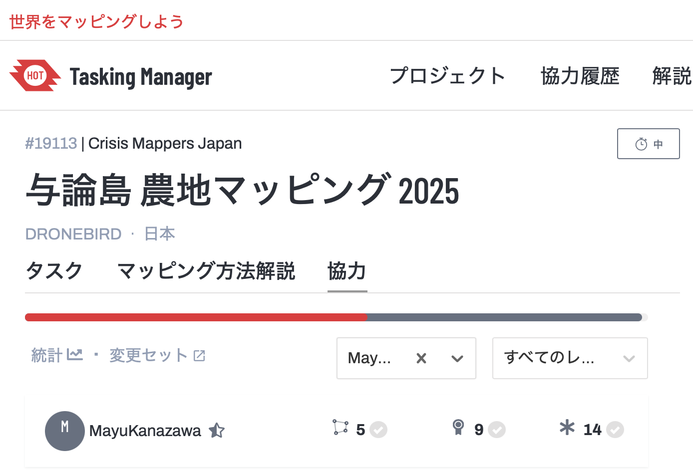
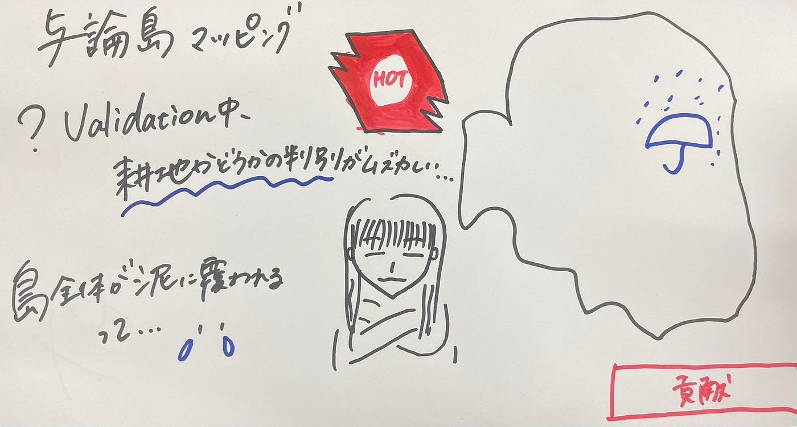

## 【2025.5.12 週報 与論島マッピングで感じた協力の力と災害の現実 】

こんにちは。ユース４年の金澤です。

今週はHot Tasking Managerで与論島の農地マッピングをしました。

#### 与論島 農地マッピング 2025（19113）とは

> 2024年11月に記録的な大雨の影響で１時間に90ミリ、３時間で145.5ミリの雨を観測した沖縄県与論町のために、与論島の方々との連携により、今後の災害に備えた OpenStreetMap の充実と、災害時の迅速な情報共有を目指したベースマップ整備を目標に、青山学院大学 古橋研究室、Salon de AManTo 天人、YouthMappers AGU、YouthMappers Reitaku University、International Humanitarian Mapathon、NPO法人クライシスマッパーズ・ジャパンが中心となって企画したものになります。

> いずれも11月の観測史上１位。午後４時までの24時間で190.5ミリの雨量を観測し、甚大な豪雨災害が発生したそうです。

> このプロジェクトは、被災地域の建物や道路の状況をOpenStreetMap（OSM）上で可視化し、復旧・復興活動を支援することを目的としています。

引用元：[https://tasks.hotosm.org/projects/19113#map=18.00/27.05301/128.44528](https://tasks.hotosm.org/projects/19113#map=18.00/27.05301/128.44528)

#### 【私の成果】

#### 【感想】

GWの隙間時間を有効活用し、マッピングを進めましたが、どんどん白の範囲が減っていき、みんなが協力し合っていることを実感できました。

また、マッピング中、Validation中に、農地かどうかの判別が難しいと感じる時がありました。

もう少し早くから貢献できていればよかったと反省していますが、少しでも与論島の方々の助けになれていれば嬉しいです。

#### 【その他】

南日本新聞を読み、与論島での被害の深刻さにより驚きました。

> 『この豪雨により、島全体が泥水に覆われ、道路のアスファルトが剥がれ、土砂が道路を塞ぐなどの被害が発生しました。特に与論町茶花の「銀座通り」では、一時的に1メートルを超える浸水があり、店舗や住宅が大きな被害を受けました。住民たちは「これまでとは違う、異常な降り方だった」と証言しています。現在、住民や高校生ボランティアが協力して復旧作業を進めていますが、作業中にも激しい雨が続いており、復旧には時間を要する見込みです。 』

引用元：[島全体が泥水に…記録的な大雨に見舞われた与論島 住民が証言「これまでとは違う、異常な降り方だった」 | 鹿児島のニュース | 南日本新聞デジタル](https://373news.com/news/local/detail/204256/)

島全体が泥に覆われるという表現は関東に住んでいたら滅多に聞かないので恐ろしいです…

