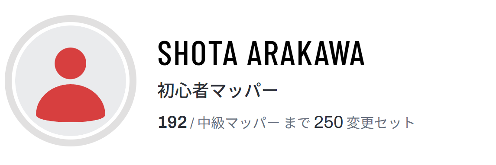
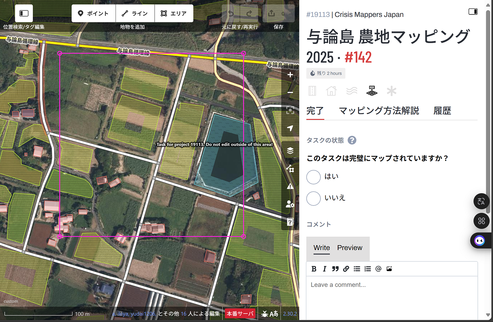
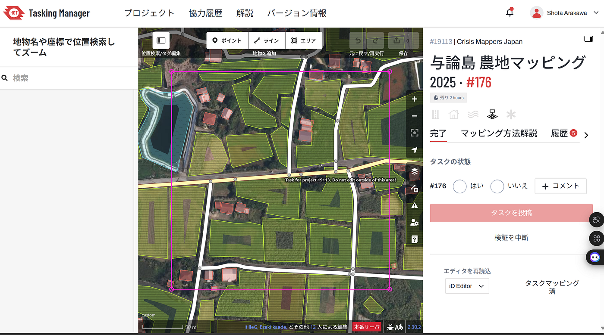
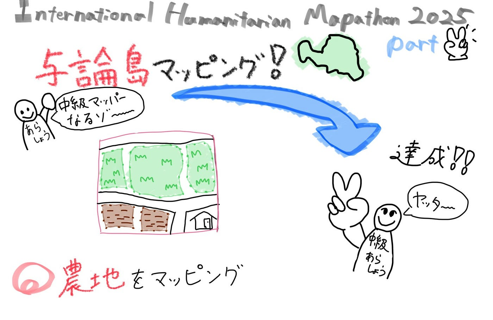

### 【5/13週報】目指せ中級マッパー！International Humanitarian Mapathon 2025 part2

こんにちは！古橋研究室3年の荒川翔汰です！ゴールデンウィークは終わりましたが、今年は5月病にならずにすみそうです。

今週は、4月30日より始まった[International Humanitarian Mapathon 2025](https://www.reitaku-u.ac.jp/news/images/mapathonpizza_20250416_193352_0000.pdf)part2として行った、与論島マッピングについて報告します。

このタスクに参加する前までの成果が192変更セットだったので、今回のイベントで中級マッパーに昇格し、確認作業を行うことを目標にして取り組みました！

#### 概要

part2では、[HOT Tasking Manager](https://tasks.hotosm.org/)のタスク[#19113与論島農地マッピング 2025](https://tasks.hotosm.org/projects/19113)を行いました。

2024年11月に沖縄県与論島で豪雨被害が発生しました。

このプロジェクトは、与論島の方々との連携により、今後の災害に備えた OpenStreetMap の充実と、災害時の迅速な情報共有を目指したベースマップ整備を目標に、青山学院大学 古橋研究室、Salon de AManTo 天人、YouthMappers AGU、YouthMappers Reitaku University、International Humanitarian Mapathon、NPO法人クライシスマッパーズ・ジャパンが中心となって企画したものです。

農地のみが今回のマッピング対象でした。

#### 活動内容・成果

農地の間にあぜ道や農道が通っている可能性があることを頭に入れながら作業を行いました。

また、目標も達成し、中級マッパーに昇格することができました！

少しですが、確認作業にも挑戦してみました！

#### 感想

普段は、建物や道のマッピング作業が多いですが、今回のマッパソンを通して農地のマッピングも体験することができて良かったです！参加者が多いイベントのため、タスクがなくなってしまうのではないかと思いましたが、想像以上に与論島には農地が多く、マッピングをしながらその数に驚かされました。

今後は、中級マッパーとして確認作業にも参加しつつ、上級マッパーへの昇格も目指していこうと思います！

#### グラレコ

