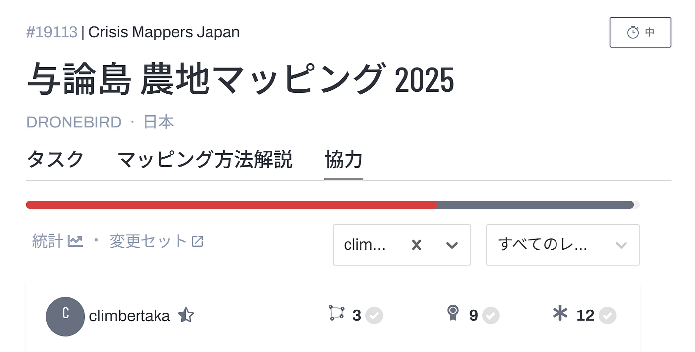
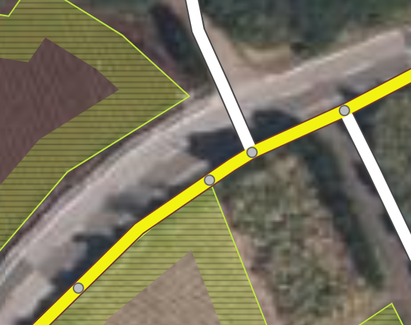
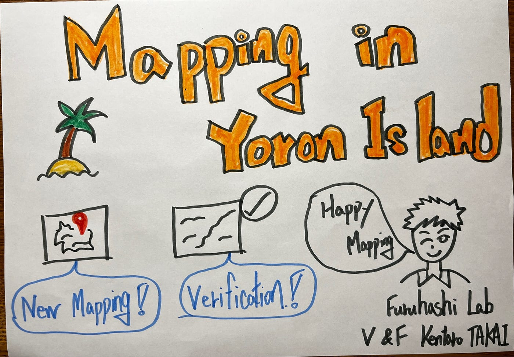

## マッピングで与論島を救え！災害支援のための地図づくりプロジェクト

こんにちは。4年の高井健太郎です。

今週は先週に引き続き、ハッカソンの一環として「[2025 International Humanitarian Mapathon](https://padlet.com/UCLA_Library/international-humanitarian-mapathon-2025-8xjwv3mztrshbiqp)」に参加し、その中の「与論島マッピングチャレンジ」に挑戦しました。

> 主な作業内容

1.新たな土地のマッピング

2.マッピングされた地域の検証作業

ゴールデンウィーク前までは、1の新たな土地のマッピングを中心に作業しました。しかし、ゴールデンウィーク明けにはほとんどの土地がすでにマッピング済みだったため、中級マッパーとしてのスキルを活かし、2の検証作業に注力しました。

> 工夫点

1.新たなマッピング作業

農地を見逃さないことを最優先とし、建物の直角化や、道路・他のマッピングポリゴンとの接続が不自然にならないよう注意してマッピングしました。

2.検証作業

すでにマッピングされた地域を開き、以下の点を重点的にチェックしました。

•	農地が漏れていないか

•	建物の直角化ができているか

•	道路や他のポリゴンと不自然につながっていないか

> 気づき

検証作業をしていると、意外にもポリゴンと道路がつながってしまっている箇所が多く見つかりました。

検証時には、この点を意識しながら丁寧に見直すことが大切だと感じました。これから作業する皆さんも、ぜひ注意してみてください。

> まとめ

正直、自分はこのマッパソンが始まるまで与論島の存在を知りませんでした。しかし、マッピング作業を通して与論島の自然の豊かさや、美しい海の魅力を知り、ぜひ実際に訪れてみたいと思いました。

今後も、マッピング活動を通じて世界中の防災支援に貢献していきたいと思います。

> グラレコ

