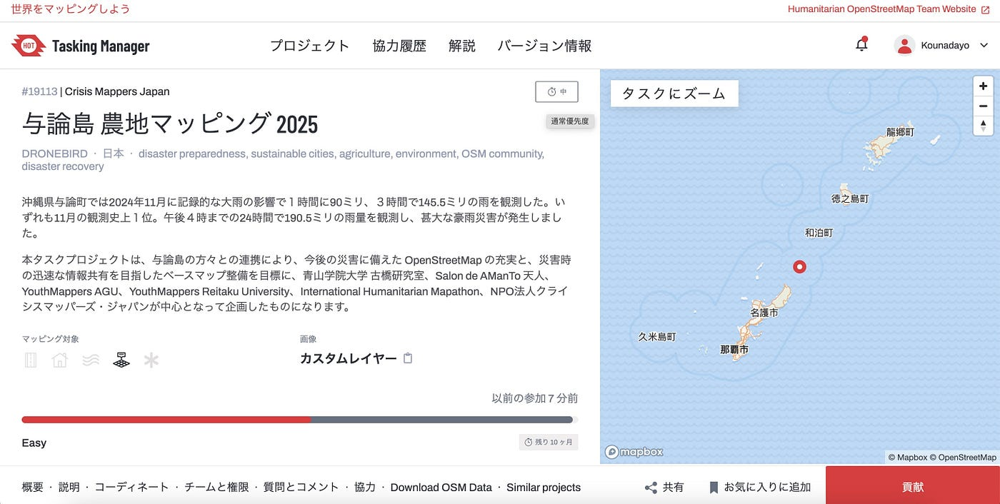
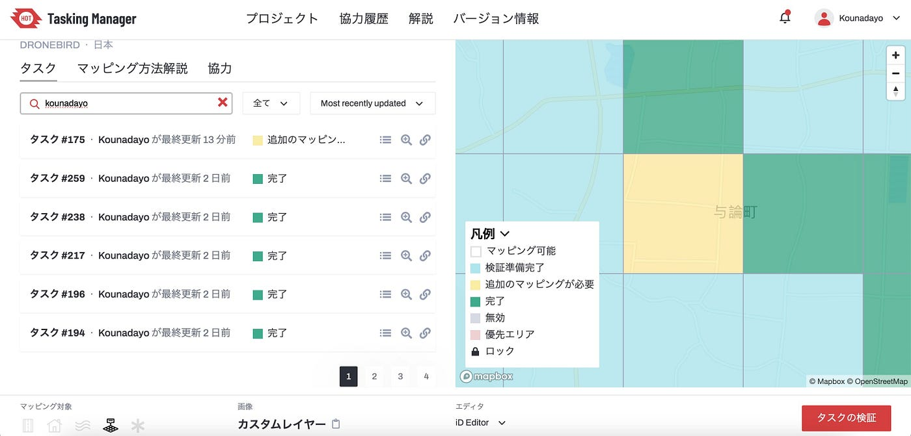
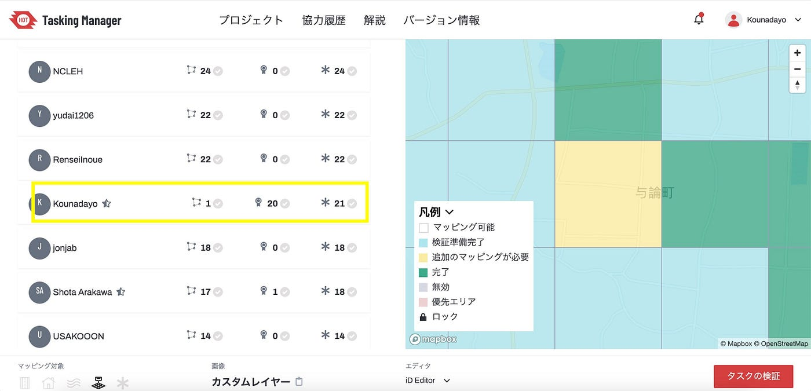
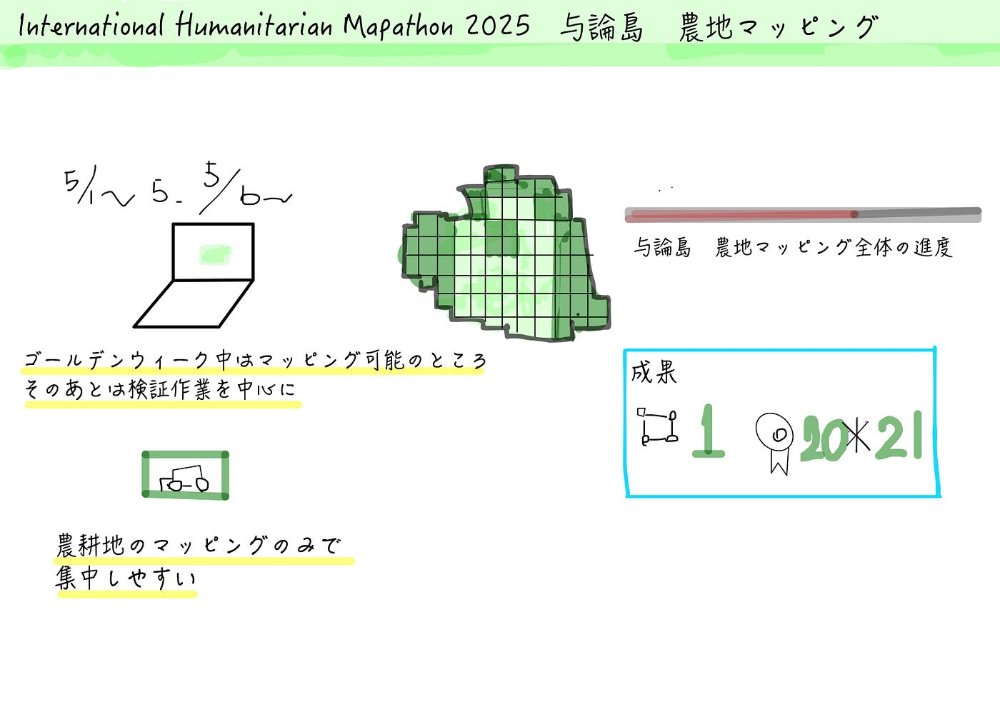

### 与論島の農地マッピングをやってみました！【5/13週報】

こんにちは、四年の福田です！

今週の週報はこの前の内容に続き、[International Humanitarian Mapathon 2025](https://mapathon.la/en/)のイベントとして、与論島の農地マッピングを行ったのでその報告をします！

今回私たちが取り組んだプロジェクトはこちらになります↓

[https://tasks.hotosm.org/projects/19113#map=18.00/27.05301/128.44528](https://tasks.hotosm.org/projects/19113#map=18.00/27.05301/128.44528)

#### 成果

今回のイベントでは、期間を分けて作業しました。ゴールデンウィークでは、マッピング可能な部分が多かったので、農地をマッピングし、その後は検証作業を中心に行いました。

#### 感想

今回の作業は農地に集中したマッピングであったため、エリアで農地を囲む作業のみで、これもあれもと考えながらの作業ではなかったので進めやすい印象でした。また、今回の作業では地図があっという間に緑に変わっていき、みんなが一つの地図に置いて取り組んでいることを実感し、楽しくマッピングすることができました。

このようにイベントがある時だけでなく、普段もマッピングすることを意識しながら、上級マッパーを目指していきたいと思います。

グラレコ

Ipadが手元にないため、パソコンで書いてみました。
