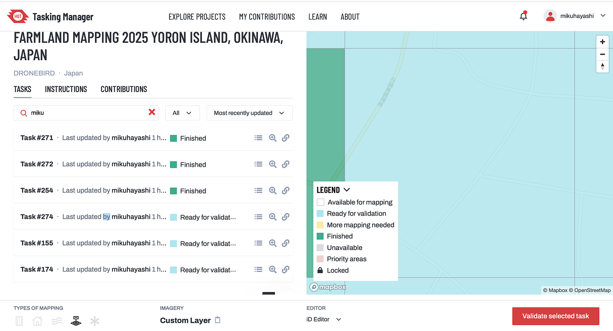
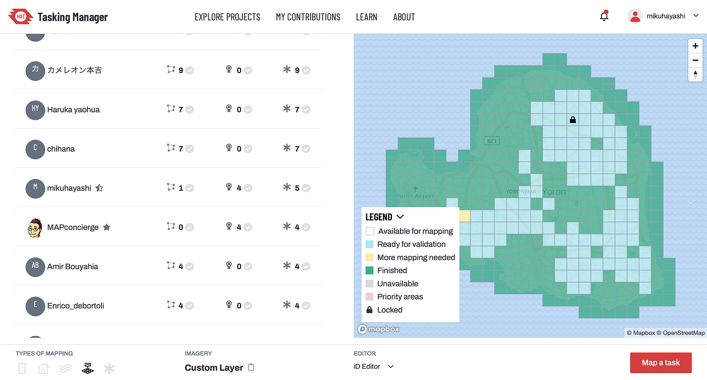
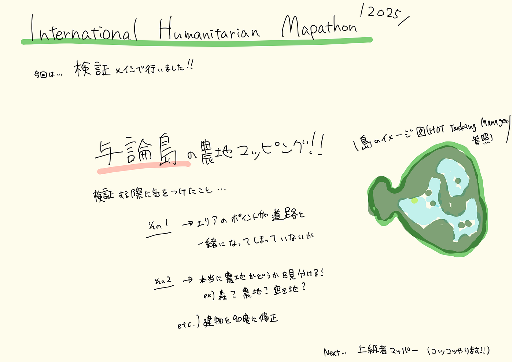

### 与論島の農地マッピングを行いました！

こんにちは！4年の林（み）です。

今年ももう早いことに、前期前半が終わろうとしております。

今週は、4月30日から開催された、[2025 International Humanitarian Mapathon](https://mapathon.la/en/)での活動報告をさせていただきます。

#### 活動内容

今回、行なった活動は、与論島の農地をマッピング作業を行いました！

普段は、建物のマッピングを主に行なっており、農地のマッピング作業は初めてだったので、いつもと気をつけることなどが違いました。

この中で、私が行なった作業は、主に、検証を行いました。

特に気をつけたことは、

・道路と農地がくっついてしまっている箇所の修正

・農地と森の判別

などを中心に行いました。

また、検証している際に、建物の角が90度でないなと気付いた箇所は、90度に直すなどの作業も追加で行いました。

#### 成果

今回のイベントには、少し遅れて参加してしまったため、確認した時には、全てのマッピング作業が終了していたため、検証をメインに行いました。

#### 感想

まず、スタートが遅れてしまったため、マッピング作業ができず、検証が中心になってしまったので、次回からは、ギリギリでやるのではなく、前々からコツコツやります。検証作業を行なっていて、割と農地と道路がくっついてしまっていたり、農地と農地が隣り合っているところもくっついてしまっている箇所が多くみられ、そこを重点的に修正しました。いつも行なっている建物をマッピングする作業に比べ、農地のマッピングは、農地なのか、森なのか、それとも農地ではない場所なのかの見分けがとても大変でした。また、検証を行うと、だんだん緑に変化しているのを見ると、陣地取りみたいな感覚になり、楽しかったです。

最後に、上級者マッパーまでまだまだありますが、早くなれるよう、コツコツこれからもマッピングしていきたいと思います。

