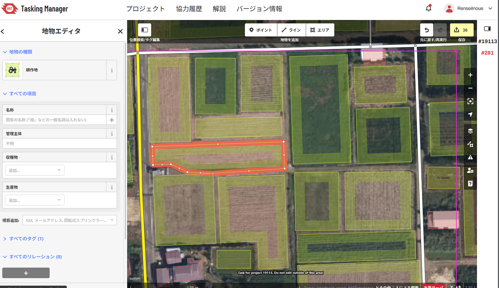
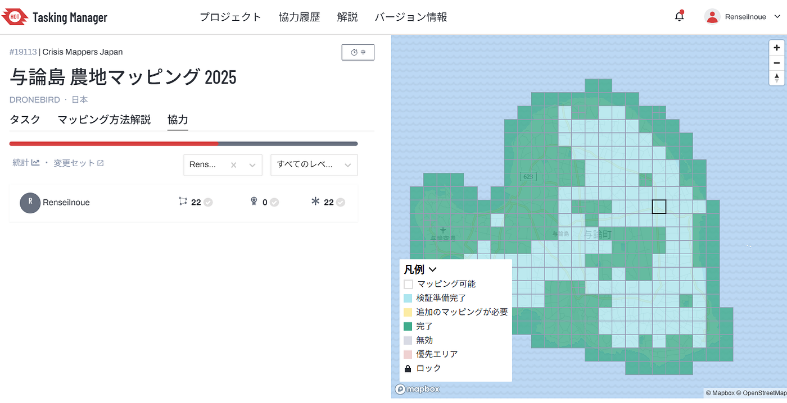
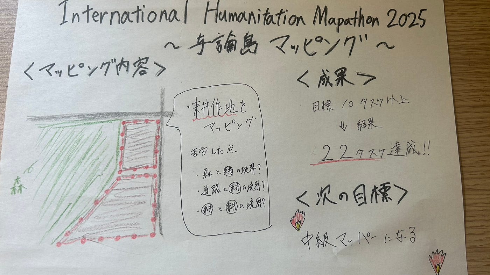

### 与論島の農耕地マッピングに参加！【2025/05/13】

こんにちは、三年の井上です。

今週の週報では、先日古橋研究室で参加させていただいた"[International Humanitarion Mapathon 2025](https://mapathon.la/en/)" のイベントの一つである、与論島の農耕地マッピングの報告です。

### 〈活動内容〉

今回私が取り組んだプロジェクトはこちらになります。

[https://tasks.hotosm.org/projects/19113](https://tasks.hotosm.org/projects/19113)

#### 耕作地をマッピング

今回のマッピングはこれまでのように家屋ではなく、耕作地をマッピングするというもので少し動揺しました。

作業を通して特に難しかったのは、耕作地の境界を判別することでした。森林と耕作地の境界、道路と耕作地の境界、耕作地とほかの耕作地の境界など見分けるのにかなり時間を要しました。

### 〈成果〉

今回のプロジェクトでは、少しでも中級マッパーに近づくためにも10タスク以上を目標にして作業に取り組みました。作業をしていると少しづつ楽しくなり、目標を上回る22タスクを達成することができました。（貢献度は全体で9番目でした！)

以下の画像が貢献記録になります。

### 〈感想〉

今回の活動を通して最も印象的だったのは、人々が協力することの偉大さでした。最初は全く埋まっていなかった地図がみるみるうちに水色や緑に変えられていき、あっという間に初級マッパーの自分ができるタスクはなくなってしまいました。一人一人の協力で大きなことを成し遂げられるという事を改めて学ぶよい機会になりました。

また、同時に初級マッパーでは活動範囲に限度があり、より貢献するには中級マッパーになる必要があることを痛感させられました。空いている時間に個人的にプロジェクトに参加したり、研究室でのマッピング活動に積極的に参加したりするなどして実績を増やしていきたいと思います。

最後に今回のグラレコになります。

