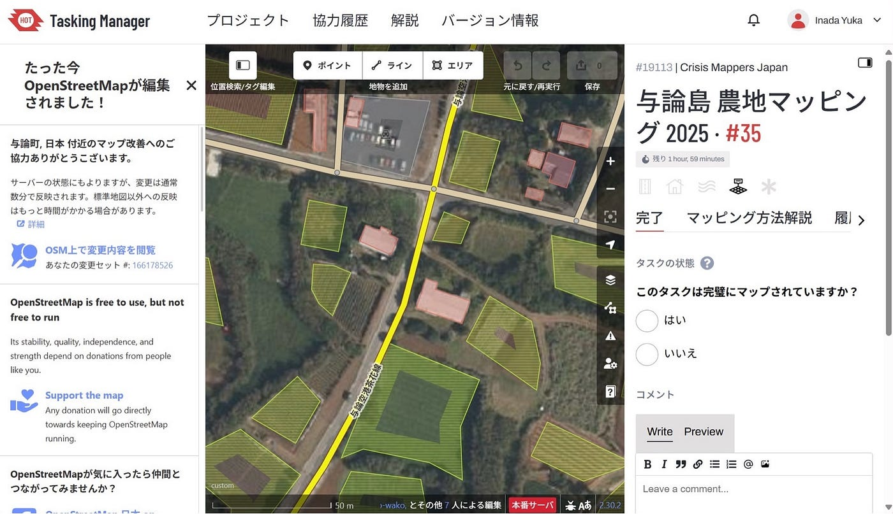
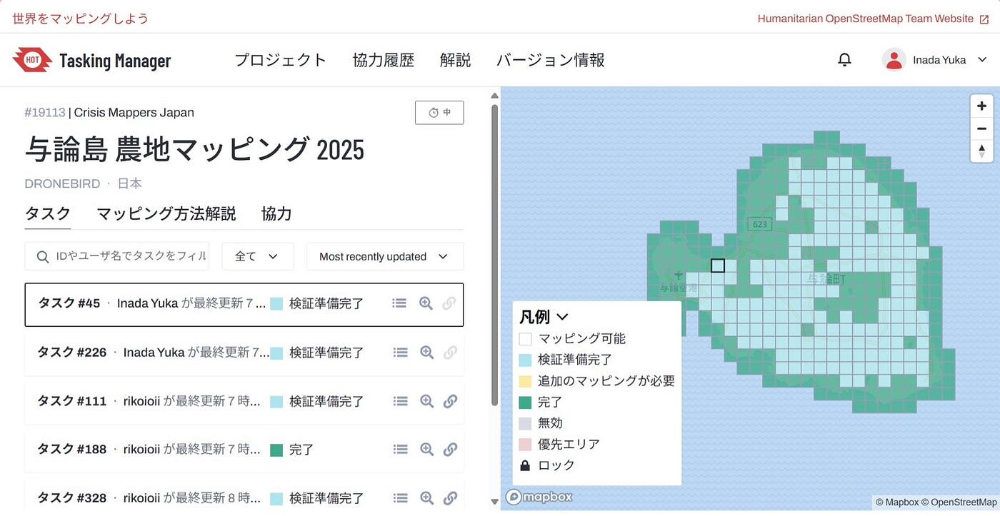
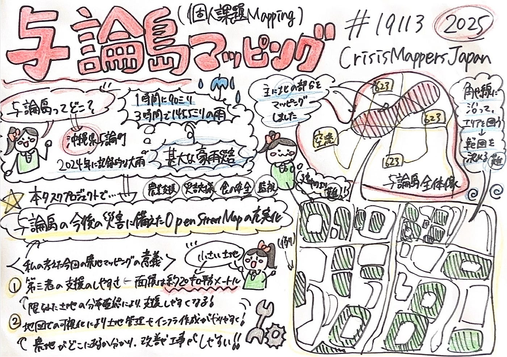

## 与論島マッピング参加

こんにちは。3年の稲田優花です。

ゴールデンウィークも終わり、学期初めから約1ヶ月半が経ちました。今回の週報は休みの間に参加した与論島農地マッピングの作業について報告していきたいと思います。ゴールデンウィーク期間中は個人作業としてHot tasking managerの与論島マッピングを行いました。その概要や作業の感想、反省点などについて述べていきます。

概要

Hot Tasking Managerにおける農地マッピングとは、主に農地の地図化作業を指し、農業支援や災害対策、食糧安全保障、土地の監視などに役立ちます。昨年11月に豪雨に見舞われた与論島の農地マッピングを行う意味についても考えました。

面積が小さく限られた与論島の正確な土地感や分布を確認する事で、第三者が支援をしやすくなります。地図に可視化することで農地の改善ができ、これから先の災害に備えた長期的な土地の管理や、インフラ作成にもつながると感じました。

農地の航空写真は今まで行った他のマッピングと比較してかなり異なっており、農地であるかの判断が難しかったものの、与論島の未来づくりに繋がるこのマッピング作業に参加することができて良かったです。

今回の実績

ゴールデンウィークから週明けまで宿泊が入ってしまったため、5タスク完了を目標にしました。旅行から帰ってきてから作業を初めることになり検証可能へと移行する作業ができましたが、その後は中級者以上の検証作業になってしまいました。結果としては4タスクとなりました。もっと参加できたと感じ悔しいです。

感想と反省点

農地のマッピングは建物が少なく簡単かとイメージしていましたが、どこまでが畑なのか、畑でないのかという境目を考えるのが難しかったです。建物と異なりマッピングする人によって囲い方が変わりそうだと思いました。

パソコンを実家に忘れてしまったために参加タスク数が非常に少なくなってしまいとても悔しい気持ちでいっぱいです。自分はまだ中級者になれていないため、ゴールデンウィークが始まる前から作業をするべきでした。

次からの展望

今回の農地マッピングで得た畑とそうでない土地の境界引きの能力を生かし、これから今までと同様に建物のマッピングを行う際には1タスクの作業完了までにかけるタイムを縮めてさくさくと進められるようにしていきたいです。また、今回は10タスク以上参加できなかったため、次回以降はもっと早くから計画をたてて、検証作業以外のマッピングにきちんと貢献したいです。そして、一日も早く初級マッパーから中級マッパーに進めるようにこれからもマッピングを頑張りたいです。

グラレコ

