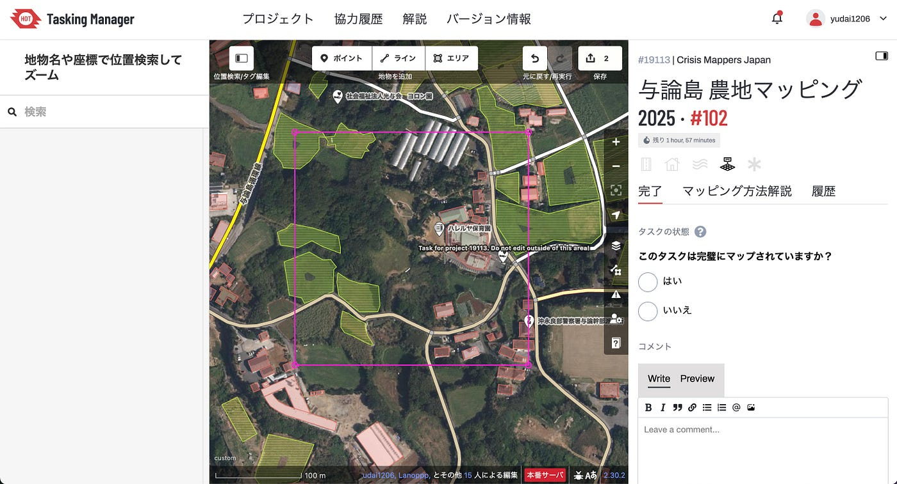
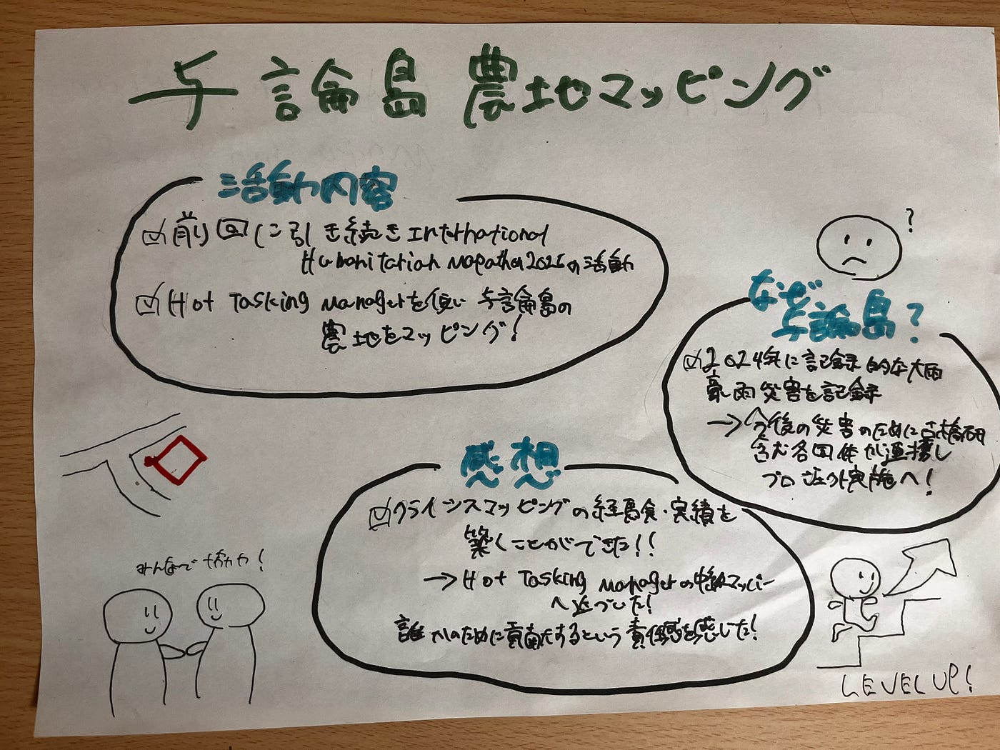

### 与論島農地マッピングに挑戦！

こんにちは！3年の加藤祐大です。皆様ゴールデンウィークはいかがお過ごしだったでしょうか？僕は襲いかかる5月病に怯えながら今月をやり過ごそうと思います。

さて、今回は麗澤大学が開催する地図を使った実践型イベント、International Humanitarian Mapathon 2025 のPart2:Humanitarian Mapathonについてご報告します。

International Humanitarian Mapathon 2025 のイベント内容の詳細については、前回の[週報](https://medium.com/furuhashilab/international-humanitarian-mapathon-2025-youth%E2%91%A1%E9%80%B1%E5%A0%B1-4-29-e15b232c4222)に記載してありますのでご覧ください。

> 活動内容

今回のPart2:Humanitarian Mapathonでは、クライシスマッピングを行うためのプラットフォーム「[Hot Tasking Manager](https://tasks.hotosm.org/)」を用い、青山学院大学 古橋研究室、Salon de AManTo 天人、YouthMappers AGU、YouthMappers Reitaku University、International Humanitarian Mapathon、NPO法人クライシスマッパーズ・ジャパンの各団体が協力し沖縄県与論町、与論島の農地をマッピングしました。

実際の活動内容は至って簡単、区画ごとに振り分けられた与論島の各エリア内の農地を航空写真を使いながら確認し、該当エリアを囲う、ただそれだけなのです！

> なぜ与論島なの？

沖縄県与論島では2024年11月、記録的な大雨の影響で記録的な豪雨災害が発生しました。そのため、与論町と各団体が協力し、今後また同じような災害が発生した際にスムーズな支援活動を実施するために、この時点からマッピングを行いました。

> 感想

今回、自分自身中級マッパーを目指しているということもあり、積極的に本プロジェクトに取り組みました。その結果かなりの数のエリアをマッピングすることができ、実績、経験を築くことができました。今回のマッパソンで中級マッパーになることはできなかったのですが、今回の経験を通して、一つの災害に向き合い誰かのために貢献するという責任感を非常に強く感じることができました。

