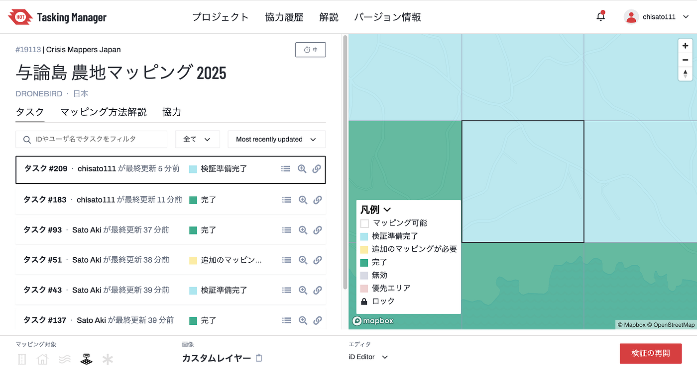
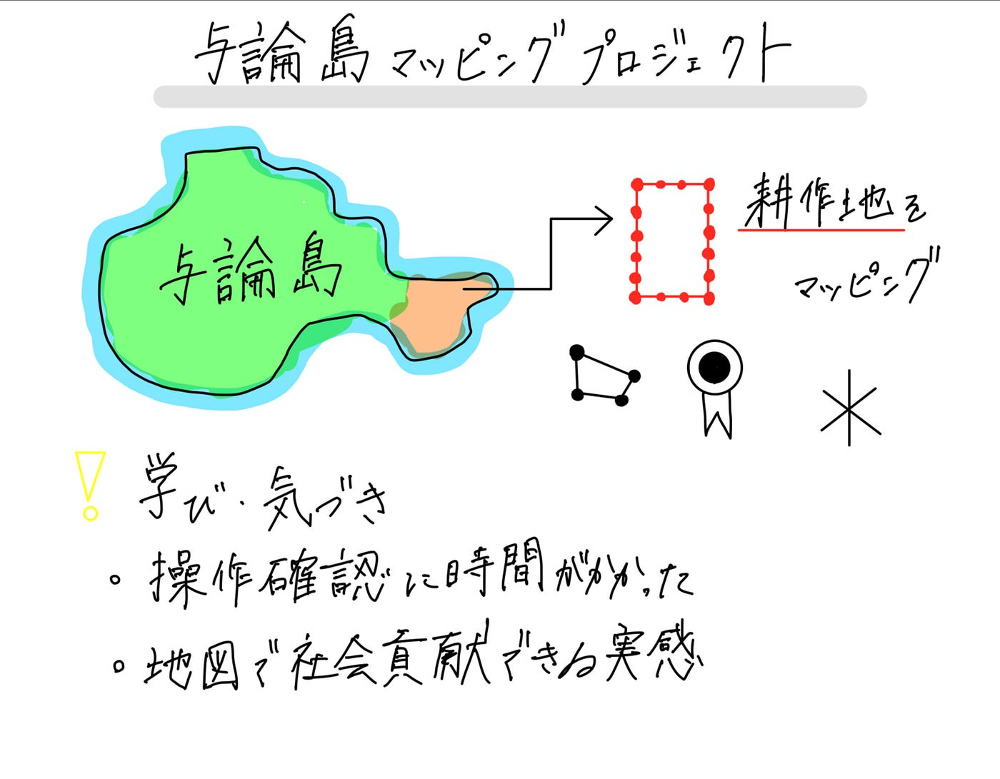

### 与論島農地マッピングに挑戦！【5/13週報】

こんにちは、古内です。今回は、「[International Humanitarian Mapathon 2025](https://mapathon.la/en/)」の一環として取り組んだ与論島の農地マッピングプロジェクトについてご紹介します。

### プロジェクトの概要

与論島は鹿児島県最南端に位置し、沖縄本島からわずか23kmの距離にある小さな島です。温暖な亜熱帯気候と美しい自然に恵まれ、サトウキビや島野菜の栽培が盛んです。しかし、農地の高齢化や耕作放棄地の増加が課題となっています。

[今回のマッピングプロジェクト](https://tasks.hotosm.org/projects/19113#map=18.00/27.05301/128.44528)では、与論島の耕作地をマッピングしました。

### 作業の進め方と気づき

今回の作業には、HOT Tasking Managerを使用しました。事前に与えられたエリアをもとに、衛星画像上で農地と思われる区域をポリゴンで囲んでいく作業です。

ただ、前回のマッピング作業から少し時間が空いていたこともあり、操作手順の確認に多少手間取りました。インターフェースの仕様やツールの使い方を思い出すまでに時間を要しましたが、一度慣れてしまえばスムーズに作業を進めることができました。

### 学びと実感

このプロジェクトを通じて、地図を使った社会貢献活動の面白さと可能性を改めて感じました。現地に行かずとも、地理情報を通じて地域課題の一端に関われるのは大きな魅力です。

また、操作に戸惑った経験から、「定期的なツール利用」や「マニュアルの見直し」の重要性も実感しました。技術の習熟度は時間とともに薄れるため、継続的なトレーニングの必要性を感じました。

### 今後に向けて

今後は、今回作成した農地データが地域の農業振興や土地管理に活用されることを願うとともに、自分自身も他地域への展開やスキルの向上に努めていきたいと思います。

**グラレコ**

