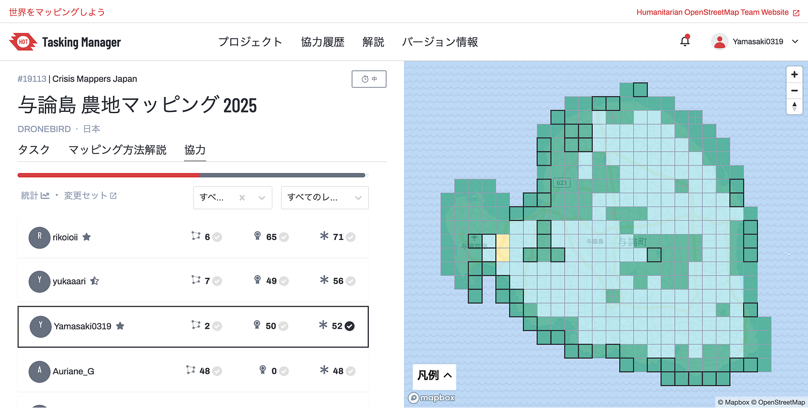
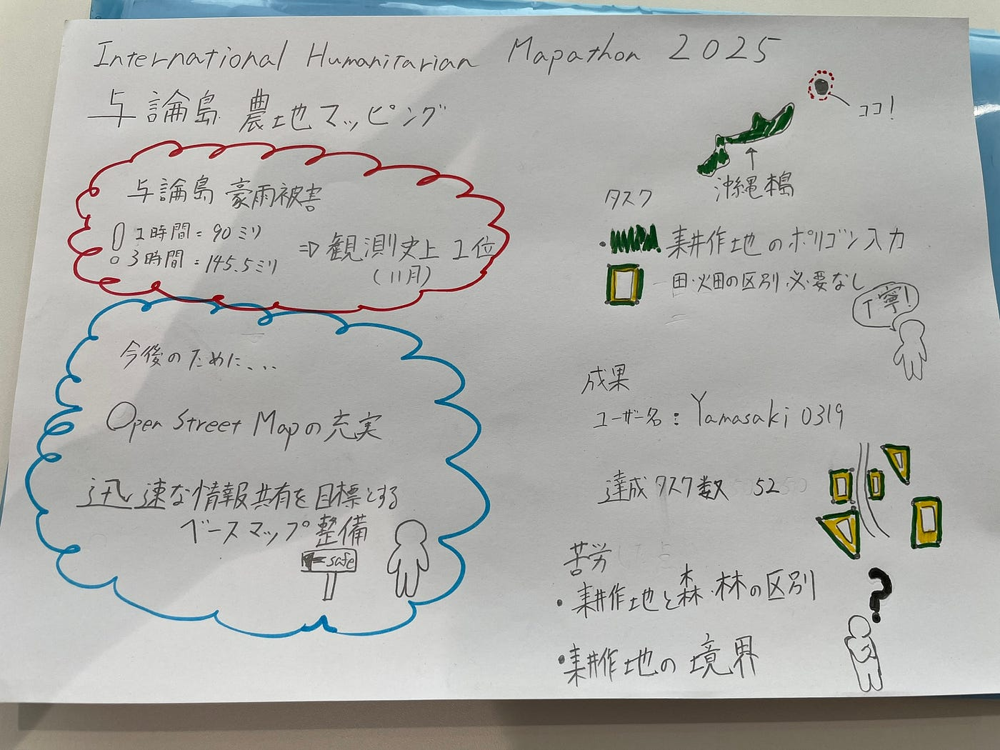

### 検証作業の達人へ

こんにちは！古橋研究室3年ドローン部１の山﨑です！。今回は**[International Humanitarian Mapathon2025**](https://mapathon.la/en/)のタスク２である与論島クライシスマッピングについて書きます！

#### **[与論島 農地マッピング 2025**](https://tasks.hotosm.org/projects/19113#map=18.00/27.05301/128.44528)

**被害**
沖縄県与論町では2024年11月に記録的な大雨の影響で**１時間に90ミリ**、**３時間で145.5ミリ**の雨を観測した。いずれも**11月の観測史上１位**。午後４時までの24時間で190.5ミリの雨量を観測し、甚大な豪雨災害が発生しました。

**目的**
本タスクプロジェクトは、与論島の方々との連携により、**今後の災害に備えた OpenStreetMap の充実**と、**災害時の迅速な情報共有**を目指したベースマップ整備を目標に、青山学院大学 古橋研究室、Salon de AManTo 天人、YouthMappers AGU、YouthMappers Reitaku University、International Humanitarian Mapathon、NPO法人クライシスマッパーズ・ジャパンが中心となって企画したものになります。

**タスク**

耕作地（田んぼ・畑の区別は無し）のポリゴン入力

#### **成果**

ユーザー名:[Yamasaki0319](https://tasks.hotosm.org/users/Yamasaki0319)
達成タスク数:52
私は時間がある時にマッピング作業をしていたためイベント開始前には上級マッパーになれました。そのため今回のイベントでは主に検証作業を中心にしました。

#### **耕作地のマッピングで苦労したことについて**

・耕作地と森林の区別

・耕作地同士の境界の区別

#### **感想**

耕作地のマッピングと聞いた時は、簡単そうなタスクだと考えていました。しかし実際にマップをみてみるとエリアが重なっていたり、耕作地と森の区別が難しかったり色々と苦労がありました。森林との区別がつかない際はGoogle Mapを使って比較してマッピングをする、時間がかかることもありました。しかし、いつの日か私たちが今回のイベントでマッピングしたことが与論島の方々に役立つものとなると嬉しいと思います。

#### グラレコ

