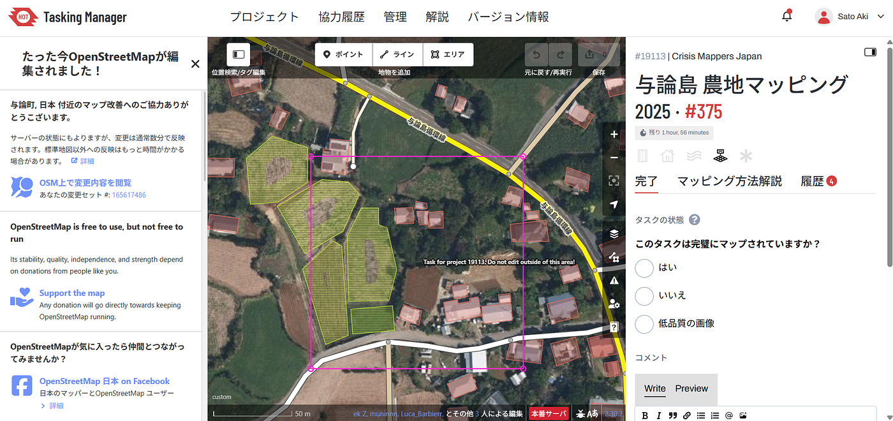
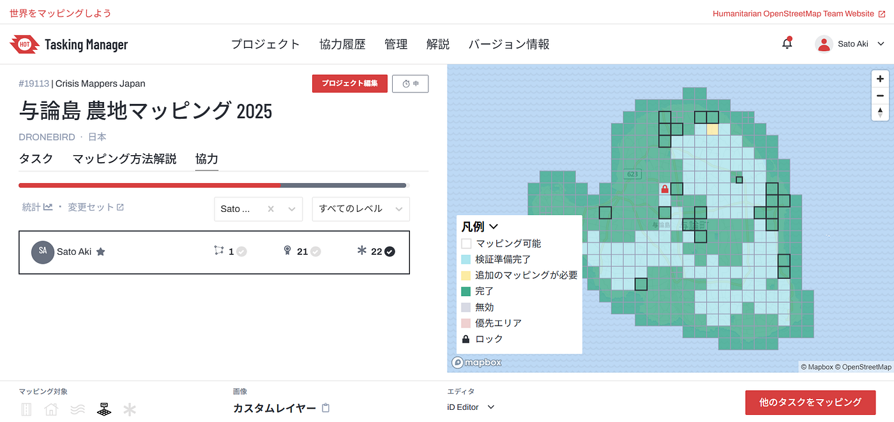
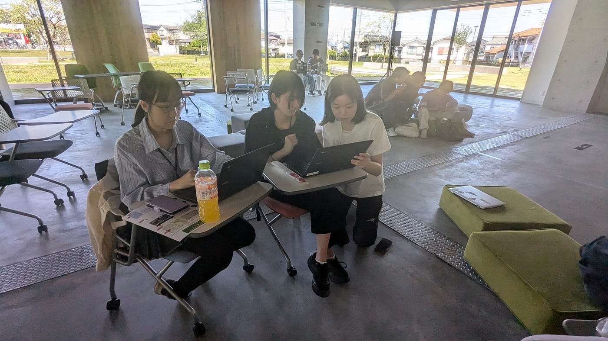
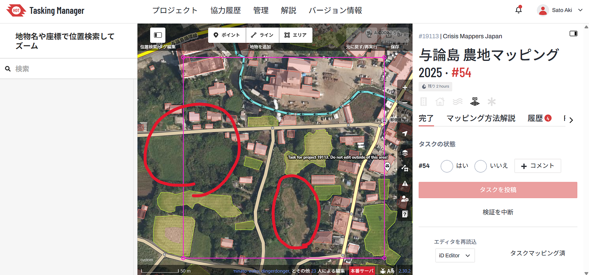
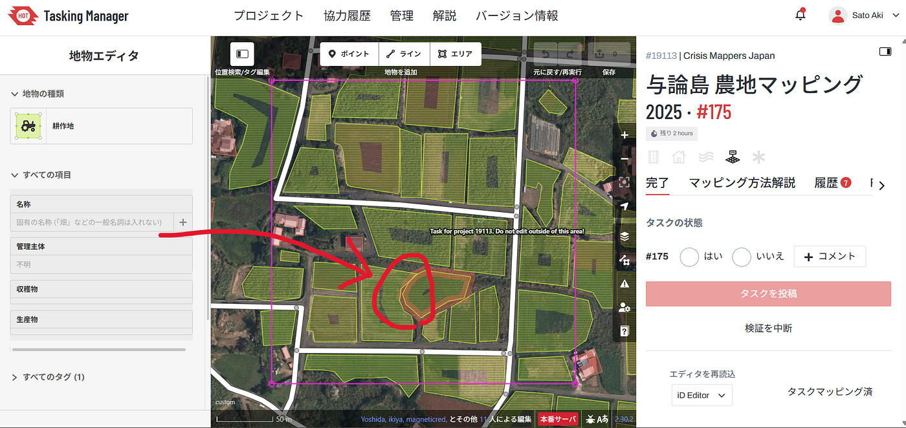
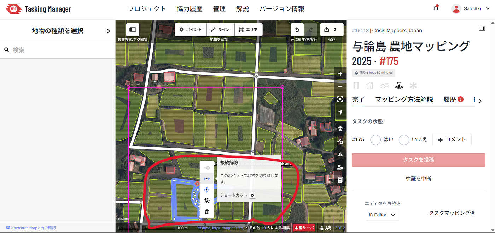
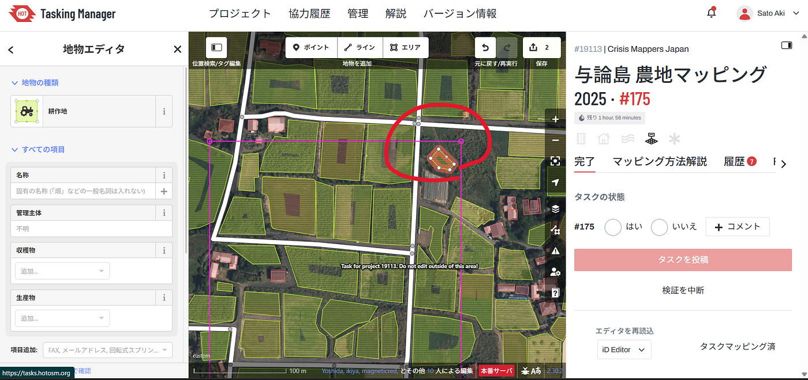
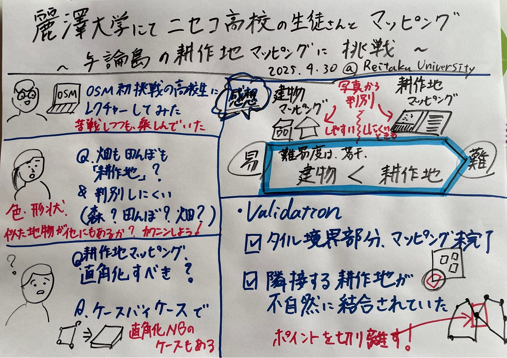

### 麗澤大学にてニセコ高校生とマッピング／与論島の耕作地マッピングに挑戦（週報）

こんにちは、4年の佐藤愛妃です。

今回の週報では、2025年4月23日から4月30日にかけて行われたHumanitalian Mapathonの活動について報告します。私は麗澤大学に助っ人として参加し、ニセコ高校の生徒さんたちにOpenStreetMap（OSM）を使ったマッピングの方法をレクチャーする機会をいただきました。

今回のクライシスマッピングでは、**与論島の耕作地**を対象とし、高校生の皆さんと一緒にマッピングに取り組みました。初心者への指導を通じて見えてきた課題や、Validation作業で苦労した点を以下にまとめます。

### 与論島の耕作地をマッピング

今回のクライシスマッピングは、与論島の耕作地が対象でした。

[https://tasks.hotosm.org/projects/19113/contributions](https://tasks.hotosm.org/projects/19113/contributions)

### ●OSM初挑戦の高校生にレクチャーしてみて

**●難易度は、建物マッピング<耕作地マッピング**

今回のマッピング対象は耕作地に限定されていましたが、建物に比べてやや難易度が高い印象を受けました。というのも、航空写真だけでは現地の土地利用が明確に判別しにくい場所が多く、耕作中か放棄地かの判断に悩む場面が多々あったためです。

**●タグの理解**

今回はマッピング対象が**耕作地のみに限定されていた**ため、対象地物の種類が絞られており、作業自体は比較的シンプルでした。

とはいえ、「畑と草地」「耕作放棄地と空き地」など、現実世界の多様な風景を、OpenStreetMapのタグ体系にどう落とし込むかを理解するのは作業に慣れるまで引っかかるポイントになるかもしれません。実際に高校生からは「**畑も田んぼも『耕作地』でいいのか？**」という質問もあり、単純なタグ指定以上に、背景となる考え方や判断基準を共有する必要があると実感しました。タグの数を減らすことは、初心者にとって混乱が減るから良いと感じました。

**●耕作地マッピングと直角化について**

今回のマッピング対象は耕作地だったため、「直角化すべきか？」という質問がありました。建物とは違い、耕作地は自然な地形に沿って形が不規則なことが多いため、**直角化は必須ではありません**。

特に今回は、**直角化を行うと長辺に引っ張られて全体の形や大きさが変わってしまう**ことがあり、あまり推奨しませんでした。結論としては、**直角化はケースバイケースで判断すべき**だと感じました。

### ● Validation

今回のValidationは、細かい確認作業が多く、全体的に確認が必要でした。特に以下のような問題が目立ちました。

●タイルの境界部分がマッピングされていない
 タイルの端で耕作地が途中で途切れており、見落とされているケースが複数ありました。

・隣接する耕作地が不自然に結合されていた
 本来分かれているはずの耕作地が1つのポリゴンにされており、理由が不明なまま編集されている箇所が見受けられました。

●マッピングが未完了のまま投稿されていた
 ポリゴンが描きかけで終わっていたり、タグ付けがされていない状態で「完了」とされているタイルが存在していました。

こうしたケースでは、Validation時に慎重なチェックが必要でした。慣れないと難しいと感じる場面も多いです。

まとめ

今回のMapathonは、高校生と一緒に作業するという貴重な経験となり、「教えることで気づくこと」や「見落とされがちなポイント」が多く学べました。

耕作地マッピングやValidationのような地味な作業こそ、地図の精度に直結する重要な工程です。今後も教育と実務を組み合わせながら、OSMコミュニティに貢献していきたいと思います。

