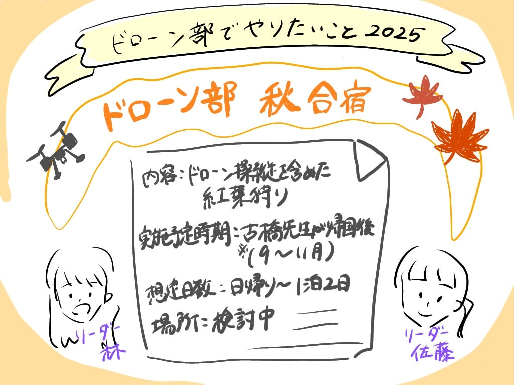

### 【5/18 週報】ドローン部、秋の合宿企画が始動中！

こんにちは！ドローン部4年の林です。

今週の週報は、ドローン部で実現したい目標をリーダー同士（佐藤、林）で話し合ったので情報を共有します。

### 考えたこと

ドローン部メンバーでの秋に**合宿（日帰り）イベント**をやりたい！

（目的）

・メンバー同士の中を深められる機会を作りたい

・ドローンを操縦できる機会の創出

・イベントの様子の動画をV&Fに提供し、古橋研究室の魅力を発信する

### 合宿でやりたいこと

内容：ドローン操縦を含めた紅葉狩り（笑）

実施予定時期：古橋先生が帰国後（秋合宿と重ならない時期）

想定日数：日帰り～1泊2日

場所：

- ドローンの操縦が可能な広い空間

- 離島や横瀬など、特別感のあるロケーション

- 紅葉を楽しめるような自然あふれる場所

### 今後の準備

- ドローン部メンバーでの日程調整

- 候補地のリサーチと決定

- ドローンに関する知識（法律・操縦・安全面など）を増やす

### 先生へのご相談

- 合宿候補としておすすめの場所があれば、ぜひご提案いただきたいです！

- また、今回の合宿は先生のご同行が必要か、メンバーのみでの実施も可能か、ご意見をいただけますと助かります。

#### グラレコ

