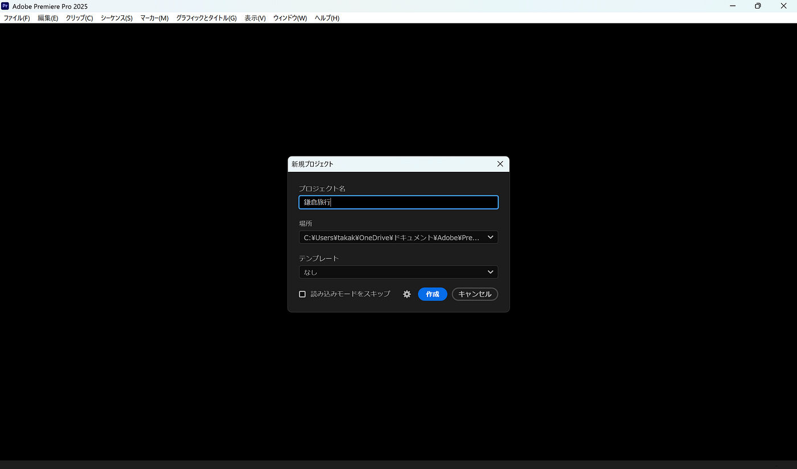
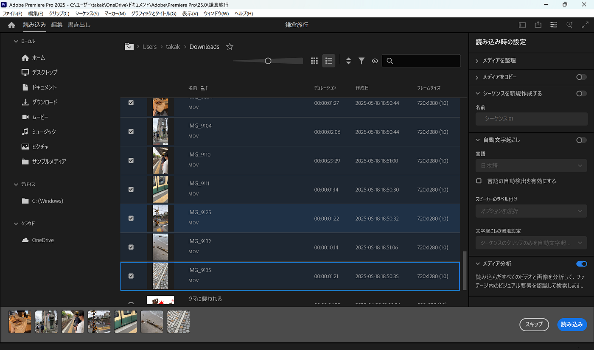
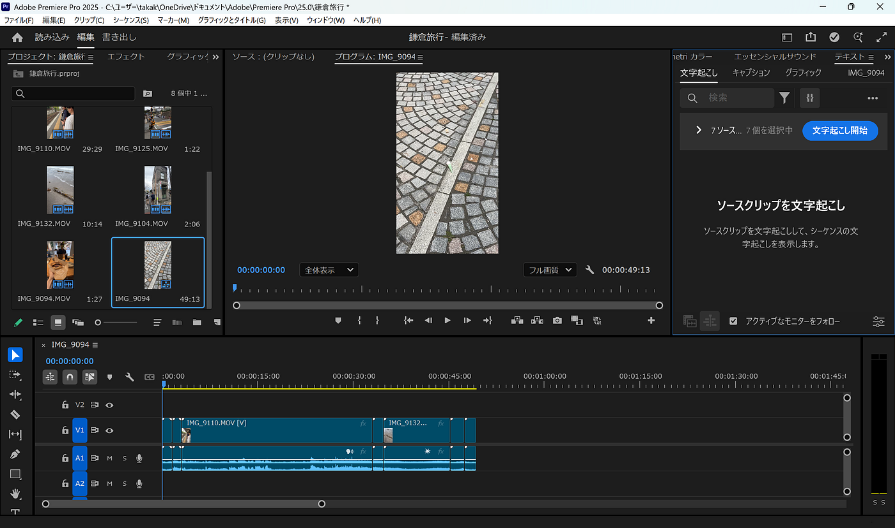
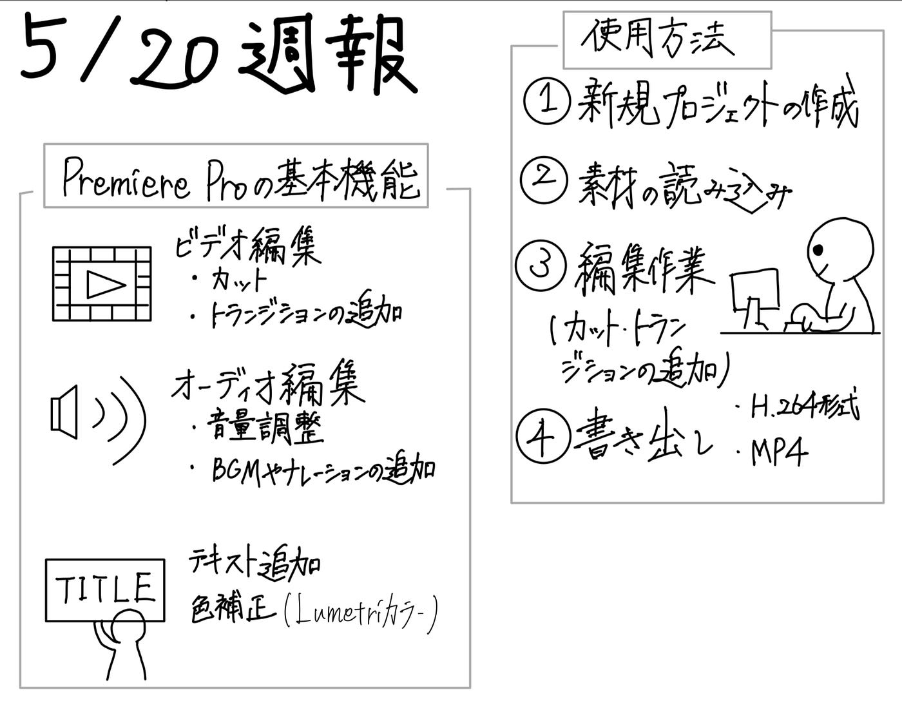

### Adobe Premiere Proに迫る！プロ仕様の映像編集ソフトを徹底調査【5/20 V&F週報】

> **はじめに**

こんにちは。高井健太郎です。
今週は、V＆FのTikTok運用に向けた仕込み期間の一環として、動画編集ソフトである**[Premiere Pro**](https://www.adobe.com/jp/products/premiere.html?sdid=WPHDJ43D&mv=search&mv2=paidsearch&ef_id=CjwKCAjwravBBhBjEiwAIr30VB-rBS3p-zbSbEtCE7CxR-4w1vYWbOgGXzN8nSd13gBIASxBo-fX_hoC3w4QAvD_BwE:G:s&s_kwcid=AL!3085!3!446333984564!e!!g!!premiere%20pro!739872410!102573497454&gad_source=1&gad_campaignid=739872410&gbraid=0AAAAAD7v3areivGR2DK6stEv30craOBgS&gclid=CjwKCAjwravBBhBjEiwAIr30VB-rBS3p-zbSbEtCE7CxR-4w1vYWbOgGXzN8nSd13gBIASxBo-fX_hoC3w4QAvD_BwE)について調査を行い、使用方法や活用事例、ビジネスモデルについて整理しました。

> **Premiere Proとは**

Premiere Proとは、[Adobe社](https://www.adobe.com/home?acomLocale=jp)が開発したプロフェッショナル向けの動画編集ソフトウェアです。
 動画の編集、カット、色調整、エフェクトの追加など、幅広い動画制作作業をこなせるように設計されています。

> **基本機能**

**1. ビデオクリップの編集**

- 必要なカットのみをつなげたり、カット間にトランジションを追加してシームレスに流れるよう編集できる。

**2. タイトル／テロップの追加**

- 映像上にテキストフィールドを挿入し、タイトルやテロップを表示可能。

- モーションエフェクトをつけて、動きのある文字表現も作れる。

**3. オーディオの編集**

- 音量の上げ下げや、BGM、ナレーションを追加できる。

**4. ビデオ補正／色補正**

- 色味やトーンを補正。

- 映像のばらつきが発生しないように、クリップごとに調整できる。

**5. 4K対応**

- 4K動画素材をそのまま取り込み、4K解像度で出力可能。

- 映像クオリティを落とさずに編集できる点が強み。

> **使用方法**

実際に、ゼミ男子メンバーの一部で鎌倉に行ったので、その時の動画を素材として少しいじってみました。

1. 新規プロジェクト作成

- Premiere Proを起動し、「新規プロジェクト」を選択。

- プロジェクト名を設定し、保存場所を決めて作成。

2.素材の読み込み

- 素材パネルで、編集に使用する動画ファイルや音声ファイルをインポート。

- ドラッグ＆ドロップでタイムラインに配置する。

3.編集作業

**・カット編集**

タイムライン上で不要部分を切り取る。

**・トランジション追加**

映像のつなぎ目に効果を入れ、滑らかに接続。

**4. 書き出し**

- 「ファイル」→「書き出し」→「メディア」で書き出し設定を選択。

> **どんな人が使用しているの？**

Premiere Proは、**プロフェッショナルな動画編集**から、趣味で動画を制作する個人まで、幅広い層が利用しています。
 特に、**YouTubeクリエイター**や**映像制作会社**、**映画業界**など、映像に関わる人々の間で高い人気があります。
 Adobeの他製品と連携しやすい点が、プロの現場で支持される理由です。

> **ビジネスモデル**

Premiere Proは有料ソフトで、**サブスクリプション（定額課金）形式**で提供されています。

#### プラン一覧（参考価格・税込）

- **単体プラン**：月額3,280円
 Premiere Pro単体利用。Adobe Express付き。

- **Creative Cloudコンプリート**：月額7,780円
 Photoshop、After Effectsなど20以上のAdobeソフトが使い放題。

- **学生・教職員向けプラン**：月額2,180円（学割適用）
 コンプリートプランが割安に。

用途に応じて、Premiere Pro単体か、他のAdobeソフトも使うかで最適なプランを選ぶ必要があります。

> **まとめ**

今回はPremiere Proについて調べましたが、自分自身も普段から使用しており、有料ソフトならではの高機能さや、映像のクオリティに徹底的にこだわれる点を改めて実感しました。
 一方で、機能が多く操作もやや複雑なため、初心者にとっては少しハードルが高いとも感じました。
 また、有料ソフトであることから、V＆Fとして全員が平等にアクセスできるツールを選ぶ必要があると考えています。
 そのため、今後のゼミ紹介動画ハッカソンでは、無料かつ高機能な[DaVinci Resolve](https://www.blackmagicdesign.com/jp/products/davinciresolve)の活用を検討した方が良いのではないかと思いました。

> グラレコ

> **参考資料**

Adobe公式サイト[https://www.adobe.com/jp/creativecloud/roc/products/premiere/beginner.html](https://www.adobe.com/jp/creativecloud/roc/products/premiere/beginner.html)

Premiere Proの製品情報（特徴・導入事例）[https://www.itreview.jp/products/premiere-pro/profile](https://www.itreview.jp/products/premiere-pro/profile)
