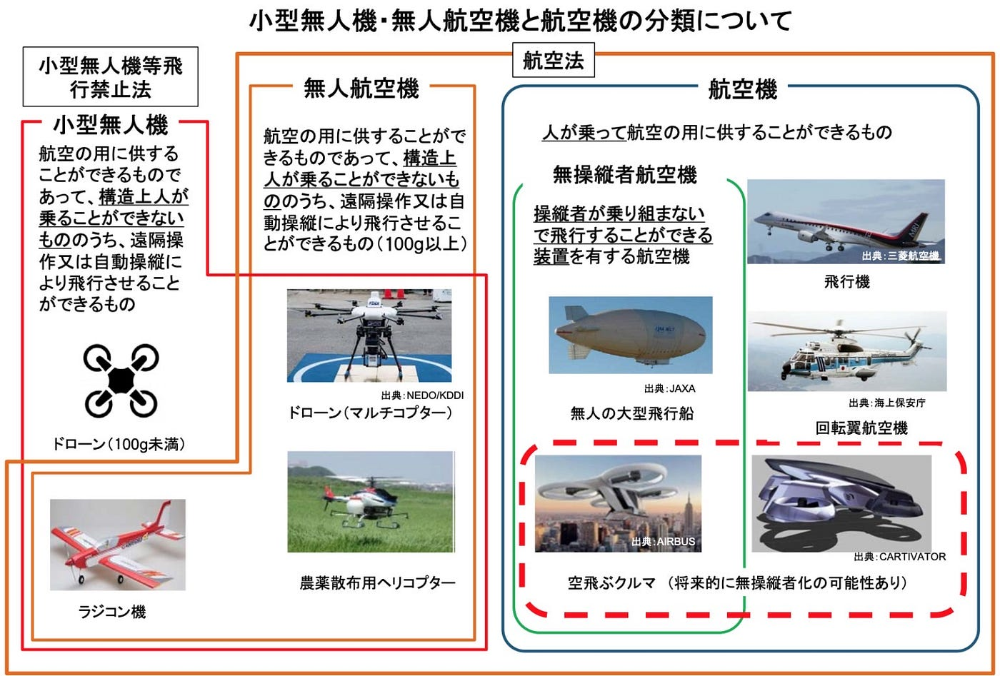
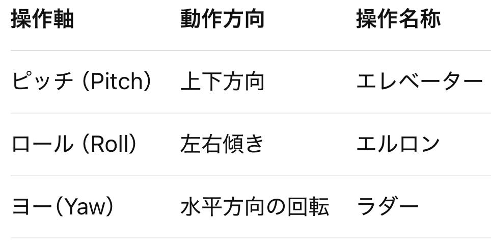
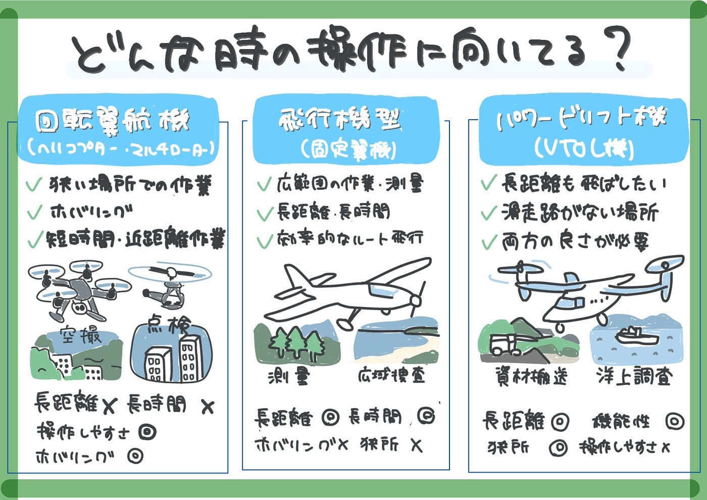

### 【5/20ドローン部２週報】ドローンの種類を学ぼう

こんにちは。三年の小崎です。

今週は、ドローン部2の三年はドローンについての事前知識がほとんどないため、ドローンを実際に操作する前に知識をつけよう！ということでドローンの種類と特徴について学びました。

### (1)機体の分類と特徴

小型無人機・無人航空機・航空機は、大きく以下のように分類され、それぞれ異なる特性を持っています。今回は小型無人機と無人航空機の２つについて深掘りしました。

#### 1.回転翼航空機（ヘリコプター型／マルチローター型）

**🎯特徴：**

・ローターの回転によって揚力を得て飛行。

- 垂直離着陸やホバリングが可能なため、狭い場所でも運用しやすい。

- マルチローターは構造が比較的シンプルで操縦しやすく、空撮や農業、インフラ点検などで広く使用されている。

- 一方で、風の影響を受けやすく、飛行時間や航続距離が短いというデメリットもある。

**✔ 向いている場面：**

- **狭い場所や障害物が多い場所での作業**

- **静止飛行（ホバリング）が必要な場面**

- **短時間・近距離のピンポイント作業**

#### 2.飛行機型無人機（固定翼機）

**🎯特徴：**

- 主翼により揚力を得て、前進運動を通じて飛行。

- 高速・長距離・長時間の飛行に優れており、広域測量や災害調査、物流に適する。

- 滑走が必要であるため、離着陸には広いスペースが求められる。

- 操作には「エレベーター（上下）」「エルロン（左右傾き）」「ラダー（方向）」の3軸操作が必要。

**✔ 向いている場面：**

- **広範囲の調査や測量**

- **長距離移動や長時間飛行が必要な場合**

- **効率的なルート飛行をしたいとき**

#### 3.パワードリフト機（VTOL型）

**🎯特徴：**

- 回転翼と固定翼のハイブリッド構造。

- 垂直離着陸が可能で滑走路を必要とせず、なおかつ高速・長距離飛行も実現可能。

- 「VTOL（Vertical Take-Off and Landing）」と呼ばれ、応用範囲が広いが、構造や制御が複雑なため運用難易度は高い。

**✔ 向いている場面：**

- **滑走路の確保が難しいけど、長距離も飛びたい時**

- **マルチローターと固定翼の“いいとこ取り”をしたい場面**

- **現場作業と基地間を1機でこなしたい時**

### （2）操作軸・制御方式の理解

すべての無人航空機には、機体の姿勢や移動を制御するための操作軸が存在しています。今回は以下の3軸について学びました。

### （3）モーター回転方向と安定性

マルチローターの安定飛行には、ローターの回転方向（CW：時計回り／CCW：反時計回り）のバランスが極めて重要です。
 このバランスが崩れると、反トルクが発生して飛行が不安定になるため、設計上、交互配置が基本となっています。

＜例＞
 クワッドコプターでは、対角線上で同じ回転方向になるように設定されており、それにより安定した姿勢制御が可能となる。

### （4）法制度と重量分類

- **100g未満**：法的には「模型航空機」扱いとなるが、事故時の責任は発生するため運用上の注意が必要。

- **100g以上25kg未満**：航空法上の「無人航空機」に該当し、飛行申請・許可が必要。

- **25kg以上**：大型無人航空機として分類され、より厳格な許可・機体検査・安全対策が求められる。

大型機は機体パワーが高く、墜落時のリスクが大きいため、操縦者の技術・飛行計画・安全管理が特に重要です。

### （５）所感・学びのポイント

- 同じ「ドローン」でも機体構造により得意な用途や操作方法が大きく異なることを再認識しました。

- マルチローターは操作性が高く汎用性がある一方、長距離飛行には不向きであり、飛行機型やVTOLの必要性も理解できた。

- 安定飛行のための回転方向設定や、操作軸のバランス調整の重要性を深く学ぶことができた。

参考資料

Drone Navigator『ドローンの種類一覧【全11種類を網羅！】』[https://drone-navigator.com/drone-type](https://drone-navigator.com/drone-type)（参照日：2025年5月19日）

以下グラレコです。

