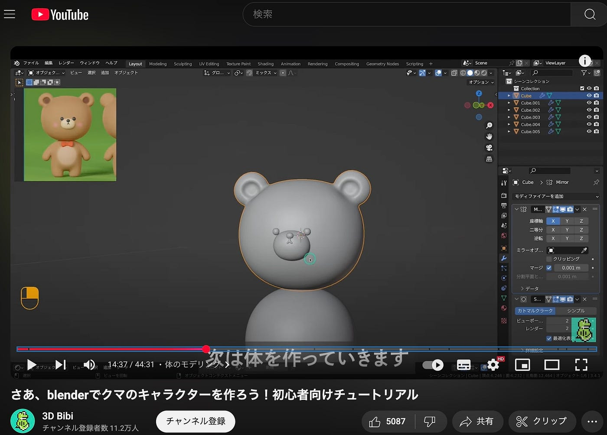
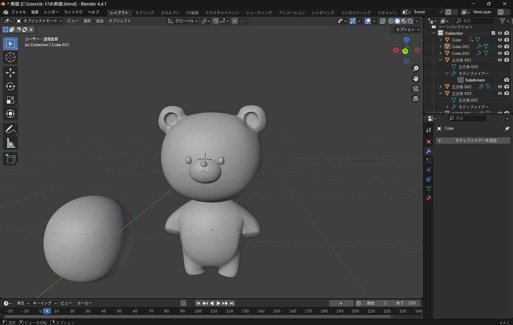
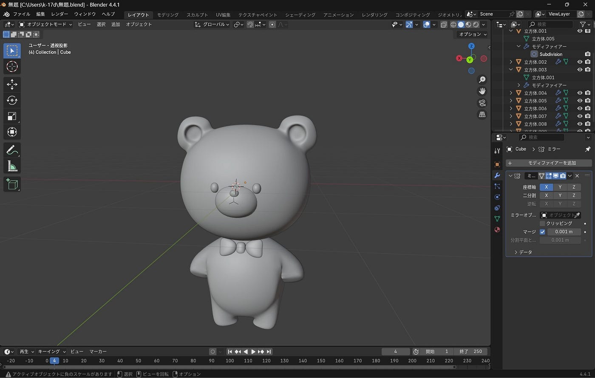
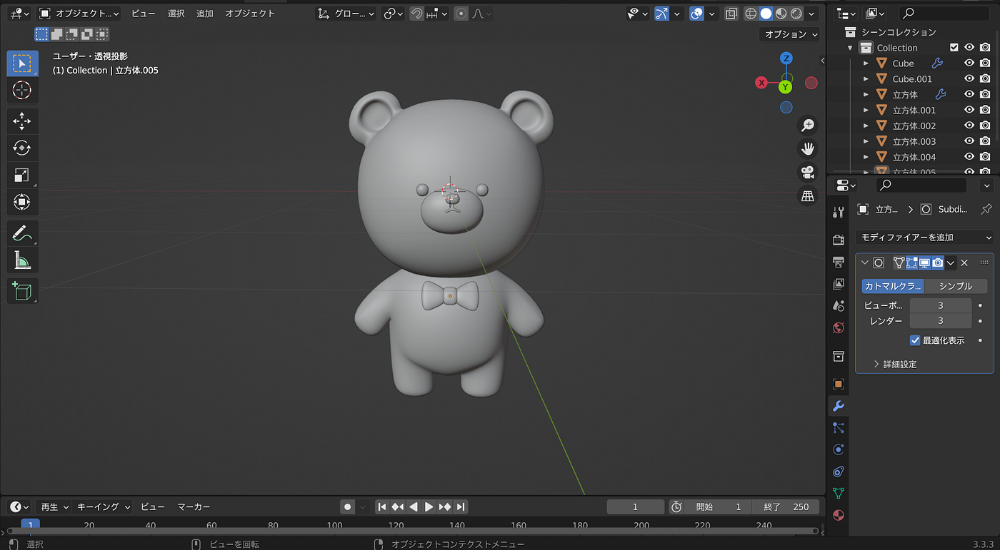
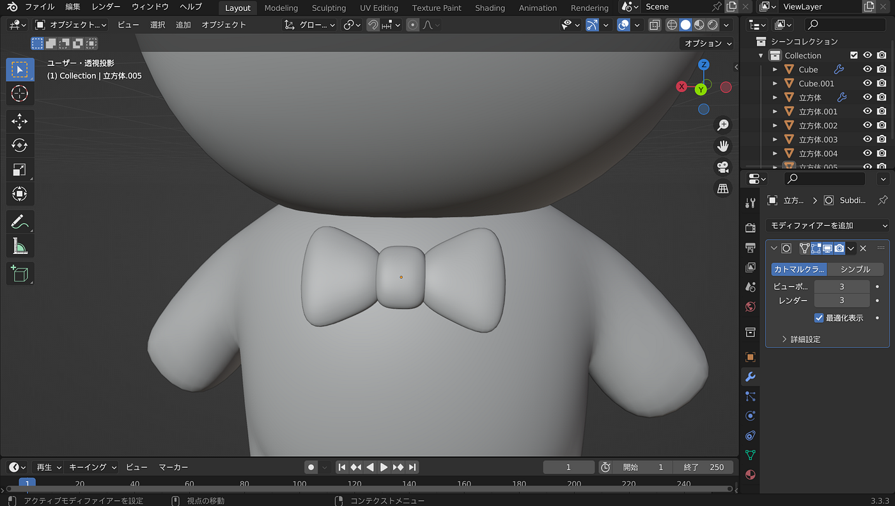
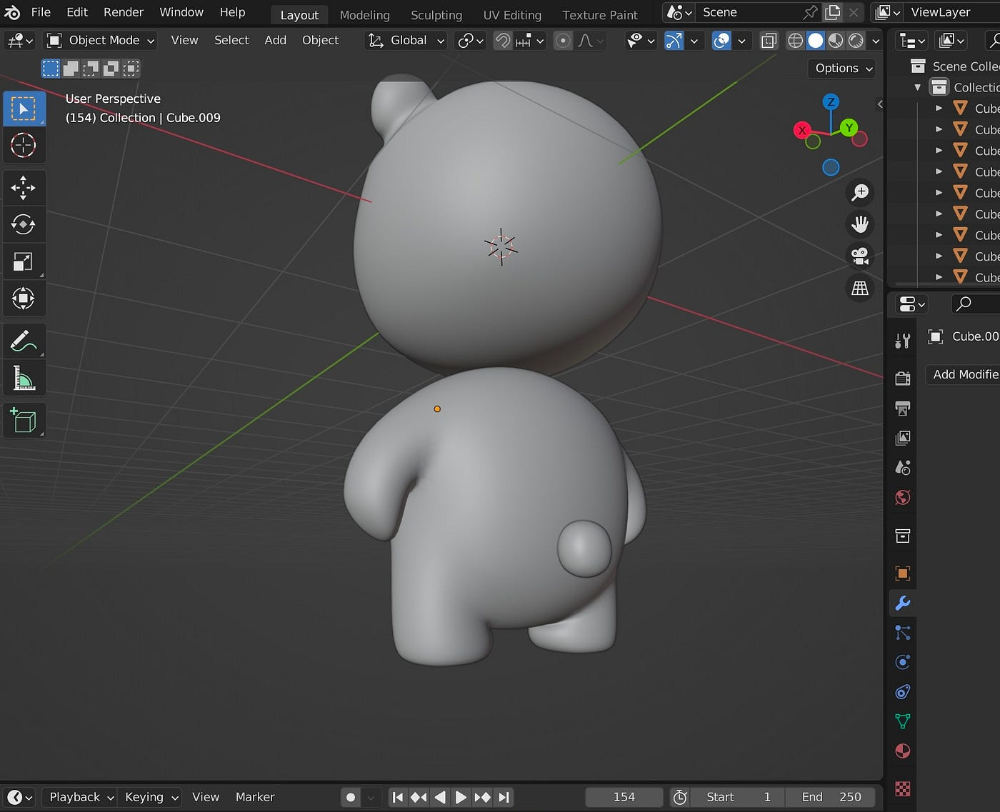
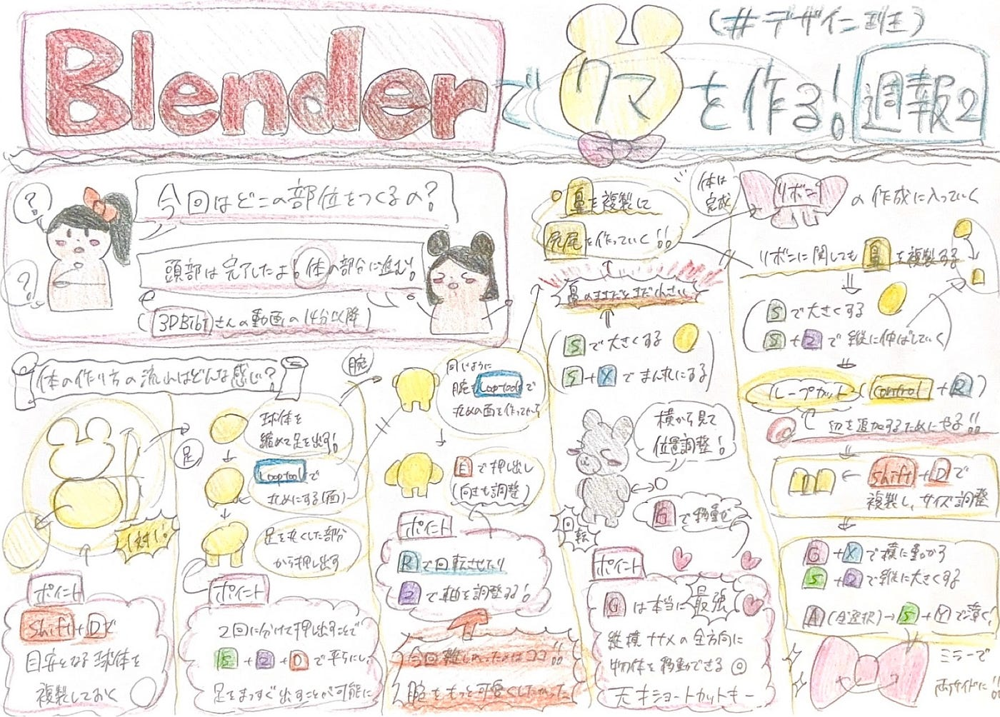

### Blenderでクマを作る！【5/20デザイン週報】

こんにちは、四年の福田です！

今週はハッカソン前の内容に続き、Blenderでクマを作る作業に取り組みました。

参考にしている動画↓

今回は頭の部分が終わっているので、体の部分に進みました。

#### グループメンバーの進度と感想

ゆうか

隣に球体を設置しておくことで、胴体のバランスを考えやすくすることができてよかったです。動画よりもお腹の部分を丸みを帯びさせるようにさせて可愛らしい体型にしました。リボンも横に伸ばした形にして自分好みに工夫してみました。今回の反省点としては、手先があまり綺麗に作れなかったことです。これからはしっかりとした円柱型に腕を作れるようになりたいです。

ちはな

全体のバランスを意識して制作しました。動画では1対1で作っていましたが、少し頭が大きくなるように作りました。

肩のラインがガタガタにならないように意識しました。

こうな

足はそんなに難しく感じなかったが、手の部分の作業が難しく、可愛くできなくて喧嘩につようそうなクマになっているので、これから少し調整していきたいと思います。

グラレコ

（ゆうか）
