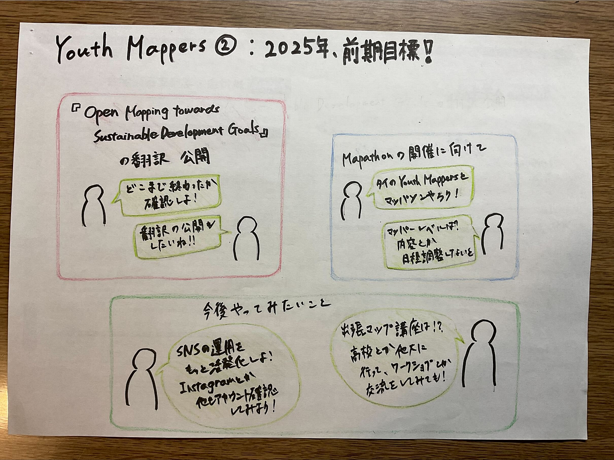

### Youth Mappers ②：2025年、前期目標！！

週報を担当する寺土日南子です。

Youth Mapper ②は5月18日（日）21:00~から15分ほどLINE電話で前期（~９月）目標について話し合った。

話し合いの結果、前期は基本的に去年の活動を引き続き行うことにした。

去年の活動は、

Open Mapping towards Sustainable Development Goals の翻訳

Mapathonの開催準備

の2つである。

> **Open Mapping towards Sustainable Development Goals の翻訳公開**

Youth Mappers AGUの学生チームは、オープンアクセス書籍『_[Open Mapping towards Sustainable Development Goals_](https://link.springer.com/book/10.1007/978-3-031-05182-1)』の日本語翻訳を通じて、グローバルなマッピング知識のローカライズと非英語圏の学生への認知向上を目指している。

昨年のYouthの活動としてメインで行った翻訳作業だが、推敲作業が不十分である。また、翻訳自体は終了している（昨年の10月のハッカソン時）が、未完成部分もあるため整理する作業が必要。

最終的には、翻訳したものを公開することを目標に活動を始めていく。

> **Mapathonの開催に向けて**

2025年に他大学（タイのシーナカリンウィート大学）との協働による、マッパソンを予定している。準備過程では、昨年行ったマッパソンや新三年生に向けた与論島マッパソンアンケート等を参考にしながら準備を進める。前期中（仮：７月予定）に実施を目指したいと考えている。

マッパソンを開催するにあたって、現地学生のレベルが不明であることからマッパーレベルや学年などの調査（アンケート？）を行う必要がある。

現在、マッパソンの内容や上記のアンケート実施と共に日程調整も進めながら動き出していく。

> **今後やってみたいこと**

● SNSの運用

Youth Mappers にもSNS（Instagram, Facebook, X等）が存在するが、実際に運用できるのがInstagramとなっており、主にInstagramを中心にYouth の活動も発信できれば良いと考えている。

● 出張マップ講座

Youth Mappersの認知拡大を目標に、高校生や他大学への出張講座の実施といったアイデアがある。

以上がYouth Mappers②の前期目標です。

グラレコ

