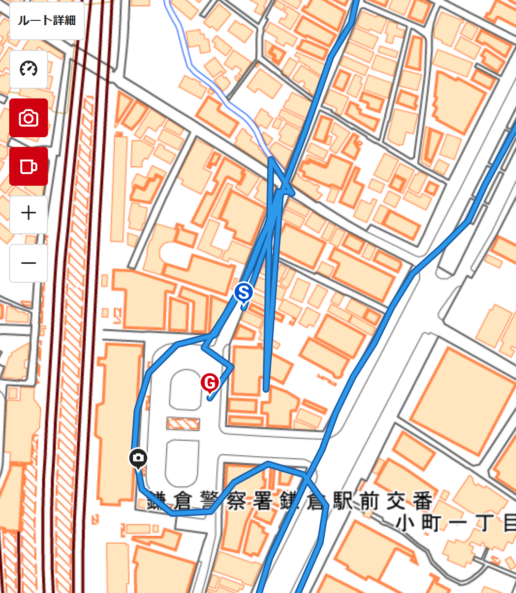
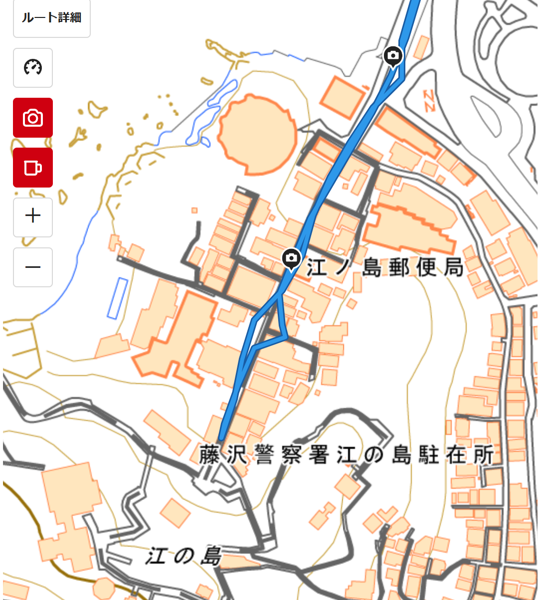
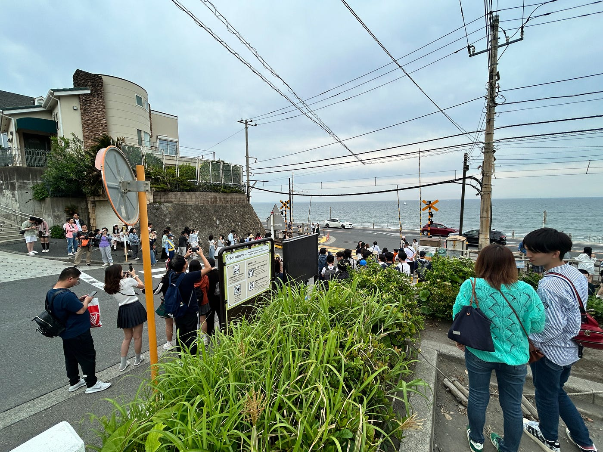
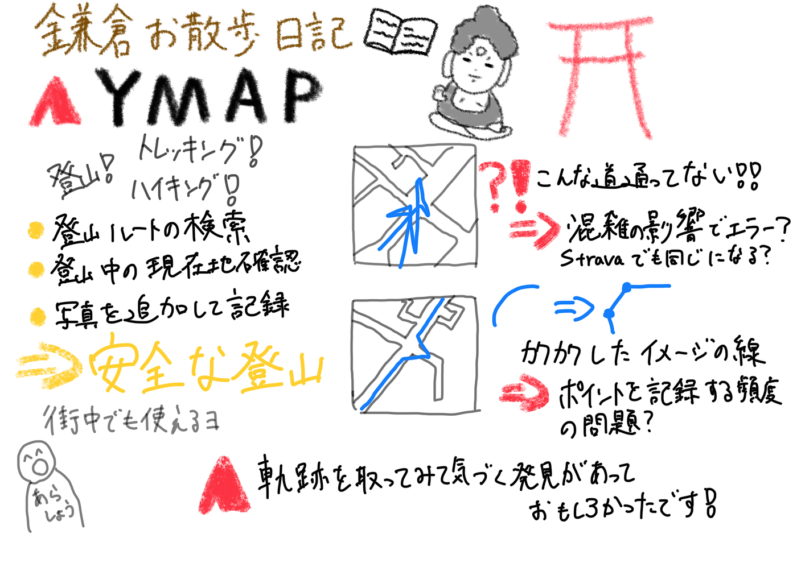

### 【5/20 Youth① 週報】鎌倉お散歩日記

こんにちは！Youth Mappers①の荒川です。

最近は、山に行ったり出かけたりとアクティブな生活をしています。今週末も山梨にハイキングに行く予定です！

今週の週報は、16日の金曜日にリト・ユウダイ・たかけんくんと鎌倉・江の島に遊びに行った際の移動の軌跡から考えたことを共有しようと思います。

#### 使用したツール

今回は、[YAMAP](https://yamap.com/)というアプリケーションを使用し、移動を記録しました。

YAMAPは、登山やトレッキング中に使用することが主な使い方で、移動距離はもちろん、高低差なども記録することができます。全国の登山ルートも検索することが可能で、登山中には電波が届かない場所でも現在地を確認することができるため、安全な登山にもってこいのアプリケーションです。

また、今回のように街中でも使用することが可能で、位置情報が付与された写真を追加して、軌跡を撮影した写真とともに振り返ることができます。

こちらがYAMAPの軌跡です。

[ScreenRecorder-YAMAP 2025-05-16_232249.mp4
Edit descriptiondrive.google.com](https://drive.google.com/file/d/1DUDSkqPaAVAjHv6ugYCTuHRQ5fIm9I-V/view?usp=sharing)

#### １日の流れ

12:00 鎌倉駅に集合

12:30 駅付近のハンバーガー屋さんで昼食

14:00 和田塚駅から江ノ島電鉄で鎌倉高校前駅に到着

14:45 そのまま江の島までお散歩＆たかけんくんと解散

15:30 江の島を観光した後、自転車をレンタルして鎌倉へ出発

16:00 鎌倉に到着し、鶴岡八幡宮へ おみくじは凶でした、、、。

18:00 少し休憩して解散

#### 考えたこと

こちらは、合流してすぐに小町通りに行った際の軌跡です。修学旅行生や観光客で溢れかえっており、YAMAPの画面上に「位置情報が不正確です」といった表示が出ていました。実際に確認してみると、道から外れて建物内を移動しているような軌跡になっており、混雑している場所では正確な記録が難しいのだろうと考えました。

また、今回はYAMAPだけで記録を行いましたが、Stravaなどほかのツールを使用しても同じようにエラーが発生するのか、次回は比較して調べてみようと思います。

こちらは、江の島を散歩した際の軌跡です。中央の道から外れてわき道に入りました。しかし、三角形のような軌跡になっており、直線に近い記録のされ方になっているなと感じました。他の地点を確認しても、曲線の表現よりも、直線といった感想を持ったので、ポイントを記録する頻度が私が思っていたよりも少ないのだろうと考えました。

小町通りのように混雑の影響も考えられますが、画面に位置情報不正確の案内が出ていなかったので、YAMAPの仕様なのだろうと考えました。

([ヘルプページ](https://help.yamap.com/hc/ja/articles/900006794703-%E3%81%A9%E3%82%8C%E3%81%8F%E3%82%89%E3%81%84%E6%B4%BB%E5%8B%95%E3%82%92%E8%A8%98%E9%8C%B2%E3%81%A7%E3%81%8D%E3%81%BE%E3%81%99%E3%81%8B#:~:text=%E6%A6%82%E3%81%AD100km%E3%81%BE%E3%81%9F%E3%81%AF1%E9%80%B1%E9%96%93%E4%BB%A5%E4%B8%8A%E3%81%AE%E9%95%B7%E6%9C%9F%E3%81%AE%E6%B4%BB%E5%8B%95%E3%81%AE%E5%A0%B4%E5%90%88%E3%81%AF%E6%B4%BB%E5%8B%95%E6%97%A5%E8%A8%98%E3%82%92%E5%88%86%E5%89%B2%E3%81%97%E3%81%A6%E8%BB%8C%E8%B7%A1%E3%82%92%E4%BF%9D%E5%AD%98%E3%81%97%E3%81%A6%E3%81%8F%E3%81%A0%E3%81%95%E3%81%84%E3%80%82%20YAMAP%E3%81%A7%E3%81%AF%E7%B4%8420m%E9%96%93%E9%9A%94%E3%81%A7%E4%BD%8D%E7%BD%AE%E6%83%85%E5%A0%B1%E3%82%92%E8%A8%98%E9%8C%B2%E3%81%97%E3%81%A6%E3%81%84%E3%81%BE%E3%81%99%E3%80%82%20%E3%81%9D%E3%81%AE%E5%9C%B0%E7%82%B9%E3%81%8C20%2C000%E3%82%92%E8%B6%85%E3%81%88%E3%81%9F%E5%A0%B4%E5%90%88%E3%80%81%E6%B4%BB%E5%8B%95%E6%97%A5%E8%A8%98%E3%81%AB%E8%BB%8C%E8%B7%A1%E3%82%92%E8%A1%A8%E7%A4%BA%E3%81%99%E3%82%8B%E3%81%93%E3%81%A8%E3%81%8C%E3%81%A7%E3%81%8D%E3%81%BE%E3%81%9B%E3%82%93%E3%80%82%20%E3%83%87%E3%83%BC%E3%82%BF%E3%81%AE%E5%AE%B9%E9%87%8F%E3%81%8C%E5%A4%A7%E3%81%8D%E3%81%84%E5%A0%B4%E5%90%88%E3%80%81%E6%B4%BB%E5%8B%95%E6%97%A5%E8%A8%98%E3%81%AE%E3%82%A2%E3%83%83%E3%83%97%E3%83%AD%E3%83%BC%E3%83%89%E3%81%8C%E3%81%A7%E3%81%8D%E3%81%AA%E3%81%84%E5%A0%B4%E5%90%88%E3%81%8C%E3%81%82%E3%82%8A%E3%81%BE%E3%81%99%E3%80%82%20%E3%81%93%E3%81%AE%E8%A8%98%E4%BA%8B%E3%81%AF%E5%BD%B9%E3%81%AB%E7%AB%8B%E3%81%A1%E3%81%BE%E3%81%97%E3%81%9F%E3%81%8B%EF%BC%9F,%C2%A9%20YAMAP%20INC.%20All%20Rights%20Reserved.)を確認したところ、約20メートル間隔で位置情報を記録していることが分かりました。)

#### 感想

軌跡をとりながら行動してみると、普段はなんとなく抱いた感想に根拠が持てるなと感じました。私は、鎌倉は坂道が多いなというイメージを持っています。今回は平たんな道が多かったのであまり参考になりませんでしたが、移動の高低差データから実際にはどうなっているのか確認することも面白いなと思いました。

特に小町通りや鎌倉高校前駅に外国人観光客が多いなと感じました。鎌倉高校前駅の踏切は、アニメ化もされている漫画「SLAM DUMK」に登場した場所として有名で、警備員が配置されるほど混雑していました。私たちも、訪れてみましたが、踏切のすぐ近くは住宅街となっており、車通りも多い場所なので近隣の住民の方々はかなり苦労しているだろうと感じました。また、正直ただの踏切だろうという感想を持ったので、「SLAM DUMK」の人気と影響力は大きいなと感じました。

軌跡を取ることで見えてくる発見もあったので、今後もどこかに出かけた際はYAMAPを起動してみようと思います！

#### グラレコ

