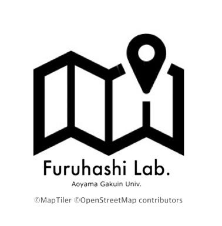
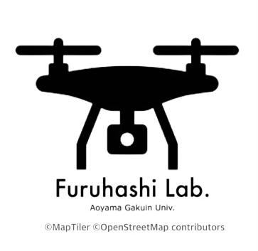
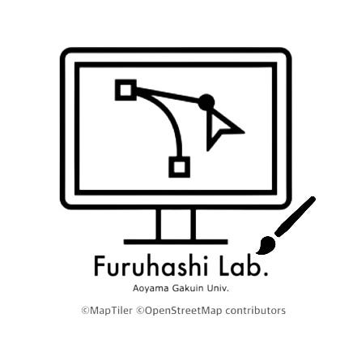
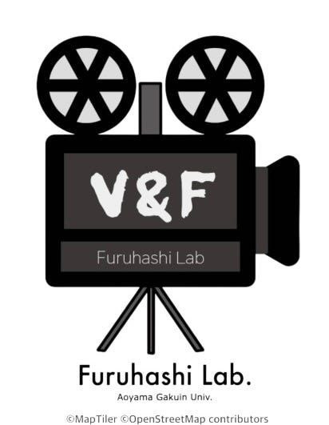
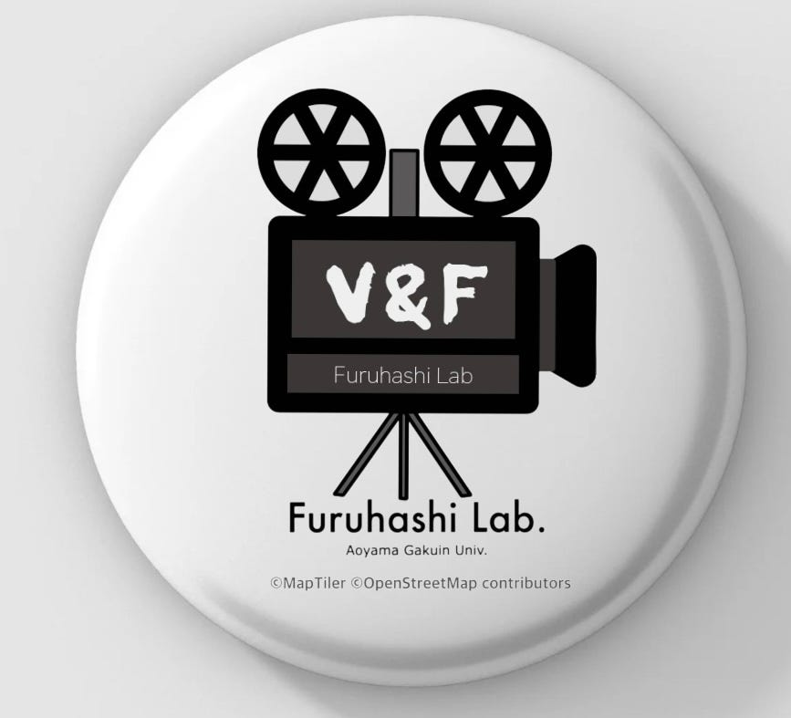
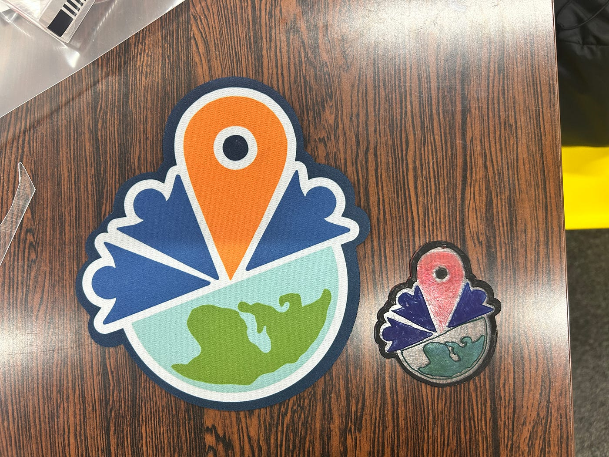
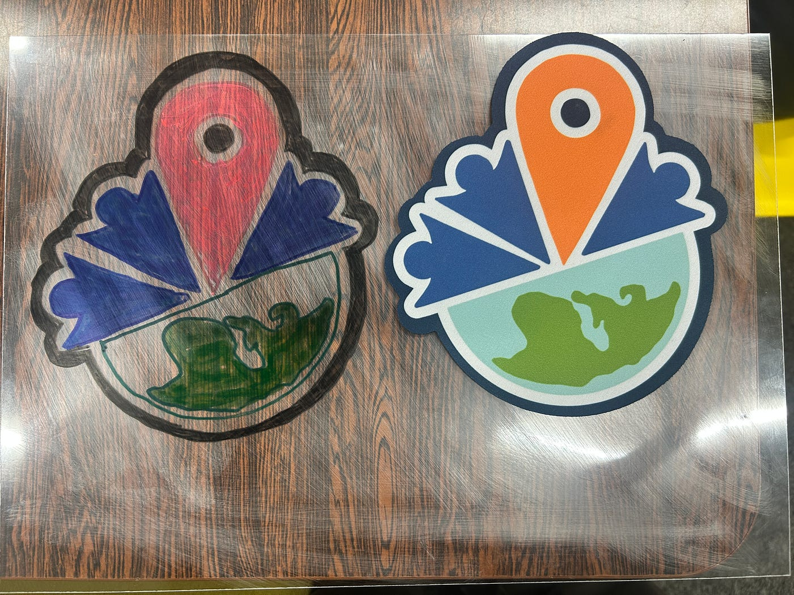
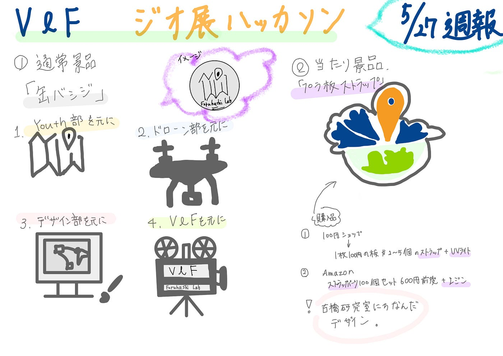

### 【5/27週報】V＆F ジオガチャ案

こんにちは！V＆Fの荒川です。先週の週末は山梨の清里地区に森林浴に行ってきました！留学中に知り合ったタイの方々と同行して、久しぶりに会うことができてうれしかったです！

今週の週報では、7月2日（水）に開催されるジオ展に設置予定のジオガチャの景品案を紹介します！

#### 案１(通常景品)

通常景品としては「缶バッジ」を提案します。

研究室に缶バッジ制作キットがあるとのことなので、そちらを使用させていただこうと考えています。

こちらはデザイン案です！

それぞれの部にちなんだデザインを使用し、古橋研究室らしさを意識しようと思います。

#### 案２(当たり景品)

当たり景品としては「プラ板ストラップ」を提案します。

試しに作ってみました！

購入が必要なものは、

・プラスチック板（今回使用したものはB4サイズ、0.03ミリ）

・ストラップパーツ

・レジン

・UVライト

です。

プラ板は、今回100円ショップで購入しました。サイズにもよりますが、1枚100円の板から2～5個のストラップを作るのが妥当かなと思います。

ストラップパーツについては、[Amazon](https://www.amazon.co.jp/100%E6%9C%AC%E3%82%BB%E3%83%83%E3%83%88-%E3%82%B9%E3%83%88%E3%83%A9%E3%83%83%E3%83%97-%E3%83%95%E3%83%83%E3%82%AF%E4%BB%98%E3%81%8D-%E3%82%A2%E3%82%AF%E3%82%BB%E3%82%B5%E3%83%AA-USB%E3%83%A1%E3%83%A2%E3%83%AA/dp/B0B5SWMTWR/ref=sr_1_16?__mk_ja_JP=%E3%82%AB%E3%82%BF%E3%82%AB%E3%83%8A&crid=1QOOM5M4SNP09&dib=eyJ2IjoiMSJ9.Ux8JnTgj0e1N1wh8pbQfLCqFr092HFwMeUwETrgVI9vHsLatxp4nh6v98eMduBHkHveYB_mySf1Rw9GEuN6eEomiuWieZel9YcRliosr2BqwvxVdnF_UWRaiQ86tYtP5gL0flYiLZVyGXaQYenzJ7QITkZ6vrp6ABO4IFaVgnEx3alxyAWk9-qMFLtHhzGV7ZlPR3QTENRZnQtZOlVf66vFLsBteWqOS7qwX225M_V_SF4VeO2UOvs43mxf50V5o5mdNA4EjSTH693Kenrb10eUP9HI8bpAA1rJZMe8moa4.c8jIuGffsQFSqh7j87A1Do9sx8B42LDxDTpRXedFv-k&dib_tag=se&keywords=%E3%82%AD%E3%83%BC%E3%83%9B%E3%83%AB%E3%83%80%E3%83%BC%2B%E3%83%91%E3%83%BC%E3%83%84&qid=1748012064&sprefix=%E3%82%AD%E3%83%BC%E3%83%9B%E3%83%AB%E3%83%80%E3%83%BC%E3%83%91%E3%83%BC%E3%83%84%2Caps%2C256&sr=8-16&th=1)で100個セットが600円前後で購入できます。

レジン・UVライトも100円ショップで購入可能でした。制作する数にもよりますがレジンは[Amazon](https://www.amazon.co.jp/Bonsky-LED%E5%AF%BE%E5%BF%9C%E3%83%AC%E3%82%B8%E3%83%B3%E6%B6%B2-%E3%83%8F%E3%83%BC%E3%83%89%E3%82%BF%E3%82%A4%E3%83%97%E6%88%90%E5%BD%A2-UV%E3%83%AC%E3%82%B8%E3%83%B3%E6%B6%B2DIY%E6%89%8B%E4%BD%9C%E3%82%8A%E8%A3%85%E9%A3%BE%E6%80%A5%E9%80%9F%E3%81%AB%E7%A1%AC%E5%8C%96-%E4%BD%8E%E3%82%A2%E3%83%AC%E3%83%AB%E3%82%AE%E3%83%BC%E6%80%A7/dp/B0C462KY1Q/ref=sr_1_2_sspa?__mk_ja_JP=%E3%82%AB%E3%82%BF%E3%82%AB%E3%83%8A&crid=2E6MGQ7Q04KGA&dib=eyJ2IjoiMSJ9.9Cakc2iHSkrC2aCfKEVCnJBykV2fXNg2RZMlgH0ZcXY1prsxUWb3q0JUyMQK2UPDilPzLthW0v7heefe9ZLOZkP4WaLmJ4C0JP77IZa_-uJz_5Dyt8AunmsEWkf_Sgd4QBtJ_BbP3GhNWalOf3mTF6ZzONyTGvzbgY3UKM-enSV8QfBGzZ26dv1KmIIu64NQTamXcso7fdZWaFScDjYIF-k6TWY7QVKW2g2YUad0cGI8ZR3PSdSdyoeSKezMrx67XSpjtBhGIU_Wte0OYK43bxcd4ZSWIHBQ2vTaREOcn3A.USZ2bUJBHkwVsu82E5Lm1J-Xex5qZgiTVgH05bWlZ9U&dib_tag=se&keywords=%E3%83%AC%E3%82%B8%E3%83%B3&qid=1748012404&sprefix=%E3%83%AC%E3%82%B8%E3%83%B3%2Caps%2C183&sr=8-2-spons&sp_csd=d2lkZ2V0TmFtZT1zcF9hdGY&th=1)で買ったほうが安いと思います。UVライトに関しては、100円ショップで1個300円で購入できるので、そちらをいくつか購入する方法が効率的かなと思います。

デザインに関しては、缶バッチと同じく古橋研究室にちなんだものを使用するつもりです。

しかし、レジンを塗っても手作り感が否めなかったので、クオリティよりも、「手作り感」で売り出すほうが良いだろうと思いました。

機能性として、ストラップではなくマグネットにする案も出ました！

また、除光液を使えば、プリントした写真を板に転写できるそうなので、アクリルスタンドのようなものを作ってみても面白いかなと思いました。

1個当たり約80～100円前後で制作できますが、1個あたりの制作にかかる時間が長いので、当たり景品として提案します。

#### グラレコ

