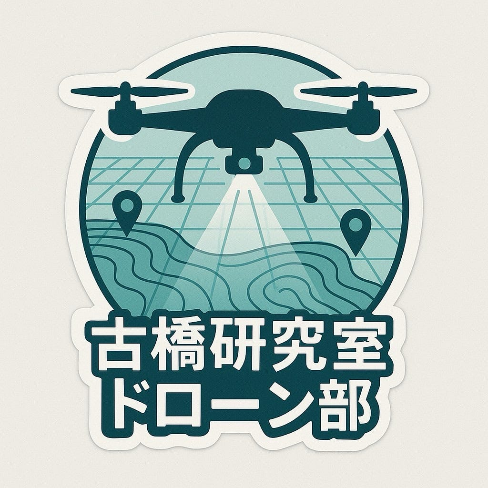
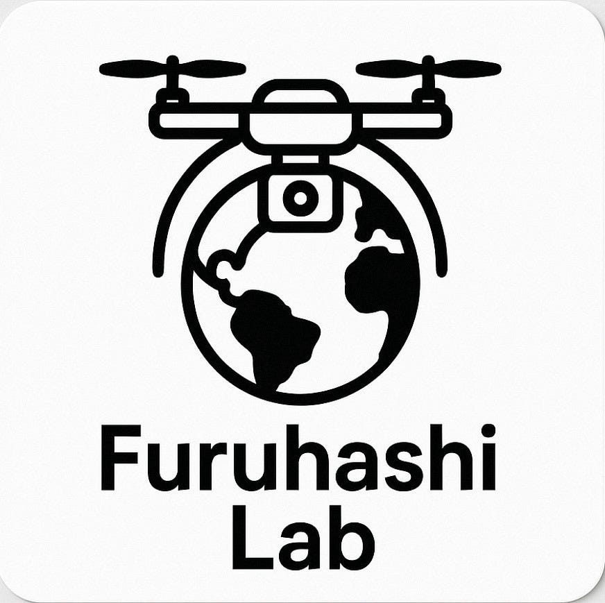
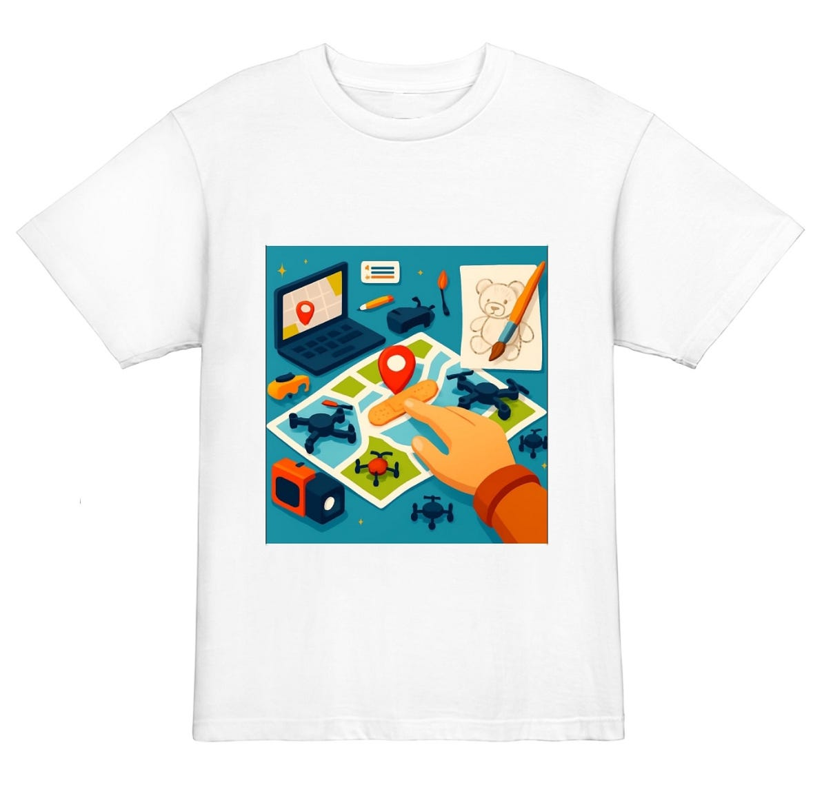
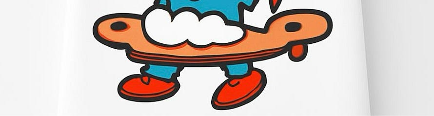
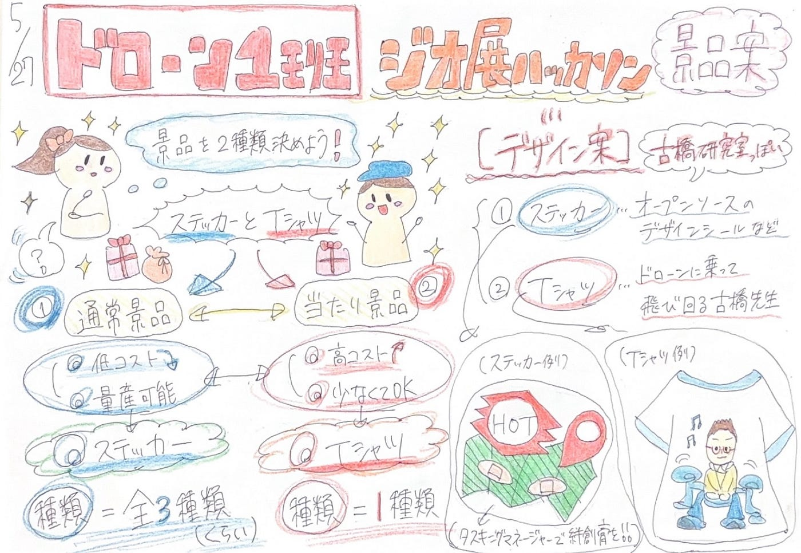

## ジオ展用景品について！【5/27ドローン1週報】

こんにちは、三年の稲田です！

今週のドローン1班は、7月2日に開催予定のジオ展ハッカソンにむけて、ガチャガチャの景品案とデザイン案を考えました。

まず、全体で話し合い、通常景品と当たり景品の2種類を提案することになりました。

そこで、私たちの班からは、通常用としてステッカー・当たり用としてTシャツを作るというふたつの案が出ました。

### **①ステッカー**

ステッカーのデザインとしては、古橋研究室らしいワードの入ったデザインや、オープンソース・ドローンなど、ゼミで実際に使用しているものを用いたイラストの案などが挙がりました。

（ゆかり）

（リト）

（れんせい）

（もえ）

### **②Tシャツ**

Tシャツのデザインとしては、まず古橋先生がドローンに乗って飛びながら地図を考えているという構図を考えました。他にも、ここ数ヶ月のゼミでの活動内容を含んだデザインの案も考えました。

（ゆうか）

生成AI([ChatboxAI](https://chatboxai.app/ja))を使ってデザインを考える上で難しいと思ったのは、作られた絵に対して追加で直して欲しい箇所を伝えた時に、途中から飛行機のようなものに乗ってしまったり、足がとび出てしまったりした点でした。そこで、「〜部分の絵はこのままで〜して」という文脈にするとデザインが変わりにくくて解決策になると思いました。

デザインのプリントは研究室にある機械でできるため、印刷以前に予算がかかるTシャツは大当たりとして数枚にすればよいと思いました。

グラレコ

