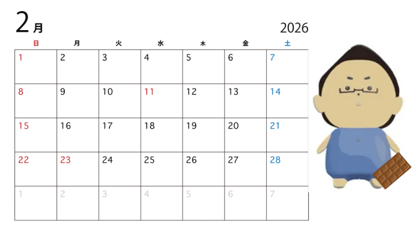
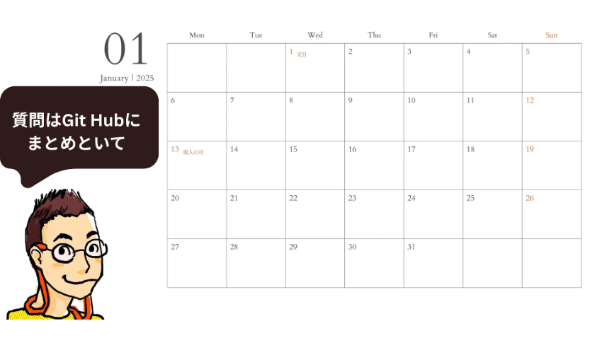
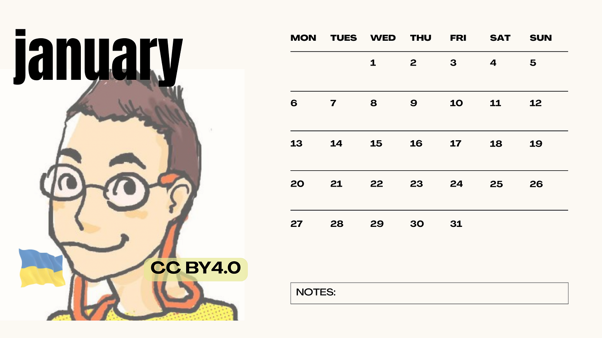
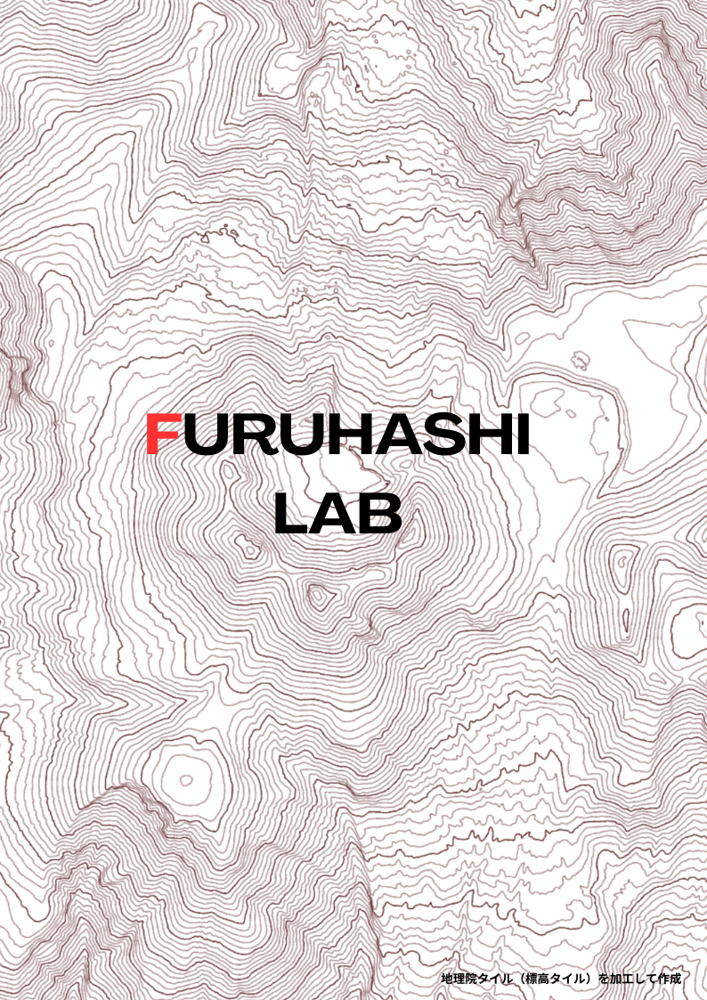
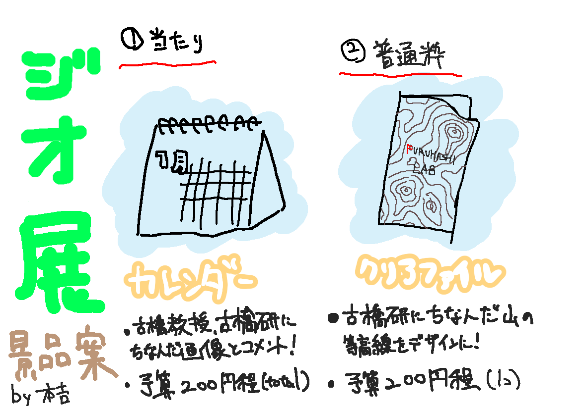

### 【ドローン部2 】 ジオ展に向けたガチャガチャ景品案

こんにちは！

ドローン2の本吉顕です。暑い日が続きますがいかがお過ごしでしょうか。私は運動のおかげで例年より新陳代謝が上がり、一層暑く感じて早速汗を流しています。

さて、今回の週報では7月2日に開催されるジオ展2025に向けて、古橋ゼミで取り組むガチャガチャの景品のアイデアを紹介します！

### その１ 日めくりカレンダー

これはガチャガチャの当たりの景品としての製作を予定しています。デザインとしては古橋教授や古橋ゼミ、ジオに関係するものの写真と共に一言添えたものを予定しています。

#### 材料（すべて100円ショップで揃う or 自宅プリント）

• A4コピー用紙（または厚紙）×5セット分

• リング・クリップ・ホチキス（製本用）

• 自作テンプレート or 無料テンプレート（PDF）

予算（5部分）

項目 数量 金額（目安） 備考

A4コピー用紙（12枚×5部＝60枚） 1袋 約100円 ダイソー等で60〜100枚入

印刷代（モノクロ片面） 60枚 約60円 自宅なら無料、コンビニなら1枚1円×60

製本用品（クリップ・リング・糊など） 適量 約40円 共有使用で1セット分として計算

→研究室備品で対応可能

合計 — 約200円以内 1部あたり約40円

#### 作り方

1. 無料テンプレートをネットでダウンロード（または自作）

2. A4サイズで12ヶ月分を印刷（1ヶ月＝1枚）

3. 上部をホチキス留め・パンチ＋リング・クリップなどで製本

4. 表紙を追加すればより仕上がりが良くなる

ポイント

• 卓上タイプにしたい場合は、厚紙で台紙をつけると安定する

• 無料テンプレート例：イメージ案としては以下のようになります。

仮案その１

仮案その２

仮案その３

### その2 クリアファイル

クリアファイルの表面に等高線によるデザインをプリントします。NANGAで有名な等高線のデザインですが、古橋ゼミの特色を活かして他の山を元にした等高線をデザインしようと考えています。（仮案）ちなみに元ネタのNANGAはNanga Parbatというヒマラヤ山脈に位置する標高8126mを誇る世界で9番目に高い山の等高線をデザインに取り入れています。このデザインを我々でオマージュするにあたって二つの山を候補にしています。。

[ナンガ パルバット コントアーマップ バンダナ
ナンガの定番モチーフをバンダナに…store.nanga.jp](https://store.nanga.jp/products/nanga-parbat-contour-map-bandanna?srsltid=AfmBOor58v8BR0Rn0_rPHEvPaeK1lL48AYXclww8LwiQ0r-8tPn7hiRE)

1, 金峰山…古橋教授の元バイト先。

2, 乗鞍岳…[古橋教授の修士論文](https://github.com/furuhashilab/original_articles_TaichiFuruhashi)のフィールド

### ✅ 商業利用が可能となる理由と該当規定

国土地理院の「コンテンツ利用規約」では、同院が提供するコンテンツ（例：地理院タイル）を編集・加工して利用する場合、以下の要件を満たすことで、申請不要で商業利用が可能とされています。

#### 1. 出典の記載

コンテンツを利用する際は、出典を記載する必要があります。

[https://www.gsi.go.jp/common/000107565.pdf?utm_source=chatgpt.com](https://www.gsi.go.jp/common/000107565.pdf?utm_source=chatgpt.com)

> _出典記載例：
 出典：国土地理院ウェブサイト（当該ページのURL）_

[https://www.gsi.go.jp/common/000268116.pdf?utm_source=chatgpt.com](https://www.gsi.go.jp/common/000268116.pdf?utm_source=chatgpt.com)

#### 2. 編集・加工したことの明示

編集・加工等を行った場合は、出典とは別に、その旨を記載する必要があります。[https://www.gsi.go.jp/REPORT/TECHNICAL/riyoukiyaku_gijutsushiryou.html?utm_source=chatgpt.com](https://www.gsi.go.jp/REPORT/TECHNICAL/riyoukiyaku_gijutsushiryou.html?utm_source=chatgpt.com)

> _編集・加工等を行ったことの記載例：
 地理院タイル（標高タイル（基盤地図情報数値標高モデル））を加工して作成[https://www.gsi.go.jp/common/000268116.pdf?utm_source=chatgpt.com_](https://www.gsi.go.jp/common/000268116.pdf?utm_source=chatgpt.com)

これは、編集・加工した情報を、あたかも国土地理院が作成したかのような態様で公表・利用しないための措置です。[https://www.gsi.go.jp/common/000268116.pdf?utm_source=chatgpt.com](https://www.gsi.go.jp/common/000268116.pdf?utm_source=chatgpt.com)

これらの規定は、国土地理院の「コンテンツ利用規約」および「出典の記載」に明記されています。

#### 申請が必要な場合

国土地理院データの商用利用（等高線を使ったクリアファイル販売）
1. 承認が必要な場合
販売目的で使う場合、国土地理院の承認が必要（測量法に基づく）。

2. 出典と加工の明記
製品に以下を記載：

「出典：国土地理院ウェブサイト（[https://www.gsi.go.jp/kikakuchousei/kikakuchousei40182.html](https://www.gsi.go.jp/kikakuchousei/kikakuchousei40182.html)）」

「国土地理院の地理院タイルを加工して作成」

3. 承認申請方法
下記ページから申請：
[https://www.gsi.go.jp/LAW/2930-qa.html](https://www.gsi.go.jp/LAW/2930-qa.html)

#### **材料**

• OHPフィルム（インクジェットプリンター対応）

• 無地クリアファイル（A4サイズ）

• 透明の両面テープ

• インクジェットプリンター（またはコンビニ印刷）

予算（1枚あたり）

項目 価格（目安）

OHPフィルム 約16円

クリアファイル 約110円

両面テープ 約20円

印刷代 約30～50円

合計 約176～200円

**参考資料**

[ＯＨＰフィルム Ａ４サイズ２枚入【公式】≪１個からお届け≫Can★Doネットショップ
100円ショップCan★Doの公式通販サイトです。ＯＨＰフィルム Ａ４サイズ２枚入を1個からお届けします。「まいにちに発見を。」をスローガンに、昨日よりもちょっといい今日をつくっていきます。netshop.cando-web.co.jp](https://netshop.cando-web.co.jp/view/item/000000015615)

[クリアホルダー モノタロウ 材質PP サイズA4 1パック(10枚) - 【通販モノタロウ】
クリアホルダー 1パック(10枚) モノタロウ 10011967 などがお買得価格で購入できるモノタロウは取扱商品2,420万点、3,500円以上のご注文で配送料無料になる通販サイトです。www.monotaro.com](https://www.monotaro.com/p/1001/1967/)

#### 作り方

1. パソコンでデザインを作成（イラスト・ロゴなど）

1. OHPフィルムにインクジェットプリンターで印刷

1. 印刷したOHPフィルムを市販のクリアファイルに貼りつける

1. 透明両面テープで貼ると、きれいに仕上がるグラレコ

仮案（乗鞍岳）

#### グラレコ

