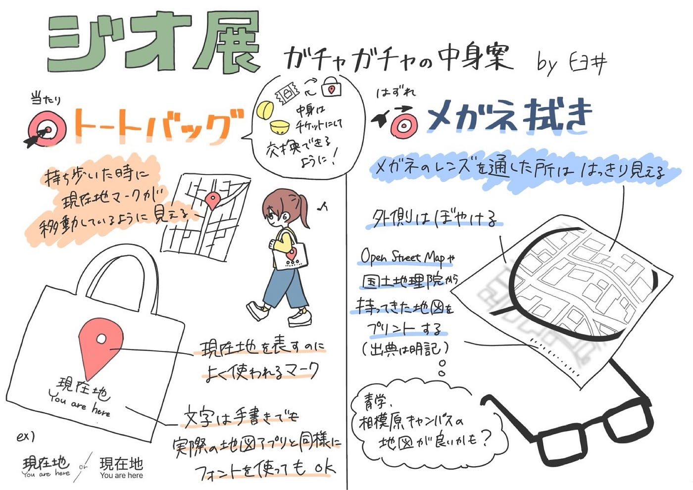
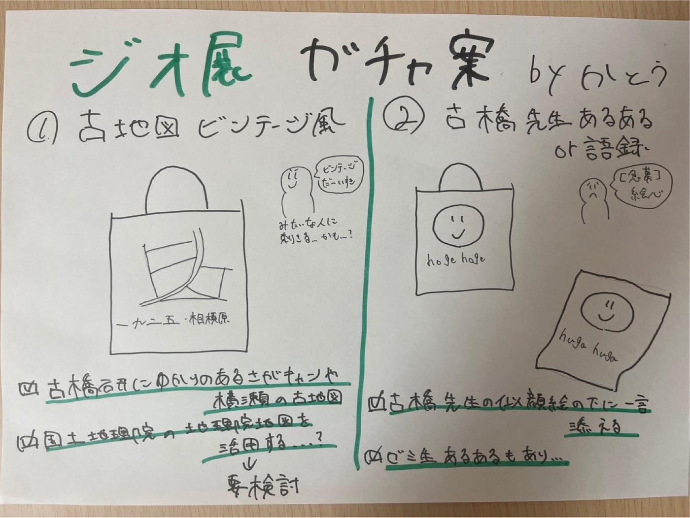
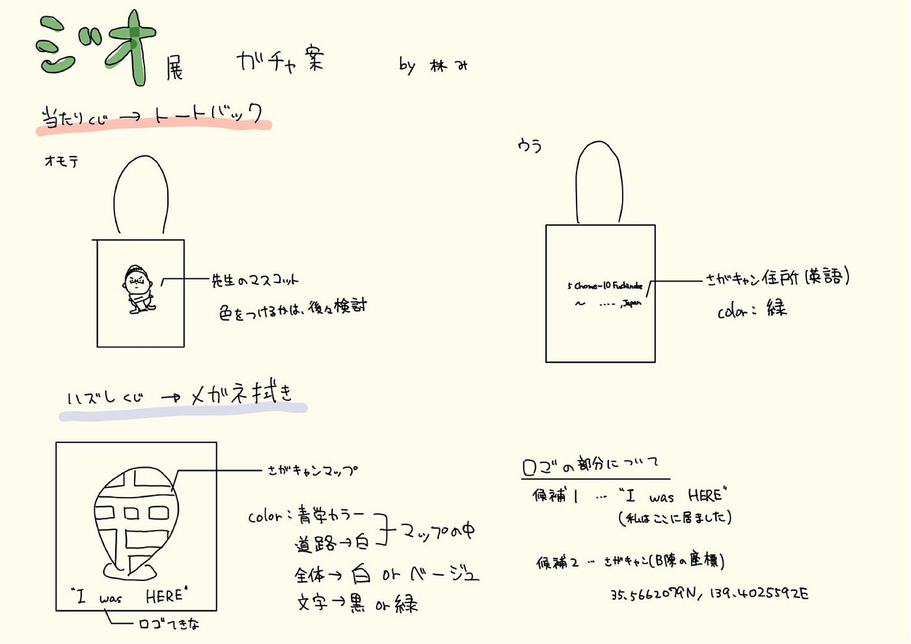

## ５月ハッカソン 素敵なデザイン案を考えました！

こんにちは。ユース４年の金澤です。

最近は、梅雨の気配を少し感じるような天気ですね。(梅雨嫌い)

今週はハッカソンメンバーで７月のジオ展に向けたアイディア、デザイン案を出し合いました！

### ジオ展とは

地図や位置情報技術を活用した製品やサービスの展示を通じて、業界の活性化を目的としたイベント。企業の製品紹介だけでなく、採用活動の場としても利用される。

来場者は、IT、建設、自動車、メディアなど多様な業界から集まり、地図をテーマに業種を超えた交流が行われる。

📅 ジオ展2025の開催概要

•	日時：2025年7月2日（水）

•	10:00～17:00 展示・プレゼンテーション

•	18:00～20:00 懇親会（出展団体限定）

•	会場：大手町三井ホール（東京都千代田区大手町1–2–1 Otemachi One 3F）

•	入場料：無料（事前登録制）

•	主催：ジオ展実行委員会（マップボックス・ジャパン合同会社、株式会社MIERUNE、アドソル日進株式会社）

•	公式サイト：https://www.geoten.org/

•	来場登録：Peatixにて受付中

🧳 過去のジオ展の様子

前回の「ジオ展2024」では、50の企業・団体が出展し、来場者数は1,000人を超えました。展示ブースでは、最新の地図技術や位置情報サービスの紹介が行われ、来場者との活発な交流が見られました。また、各社の採用情報も紹介され、業界への関心を持つ学生や求職者にとって貴重な情報収集の場となりました。

[ジオ展 (じおてん, Geo-ten)
「ジオ展2025」は、マップボックス・ジャパン合同会社、株式会社MIERUNE、アドソル日進株式会社が共同運営を行います。 ジオ展とは？ 2016年に始まった、地図位置情報関連の企業やサービスが一堂に会する共同展示会です。…www.geoten.org](https://www.geoten.org/?fbclid=PAQ0xDSwKiCRhleHRuA2FlbQIxMAABpxBTgKkI6m3aNs3Wk1WFVKOIX8IUDXBmGl7NGW3iE9n9-XfCtFwGgphKbn2l_aem_jppzkBHalY7lHYwP4uG55w)

### アイディア

①トートバッグ

②メガネ拭き

### 具体的なデザイン案

①Chihana 作

②Yudai 作

③Miku 作

どの案も創意工夫が感じられ、実現できれば素晴らしいなと思いました！

３年生は初めてのジオ展なので、４年生としてリードできれば良いです。
