### ジオ展に向けて ジオガチャデザインソン【6/3ドローン1週報】

こんにちは！3年の安生です。

今回の週報では、2025年7月2日に開催されるジオ展に向けてのジオガチャデザインソンについて報告します。

先週のアイデアソンに引き続き、今週は①メガネ拭き②トートバッグ③日めくりカレンダー・代替案の３つについて考えました。

### ①メガネ拭き

1．りと作

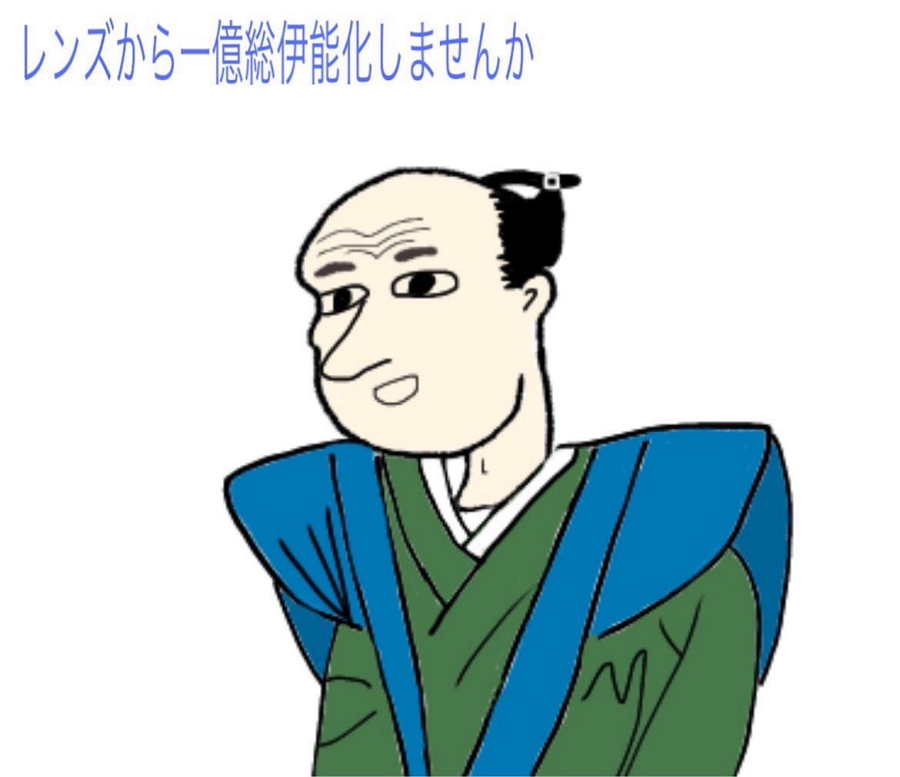

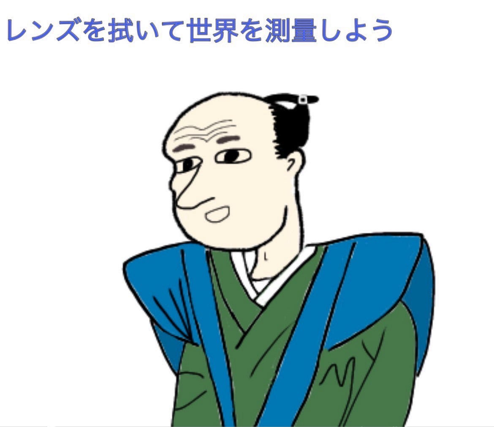

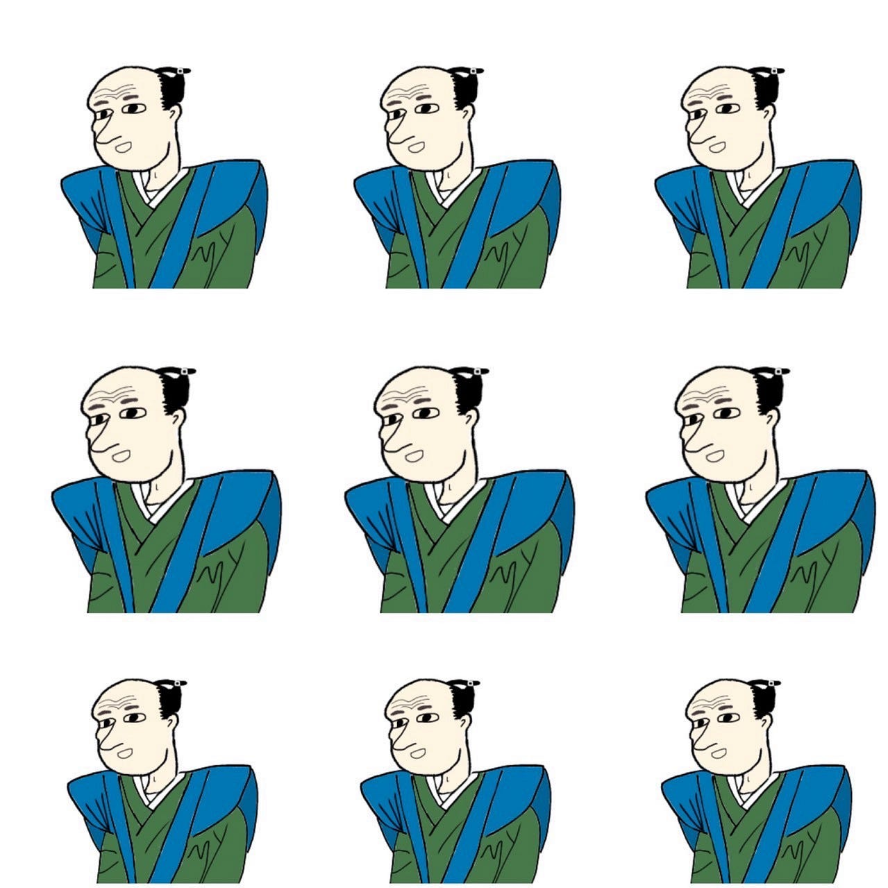

一億総伊能化をメガネ拭きから始めたいと思いました。

(使用したツール)
・ 編集：[Picsart](https://picsart.com/ja/) のコラージュ機能
・伊能忠敬の画像：FuruhasiLabの共有Googleドライブhttps://drive.google.com/file/d/1f0oiWxkm1jDC6IJ8S3pdE6ZdpsZfCVBF/view?usp=drivesdk

2．もえ作

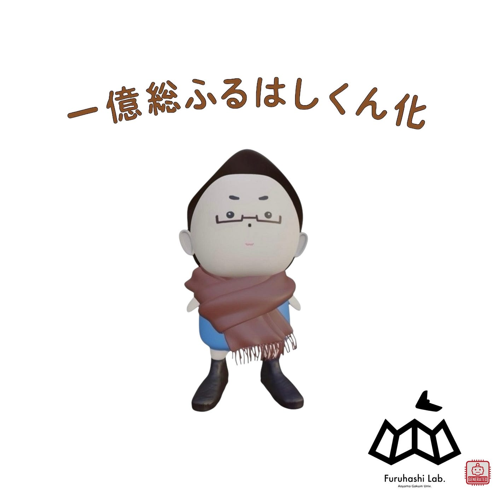

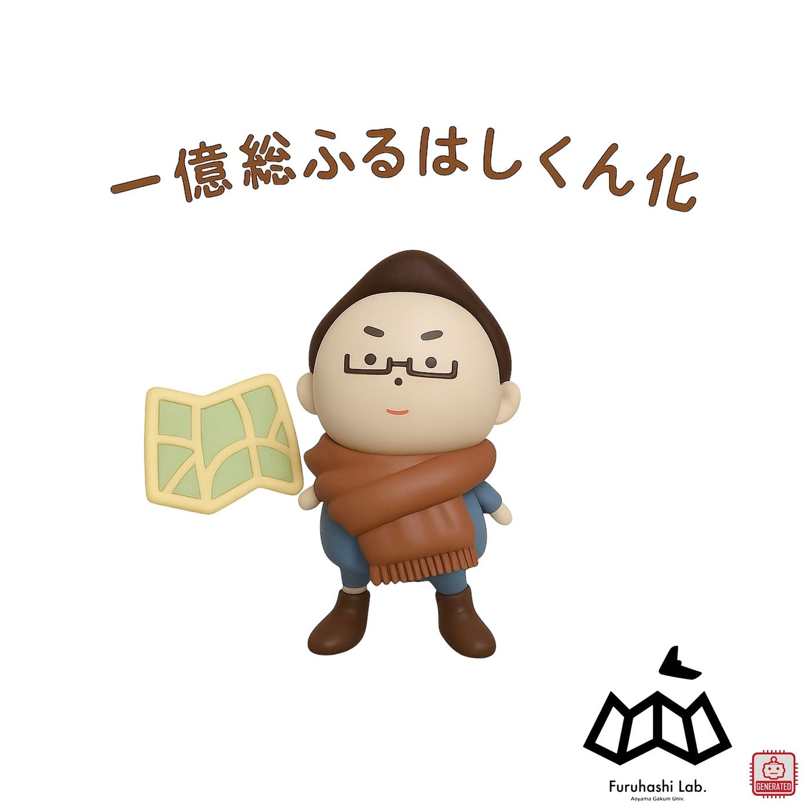

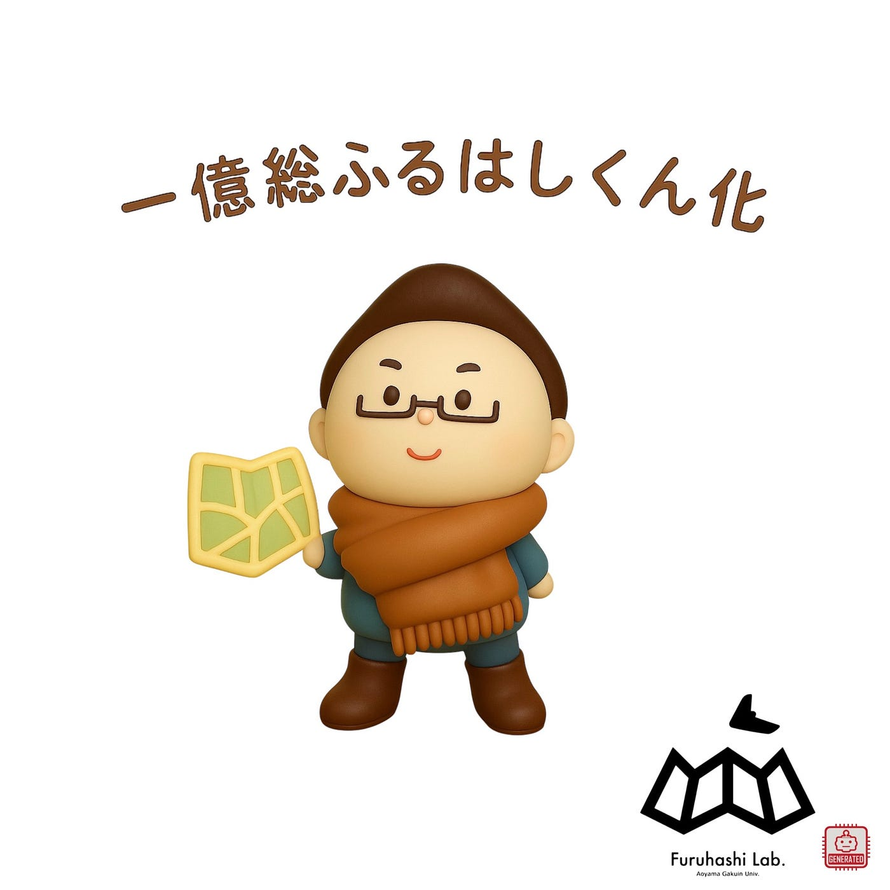

過去に先輩方が[Blender](https://www.blender.org/)を使用して制作してくださった[”ふるはしくん”](https://medium.com/furuhashilab/%E3%82%AC%E3%83%81%E3%83%A3%E3%82%AC%E3%83%81%E3%83%A3-%E3%81%B5%E3%82%8B%E3%81%AF%E3%81%97%E3%81%8F%E3%82%93-ab17bd4f9025)という古橋先生をモデルにしたキャラクターの[冬バージョン](https://medium.com/furuhashilab/%E3%82%AC%E3%83%81%E3%83%A3%E3%82%AC%E3%83%81%E3%83%A3%E3%83%8F%E3%83%83%E3%82%AB%E3%82%BD%E3%83%B3-4a86400c2fe6)をモチーフにしました。古橋先生が掲げている「一億総伊能化」をもじって｢一億総ふるはしくん化｣としたところがポイントです。それぞれ異なる質感の”ふるはしくん”になっています。

(使用したツール)
・背景透過：[Photoroom](https://www.photoroom.com/ja)
・画像生成：[ChatGPT](https://openai.com/ja-JP/chatgpt/overview/) 4o, 2025–06–02
・レイアウト：[Picsart](https://picsart.com/ja/)

### ②トートバッグ

1．ゆかり作

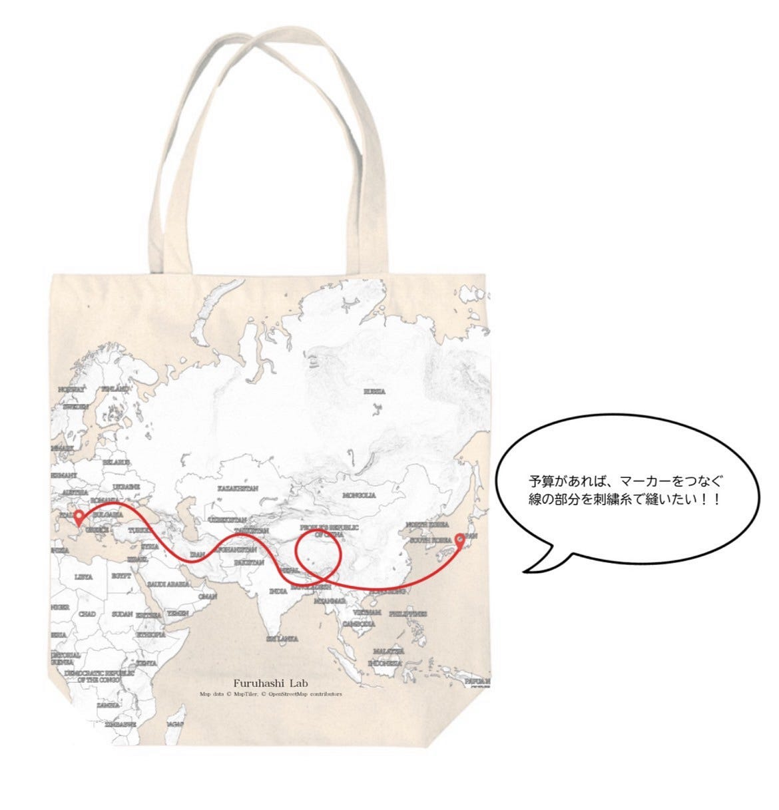

シンプルなデザインにしつつも日本とイタリアを結んで、古橋研らしさを残しました！

(使用したツール)
・[Maptiler](https://www.maptiler.com/ja/) (デザインの中にMapTilerを使用するためのコピーライトを使用)
・[Canva](https://www.canva.com/ja_jp/)

2．ゆうか作

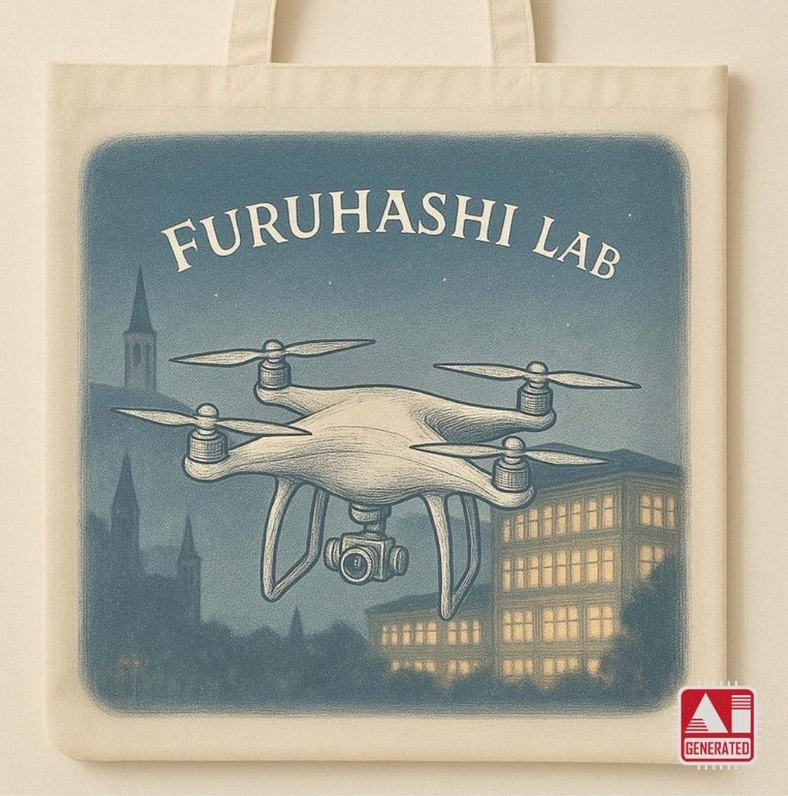

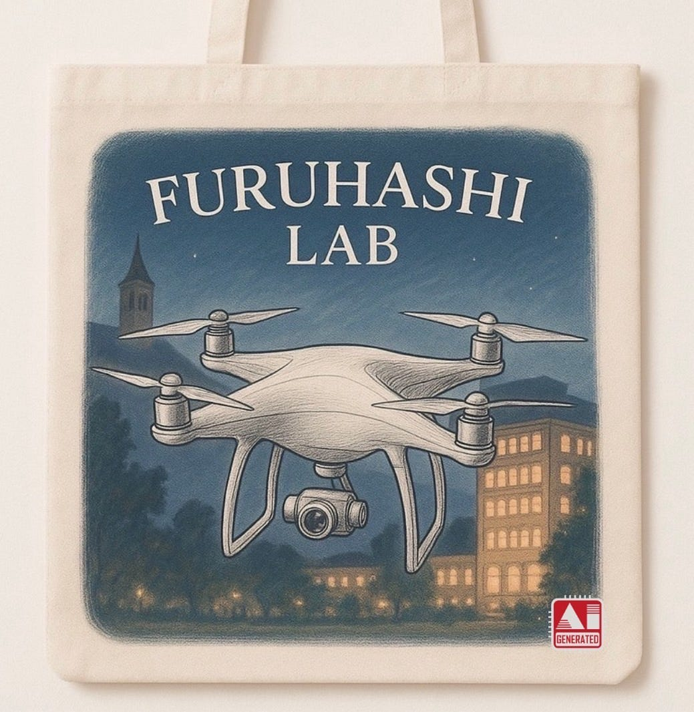

夜のさがキャンにphantom4を飛ばしてみました。

(使用したツール)
・[ChatGPT](https://openai.com/ja-JP/chatgpt/overview/) 4o, 2025 – 06 – 02

### ③日めくりカレンダー・代替案（れんせい担当）

1．日めくりカレンダー
（31日分作成し、毎月使用できるように）

【デザイン案】

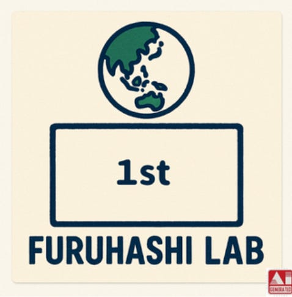

シンプルな構成で古橋研を表現しつつ､手書き感を出して親しみやすさを意識しました。

(使用したツール)
・[ChatGPT](https://openai.com/ja-JP/chatgpt/overview/) 4o, 2025 – 06 – 02

【大量生産について】

単価500円に抑える場合、1000個以上の注文が必要

→50万ほどの費用が掛かり、非現実的

（参考サイト）
https://www.365calendar.info/or_table.html

2．代替案

（1）印刷済みトイレットペーパー

・印刷種類と詳細

ⅰ.トイレットペーパーに印刷ver.
注文個数：1000個～
 単価：約200円
 特徴：印刷は一色のみ、追加料金で包装紙にも印刷可能

ⅱ.リーズナブルver.
注文個数：1000個～
 単価：約100円
 特徴：包装紙に印刷、1～4色

ⅲ.注文数少ないver.
注文個数：100個～
 単価：約200円
 特徴：包装紙に印刷、フルカラー限定

（参考サイト）
https://www.pt-koujou.net/lineup/toilet/?utm_source=bing&utm_medium=cpc&utm_campaign=bing_0601&msclkid=1ac667203d421d19bc900f1d6fda57e8

（2）箸袋

注文個数：10000枚～
 単価：約2円
 特徴：一色からフルカラーまで対応、初回注文に2000円、箸袋のみの注文

（参考サイト）

[中袋型箸袋【コースター工房の東京宣広社】
www.original-coaster.info](https://www.original-coaster.info/chopstick-bag/nakabukuro.html)

### 【まとめ】

今回のデザインソンでは、「古橋研究室らしさ」や「もらって嬉しいデザイン」を心掛けて制作しました。どれも古橋研究室らしさともらって嬉しいを兼ね備えた素敵なデザインだと思います。

ただ、日めくりカレンダーに関しては、実現できることが理想ですが、価格がネックであることが分かりました。また、トイレットペーパーや箸袋は安価であるものの、日めくりカレンダーのように複数のデザインを印刷することはできないというデメリットも挙がりました。

最後にグラレコです。

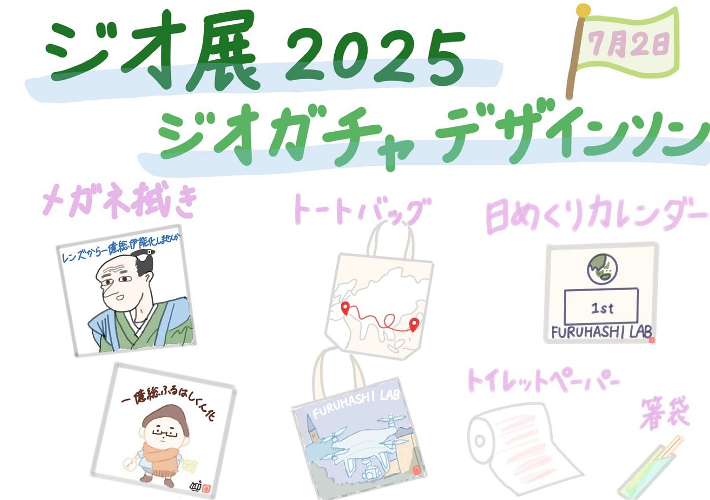
