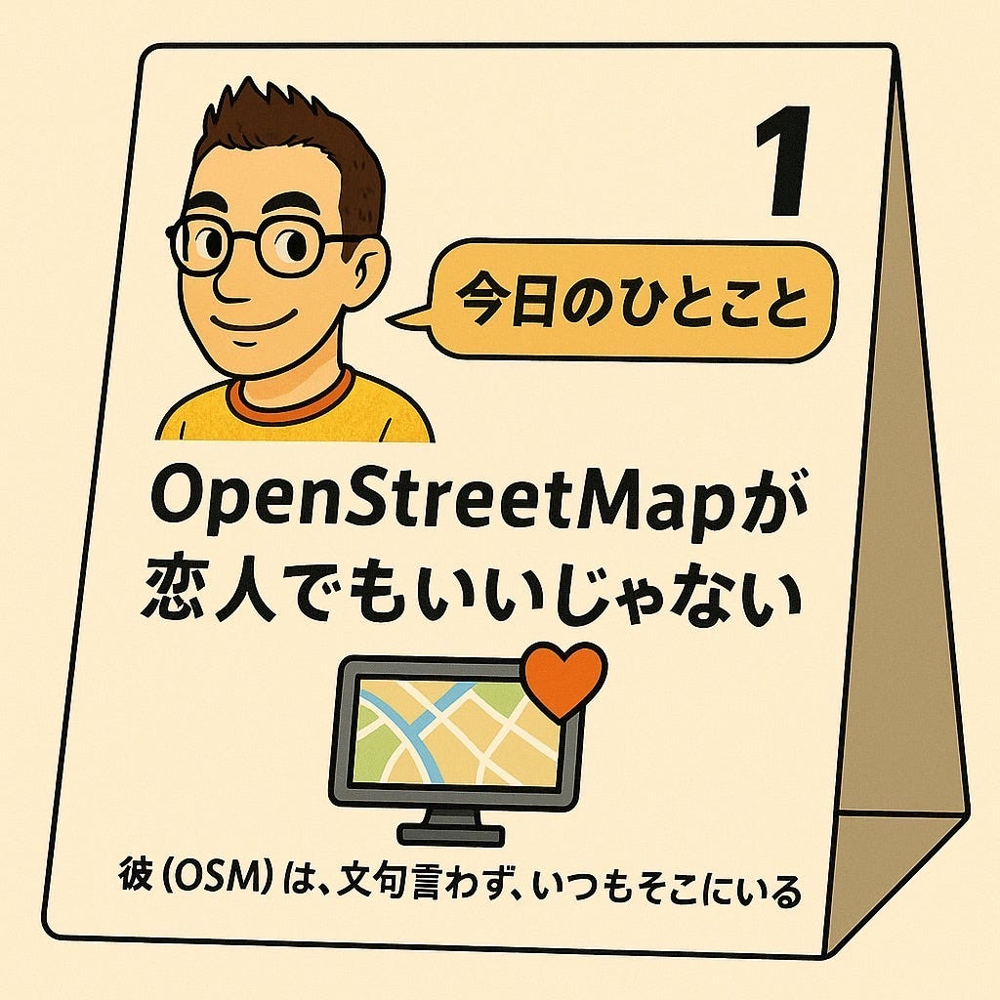
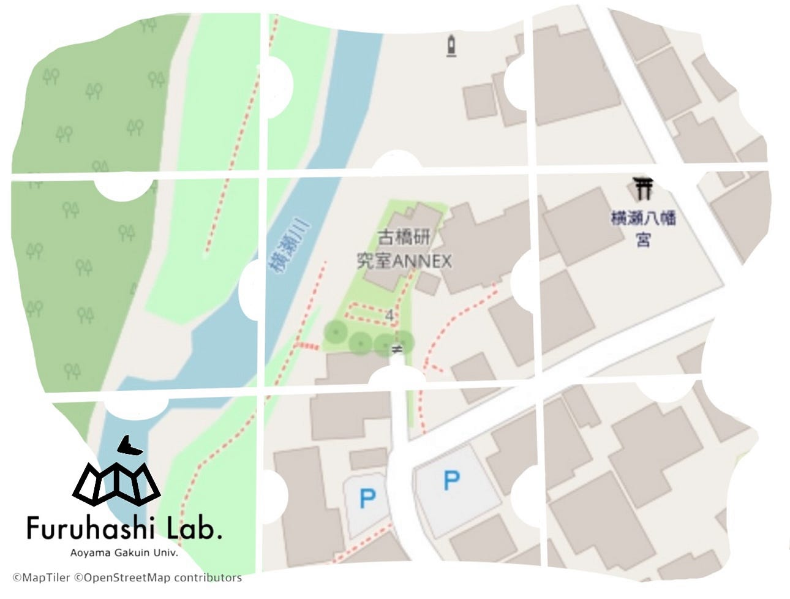
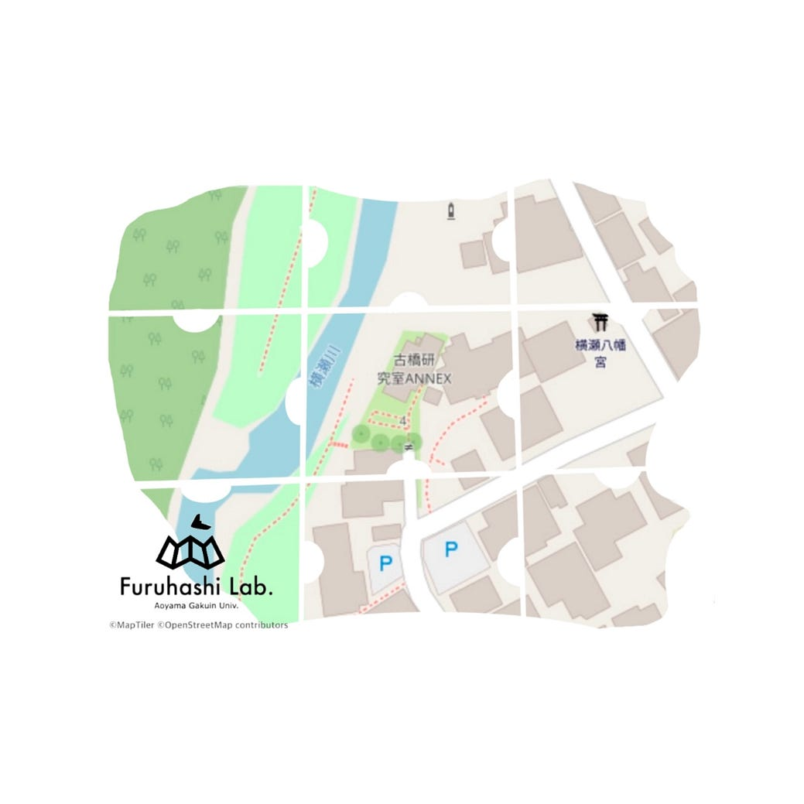
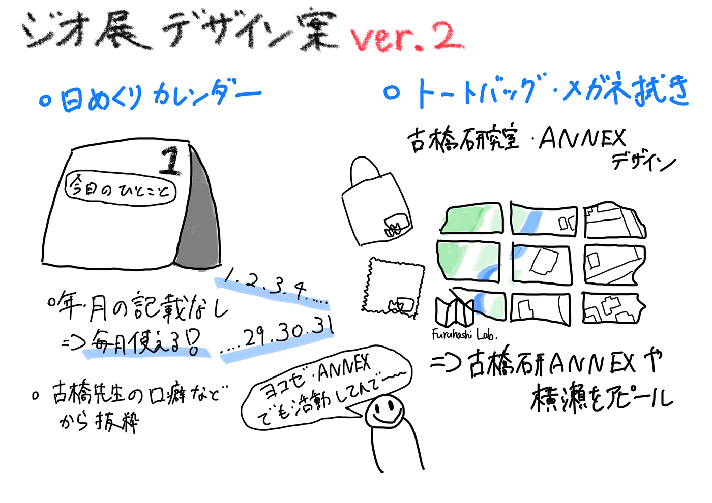

### ジオ展に向けてデザインを考えました！【6/3V&F週報 】

こんにちは！四年の福田です。

先週の週報内容に続き、今回もジオ展に向けて私たちが考えたメガネ拭き、トートバッグ、日めくりカレンダーのデザインを紹介します！

#### 日めくりカレンダー

私たちが考える日めくりカレンダーは繰り返し使えるように、年月は記載しなく、１から31と日のみにしています。古橋先生のアイコンのイラストを使い、セリフは、ChatGPTのMr.Uモードを使った時のハッカソンの時に学んだことを使い、古橋先生が出演している動画を文字に起こして31日分考えようと思います。

毎日のひとことを楽しみながら使うことができます！

#### トートバッグ・メガネ拭き

デザインをする際は[Procreate](https://procreate.com/jp)を使い描きました。

トートバッグとメガネ拭き共通のデザインにしました。

私たちの思い出が詰まった古橋研究室ANNEXの地図を元に、不規則なパズルの形に設計しました。

まだ古橋研究室ANNEXを知らない方々に「ここで活動もしてるよ」と知ってもらう機会にもなります！

グラレコ

