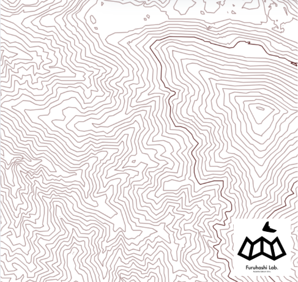
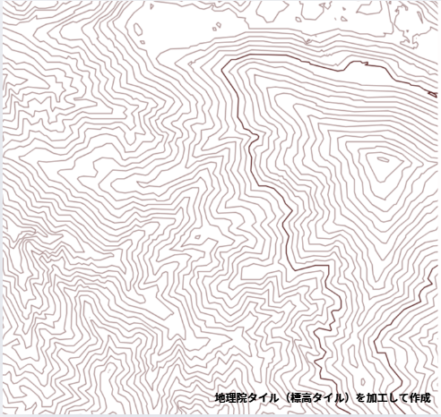
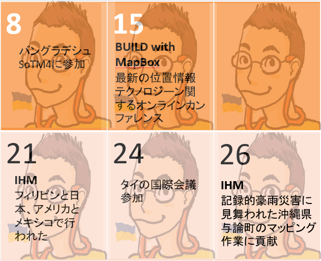
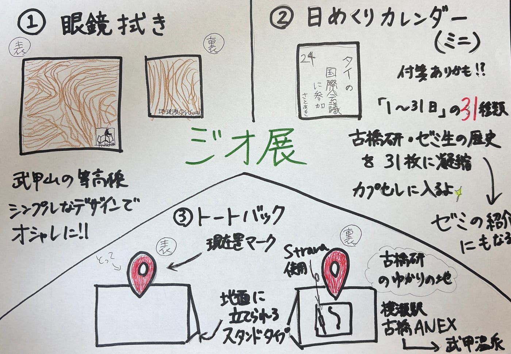

### ジオ展に向けて～デザインソン～第2弾【6/3 ドローン2 週報】

今回の週報を担当しますドローン2班の岡村です！

前回に引き続き、2025年7月2日に開催されるジオ展の景品の案を紹介します。

#### **① 眼鏡拭き**

前回の改善点: 貰ってうれしいデザインにせよ。 古橋研らしさを取り入れるべし。

今回の案: 武甲山の等高線をプリントし右端に古橋研究室のロゴをいれた。

なじみがあり、有名な武甲山の等高線をプリントしシンプルなデザインでオシャレに！右端には古橋研究室のロゴを入れる。完成案↓

裏面に国土地理院データを加工したことを明記。

使用したツール↓

[Web等高線メーカー|Web Contour Maker of Japan|埼玉大学教育学部 谷謙二（人文地理学研究室）](https://ktgis.net/service/webcontour/index.html)

#### **②日めくりカレンダー**

前回の改善案: 31枚が現実的にできるのかを考える。

今回の案: ガチャのカプセルに入る大きさを作りたい！

付箋とカレンダーを掛け合わせてみた。「1～31日」の31種類に古橋研究室・ゼミ生の活動内容（タイの国際会議など）を凝縮。→実用的でゼミの紹介にもなる。

31日分揃えるのは難しかった。文字と数字だけでは寂しいが何を挿入しようか、迷ったまま進まず。むしろカレンダー要素を無くし、付箋にしてははどうだろうかという結論にいたった。

仮案↓

#### **③トートバック**

前回の改善点: 現在地マークという発想を活かしつつ、改良。

今回の案: 自立するスタンドタイプのトートバックで持ち手を現在地マークにする。

完成案↓

グラレコ参照

訂正: Stravaで記録した古橋ANEXから武甲温泉までの軌跡の画像は広告目的での使用禁止だったため、なかったことにします。[Strava サービス利用規約](https://m.strava.com/legal/terms/2024?utm_source=chatgpt.com)

④グラレコ

