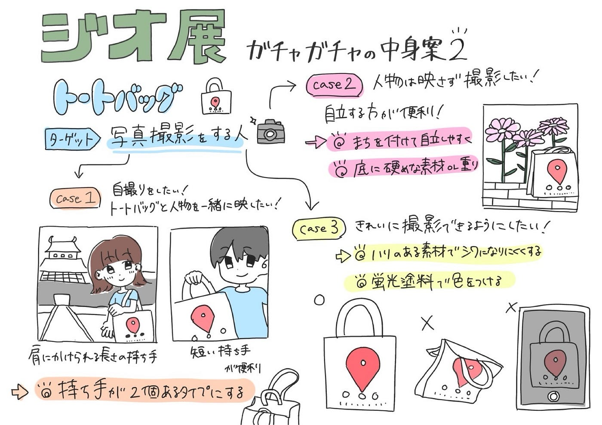
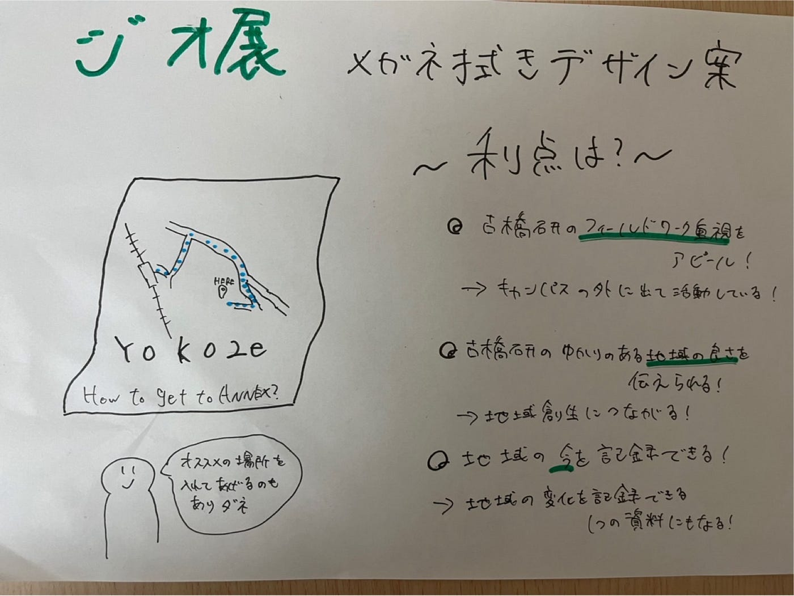
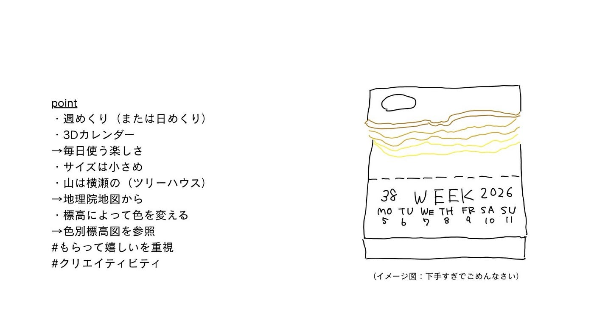
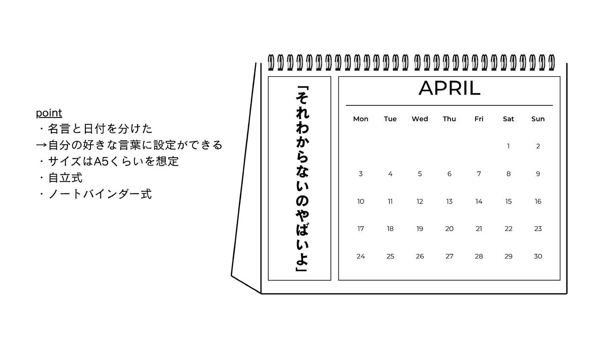
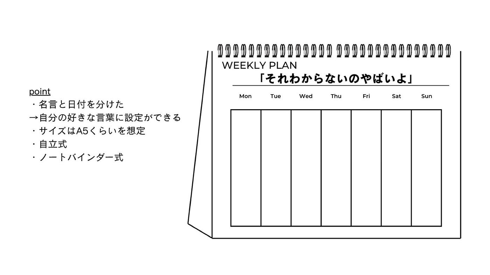

## 【6/3 週報】前回に引き続き…

こんにちは。４年ユースの金澤です。

今週は先週に引き続きジオ展のアイデア練りをしました。

**デザイン改善に向けて気をつけたこと**

①古橋研らしさ

②もらって嬉しいデザイン

**具体的な改善案**

①Chihana 作

②Yudai 作

③Miku 作

↑

※イメージ図

[Amazon.co.jp: 立体カレンダー
Amazon.co.jp: 立体カレンダーwww.amazon.co.jp](https://www.amazon.co.jp/%E7%AB%8B%E4%BD%93%E3%82%AB%E3%83%AC%E3%83%B3%E3%83%80%E3%83%BC/s?k=%E7%AB%8B%E4%BD%93%E3%82%AB%E3%83%AC%E3%83%B3%E3%83%80%E3%83%BC)

※地理院地図のデータを使用

[国土地理院コンテンツ利用規約
本サイトのコンテンツには特段の記載が無い限り 公共データ利用規約（第1.0 版） （PDL1.0）が適用されています。PDL1.0…www.gsi.go.jp](https://www.gsi.go.jp/kikakuchousei/kikakuchousei40182.html)

[標高・土地の凹凸｜地理院地図の使い方 - 国土地理院
国土地理院が提供する「地理院地図」での基本となる地図の一覧です。maps.gsi.go.jp地理院地図のデータを使用](https://maps.gsi.go.jp/help/intro/looklist/3-hyoko.html)

今週もデザイン組に、先生にご指摘いただいたことをうまく反映してもらいました。(指摘内容に関しては授業のアーカイブ動画が役立ちました笑)

自分がガチャガチャを引いた際、もし、提案した上記三つの作品がでできたら、素直に面白いと感じると思います。
