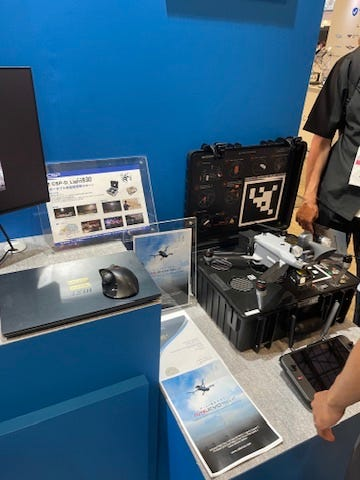
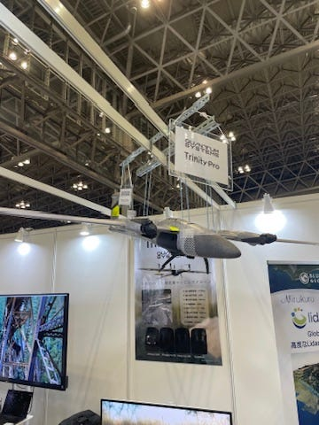
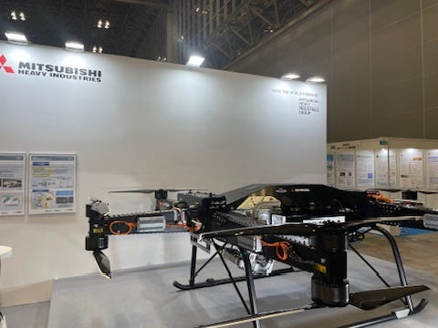
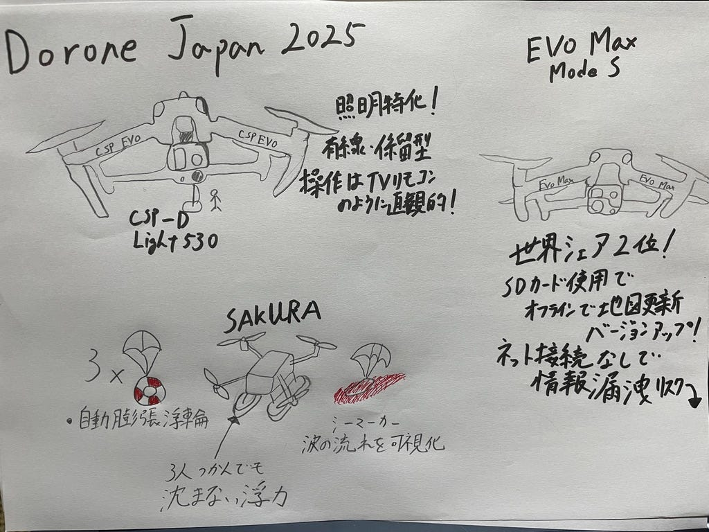

### Japan Drone 2025に行ってみた！

こんにちは、古橋研究室ドローン部3年山﨑 璃音です！今回は2025年6月4日(水)〜6月6(金)に幕張メッセで開催された[Japan Drone2025](https://ssl.japan-drone.com/)に行ったので、特に面白かったドローンと感想を書きます！

#### **Japan Drone2025**

Japan Droneは2016年に第１回が開催され、今年で10回目を迎える国内最大規模の専門展示会で、さまざまな社会課題に取り組む企業を紹介し、企業同士がつながる場所を提供し社会基盤整備とスマートシティを推進することを目的としたイベントです。

#### 気になったブース紹介

早速、私が実際に赴き印象的だったブースについて紹介したいと思います！

#### ブース１（BB-3)

**[株式会社WorldLink&Company](https://prtimes.jp/main/html/rd/p/000000163.000034283.html)
**株式会社WorldLink ＆ Companyは2015年以降ドローン事業を立ち上げ、SkyLink Japanというブランドで国内外のドローンの販売や産業向けソリューションを提供している会社です。ここのブースでは日本、世界のドローンを紹介していたので一部を皆さんにも共有したいと思います！

**１[CSP-D_Light530**](https://www.we-are-csp.co.jp/corporate/drone/index.php)
[セントラル警備保障株式会社](https://www.we-are-csp.co.jp/company/overview/index.php)が開発したドローンです。
このドローンはポータブル係留型証明ドローンで、カメラ機能は一切なく照明に特化していて、主に夜間救助、停電時の照明確保に使われることを想定しています。照明の明るさが想像以上で、スーパームーンが出ていると思うくらいです。また操縦がテレビのリモコンのようで簡単に直感的に操作できるのも特徴的です。私は知らなかったのですが、[2021年の国土交通省の法規制緩和措置](https://www.mlit.go.jp/report/press/kouku10_hh_000201.html#:~:text=%E5%8D%81%E5%88%86%E3%81%AA%E5%BC%B7%E5%BA%A6%E3%82%92%E6%9C%89%E3%81%99%E3%82%8B%E7%B4%90%E7%AD%89%EF%BC%8830m%E4%BB%A5%E4%B8%8B%EF%BC%89%E3%81%A7%E4%BF%82%E7%95%99%E3%81%97%E3%80%81%E9%A3%9B%E8%A1%8C%E5%8F%AF%E8%83%BD%E3%81%AA%E7%AF%84%E5%9B%B2%E5%86%85%E3%81%B8%E3%81%AE%E7%AC%AC%E4%B8%89%E8%80%85%E3%81%AE%E7%AB%8B%E5%85%A5%E7%AE%A1%E7%90%86%E7%AD%89%E3%81%AE%E6%8E%AA%E7%BD%AE%E3%82%92%E8%AC%9B%E3%81%98%E3%81%A6%E3%83%89%E3%83%AD%E3%83%BC%E3%83%B3%E7%AD%89%E3%82%92%E9%A3%9B%E8%A1%8C%E3%81%95%E3%81%9B%E3%82%8B%E5%A0%B4%E5%90%88%E3%81%AF%E3%80%81%E4%BB%A5%E4%B8%8B%E3%81%AE%E8%A8%B1%E5%8F%AF%E3%83%BB%E6%89%BF%E8%AA%8D%E3%82%92%E4%B8%8D%E8%A6%81%E3%81%A8%E3%81%97%E3%81%BE%E3%81%97%E3%81%9F%E3%80%82%20*%20%E4%BA%BA%E5%8F%A3%E5%AF%86%E9%9B%86%E5%9C%B0%E4%B8%8A%E7%A9%BA%E3%81%AB%E3%81%8A%E3%81%91%E3%82%8B%E9%A3%9B%E8%A1%8C%EF%BC%88%E8%88%AA%E7%A9%BA%E6%B3%95%E7%AC%AC132%E6%9D%A1%E7%AC%AC1%E9%A0%85%E7%AC%AC2%E5%8F%B7%EF%BC%89%20*%20%E5%A4%9C%E9%96%93%E9%A3%9B%E8%A1%8C%EF%BC%88%E8%88%AA%E7%A9%BA%E6%B3%95%E7%AC%AC132%E6%9D%A1%E3%81%AE2%E7%AC%AC1%E9%A0%85%E7%AC%AC5%E5%8F%B7%EF%BC%89%20*%20%E7%9B%AE%E8%A6%96%E5%A4%96%E9%A3%9B%E8%A1%8C%EF%BC%88%E8%88%AA%E7%A9%BA%E6%B3%95%E7%AC%AC132%E6%9D%A1%E3%81%AE2%E7%AC%AC1%E9%A0%85%E7%AC%AC6%E5%8F%B7%EF%BC%89%20*%20%E7%AC%AC%E4%B8%89%E8%80%85%E3%81%8B%E3%82%8930m%E4%BB%A5%E5%86%85%E3%81%AE%E9%A3%9B%E8%A1%8C%EF%BC%88%E8%88%AA%E7%A9%BA%E6%B3%95%E7%AC%AC132%E6%9D%A1%E3%81%AE2%E7%AC%AC1%E9%A0%85%E7%AC%AC7%E5%8F%B7%EF%BC%89%20*%20%E7%89%A9%E4%BB%B6%E6%8A%95%E4%B8%8B%EF%BC%88%E8%88%AA%E7%A9%BA%E6%B3%95%E7%AC%AC132%E6%9D%A1%E3%81%AE2%E7%AC%AC1%E9%A0%85%E7%AC%AC10%E5%8F%B7%EF%BC%89)により、30m未満の係留装置による有線給電型ドローンは下記の許可が不要になり即座の救助活動が可能になったそうです。著作権の関係上、画像を掲載することができませんでしたので下記のリンクから見てください。

『災害対応サービス』
[https://www.we-are-csp.co.jp/corporate/drone/disaster/#csp-d_light530](https://www.we-are-csp.co.jp/corporate/drone/disaster/#csp-d_light530)

・人口密集地上空における飛行（航空法第132条第1項第2号）

・夜間飛行（航空法第132条の2第1項第5号）

**２[EVO Max-mode S**](https://skylinkjapan.com/autel-robotics-evo-max-mode-s/)

アメリカで起業し、現在は中国に本社を置く[Autel Robotics](https://www.autelrobotics.com/)が開発したドローンです。
Autel Roboticsは世界シェア１位のDJIに次ぐ２位のシェア率を誇る世界的メーカーです。しかしスタッフさんの話によると、日本ではシェアが低かったのが課題だったそうです。その理由としてはマップやバージョンアップする際にインターネットに繋ぐ必要があり、中国に本社を置くことも相まって、除法漏洩することを警戒する声が大きかったことが挙げられます。しかしEVO Max-mode Sはインターネットに繋がずに、SDカードを介してマップ表示やバージョンアップが可能になったことで、それらのリスクを下げることに成功した機種となります。また完全オフラインになったことで、山間部や機密性の高い場所での使用が期待されています。

#### ブース２(AF-3)

**[株式会社manisonias**](https://manisonias.com/aboutus/)
株式会社manisoniasは福島県田村市に本社、神奈川の湘南にもオフィスを構えるドローンの会社で、「今日と同じ明日の笑顔を守る」をキーワードに災害、環境保護、救助、地域の課題解決に日々取り組んでいる会社です。

**[SAKURA**](https://manisonias.com/news/2541/)
株式会社manisoniasが開発したドローンSAKURAは水難救助に特化したドローンです。SAKURAの特徴として、救助ツールを4つ搭載可能な投下装置がついていることです。4つのうち1つにはシーマーカーという、着水する発色し波の流れを可視化する装置が搭載されていて、離岸流の可視化や、人が流された方向の予測に使います。他3つは自動膨張浮き輪が搭載されていて投下されるとパラシュートが開きます。最悪の場合、浮き輪が救助者に届かなかった時は、ドローン本体が浮き輪の役割を担えるように、ドローンの下には水上着水可能なフロートがついていて、３人くらいの成人男性が同時に掴んでも沈まない浮力を確保できます。開発者さんが「着水した時に部品が濡れたら壊れることは間違い無いけど、人命に比べたら安い」という言葉は、会社の絶対に人を助けるという使命を感じたました。

著作権の関係上、画像を掲載することができませんでしたので下記のリンクから見てください。

『manisonias-お知らせ【プレスリリース】海難・水難レスキュードローン「SAKURA」披露！～Japan Drone 2025にてデモ実施＆代表・橋本登壇～』[https://manisonias.com/news/2541/](https://manisonias.com/news/2541/)

#### 感想

今回の週報では全く紹介しきれないくらい、色々な種類のドローンがありました。中には飛行機やヘリコプターみたいな形のもあり、今まで僕自身が考えていた4つくらいのプロペラで動くという考えを壊してくるようなものもあり、ドローン業界の無限の可能性を感じました。
ドローン操縦体験も参加させていただいたのですが、テレビとかで見るのとは全然違って操縦が安定せず、少しスティックを動かしただけでも凄い速さで動くなど難しかったです。これから人口減少と高齢化に伴い働き手がどんどん消えいていくと予想されている現代の日本で、なんとかそれらの社会問題に対処しようとする会社の方々と交流する機会は大変貴重なものとなりました。トレーニング用のドローンをもらったので練習して、国家資格をいつか取りたいです。ありがとうございました。

参考資料

『SkyLink Japan、「第10回Japan Drone 2025」に出展 多数のドローン関連商品を展示 株式会社エクセディと共同出展』[https://prtimes.jp/main/html/rd/p/000000163.000034283.html](https://prtimes.jp/main/html/rd/p/000000163.000034283.html)（参照日：2025年6月6日）

『ドローンサービス』
[https://www.we-are-csp.co.jp/corporate/drone/index.php](https://www.we-are-csp.co.jp/corporate/drone/index.php) 
(参照日：2025年6月6日）

国土交通省『[無人航空機（ドローン・ラジコン機等）の飛行ルール](https://www.mlit.go.jp/koku/koku_tk10_000003.html)』[https://www.mlit.go.jp/koku/koku_tk10_000003.html](https://www.mlit.go.jp/koku/koku_tk10_000003.html)（参照日：2025年6月6日）

『災害対応サービス』
[https://www.we-are-csp.co.jp/corporate/drone/disaster/#csp-d_light530](https://www.we-are-csp.co.jp/corporate/drone/disaster/#csp-d_light530)
（参照日：2025年6月6日）

『Autel Robotics EVO Max — Mode S』
[https://skylinkjapan.com/autel-robotics-evo-max-mode-s/](https://skylinkjapan.com/autel-robotics-evo-max-mode-s/)
（参照日：2025年6月6日）

『Autel Robotics Enterprise Drone, Quadcopter & UAV for Sale』
[https://www.autelrobotics.com/](https://www.autelrobotics.com/)
（参照日：2025年6月6日）

『manisonias-私たちについて』
[https://manisonias.com/aboutus/](https://manisonias.com/aboutus/)
（参照日：2025年6月6日）

『manisonias-お知らせ【プレスリリース】海難・水難レスキュードローン「SAKURA」披露！～Japan Drone 2025にてデモ実施＆代表・橋本登壇～』[https://manisonias.com/news/2541/](https://manisonias.com/news/2541/)
（参照日：2025年6月6日）

#### グラレコ

