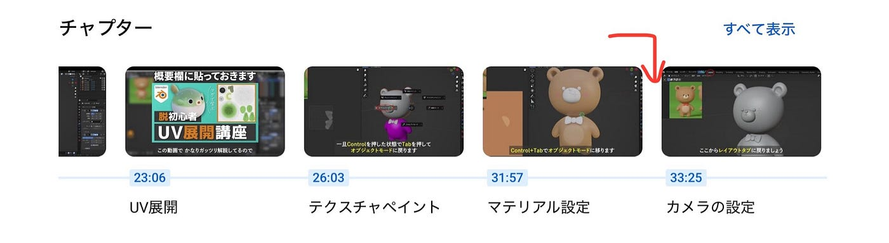
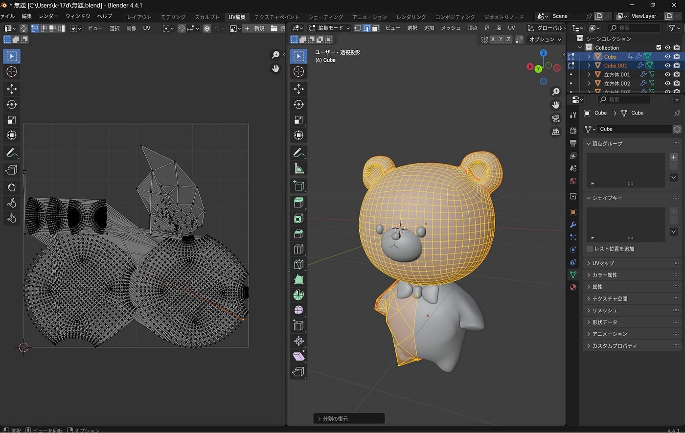
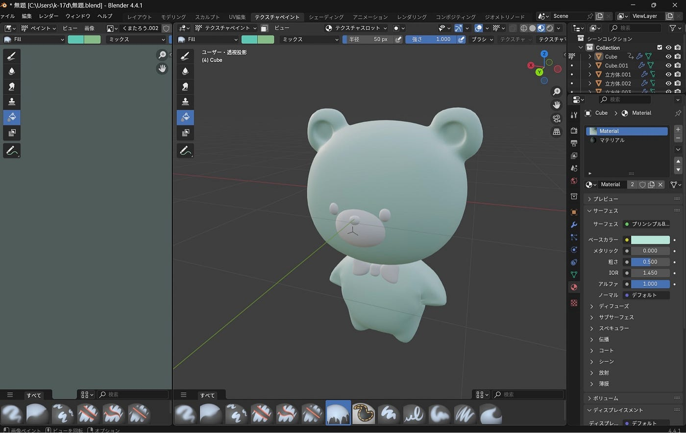
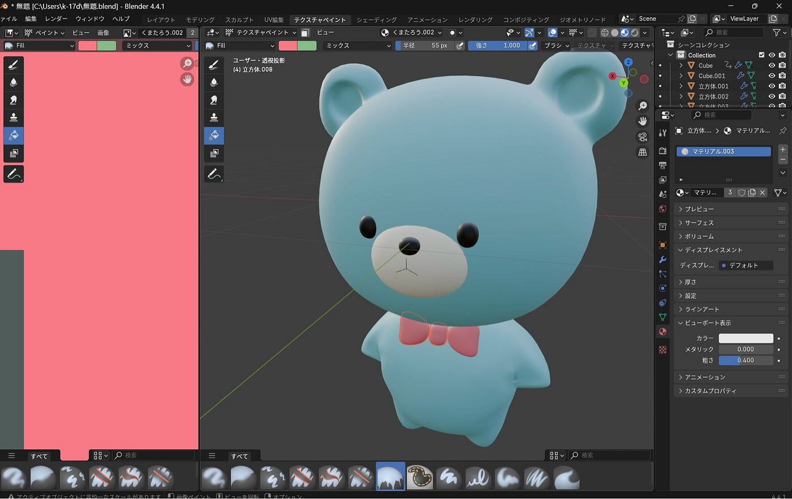
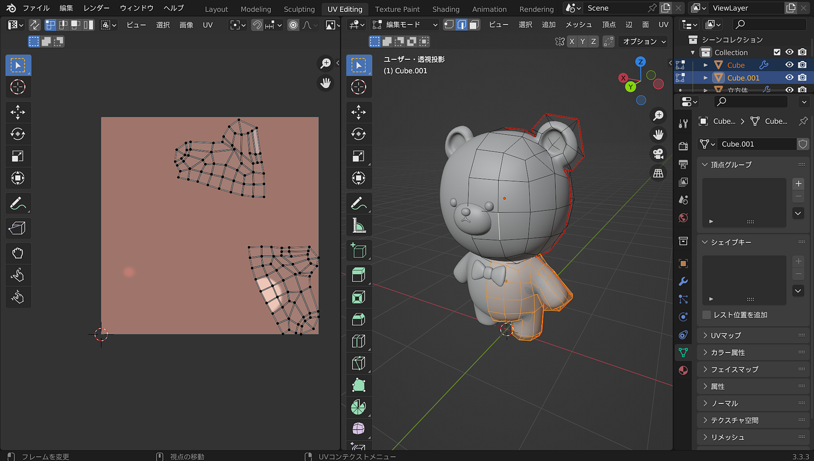
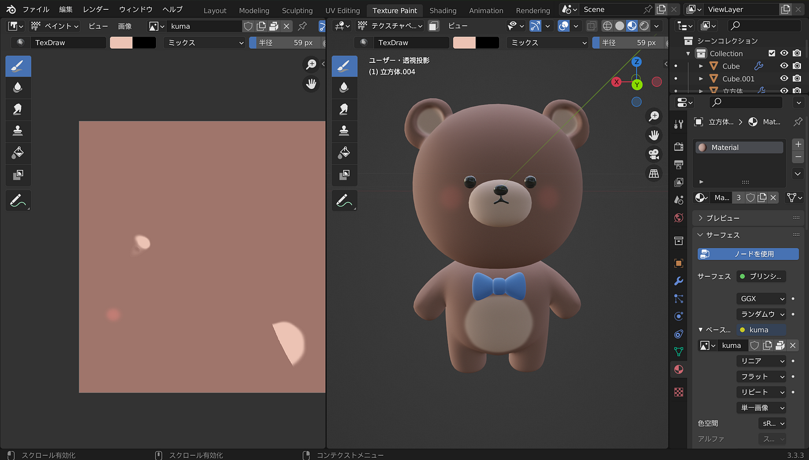
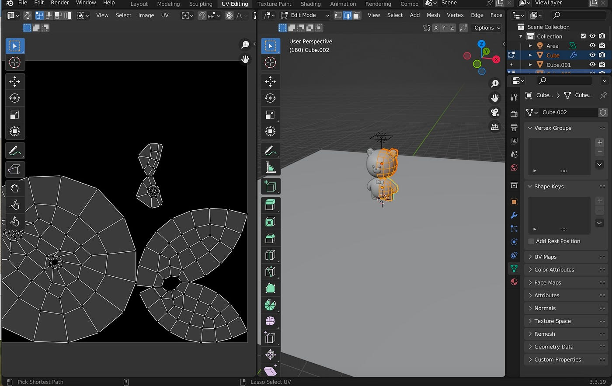
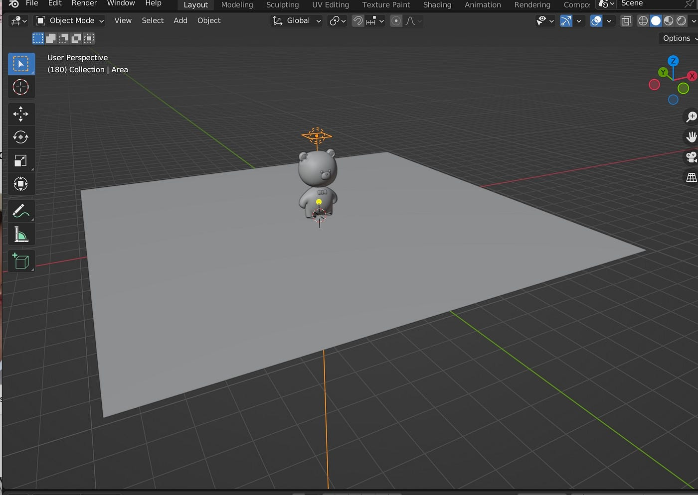
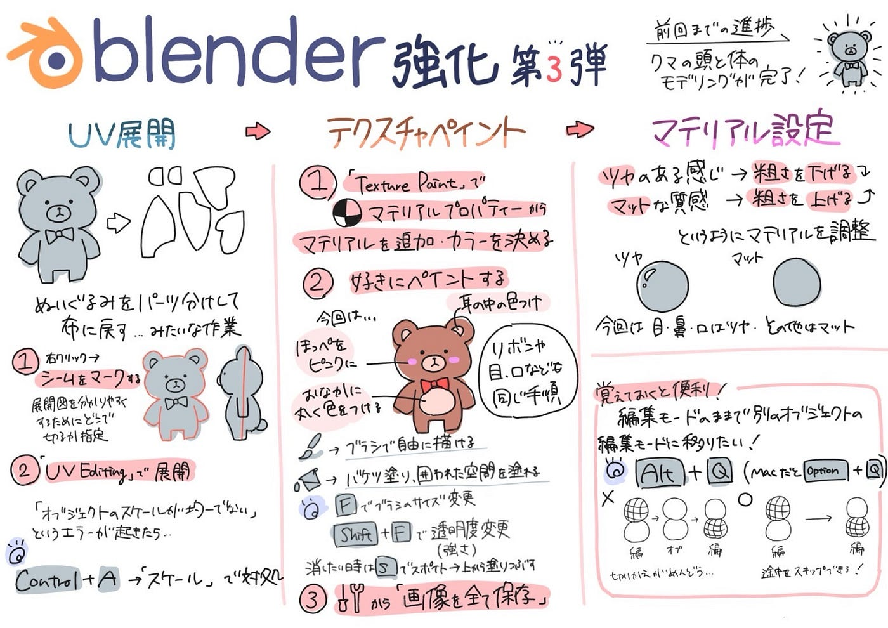

### Blenderの進捗について【6/10デザイン班週報】

こんにちは！三年の稲田です。

今週はジオ展に向けた景品デザインの考案前の内容に続き、Blenderを用いたクマの制作作業として胴体以降のパートを進めていきました。

参考動画はこちらです。

今回のデザイン班での全体目標としては、uv展開からマテリアル設定の部分までの作業を進めることを掲げました。(写真の赤矢印のところ)

### 各メンバーの進捗と一言

ゆうか

早く進めなくてはと考えながら作った際、1度腕を失敗してしまったため、今回は、時間をかけて動画と見合わせ、確認しながら進めました。

また、工夫したところは、クマの色に関して、本当にカーソル次第で何種類もの色にできたため、納得いくまでさまざまな色を実際にクマに試し塗りしていき、薄水色に決めた点です。

ちはな

少し工夫して、動画通りではなく自分の好きな色を付けました。

今回の作業は、感覚的に理解できるモデリング作業とは違って、今何をしているのか分かりづらいものが多く、何度かやり直して完成させました。

こうな

クマをいつも想像するような可愛いクマの色ではなく、白黒に色をつけました。

マテリアル設定やUV展開は説明通りにできて、あまり難しい感じはしなかったです。

### グラレコ

(ちはな作)
