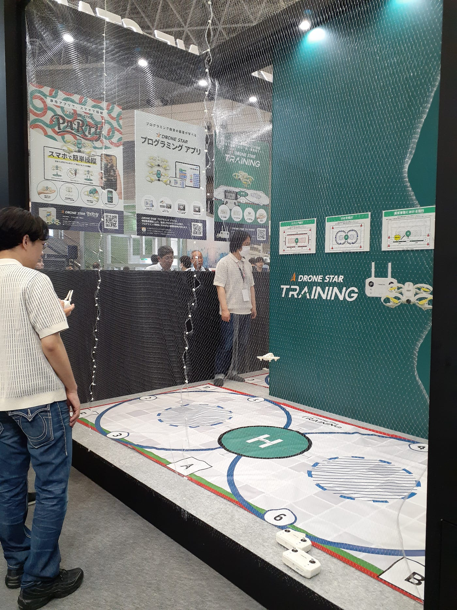
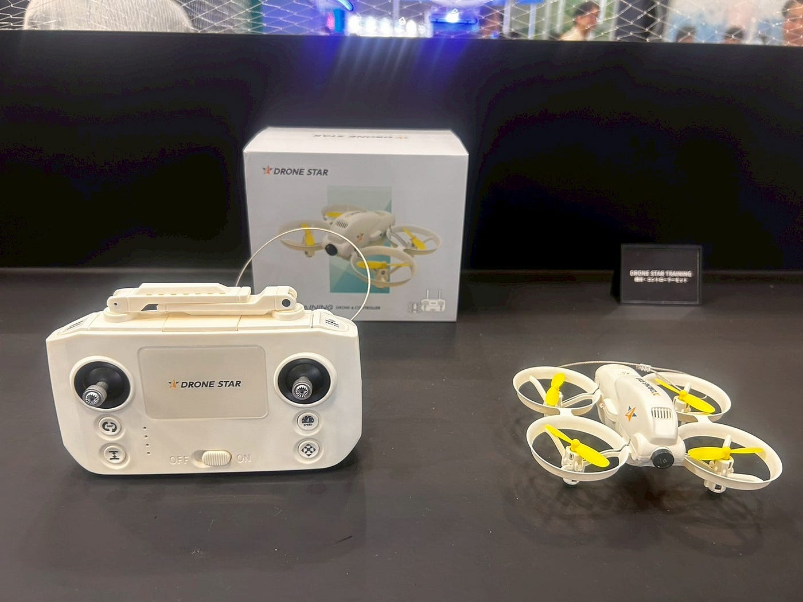
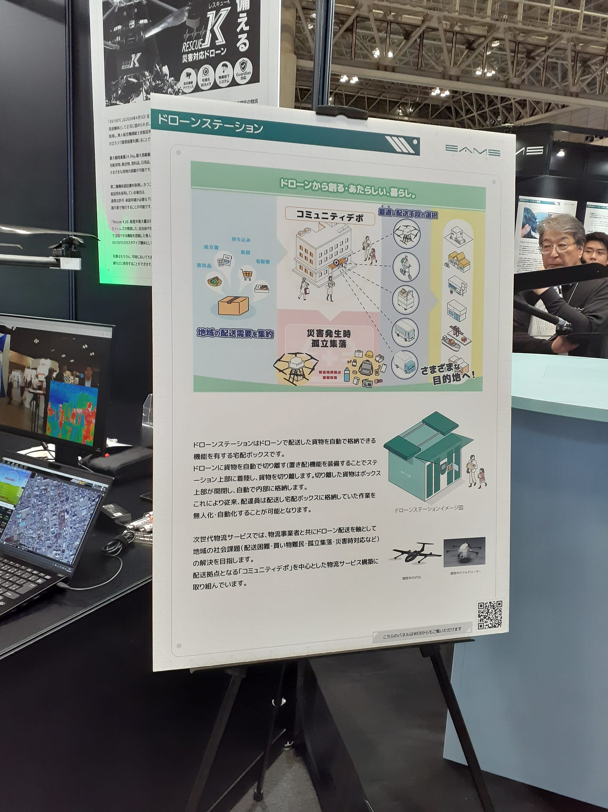
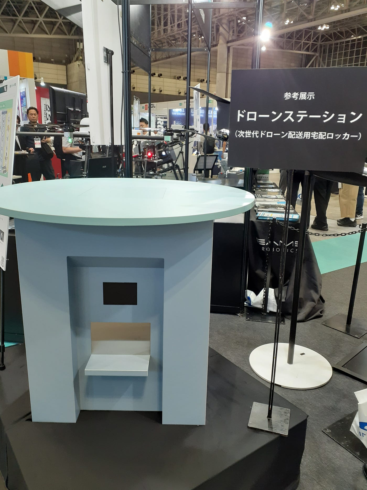
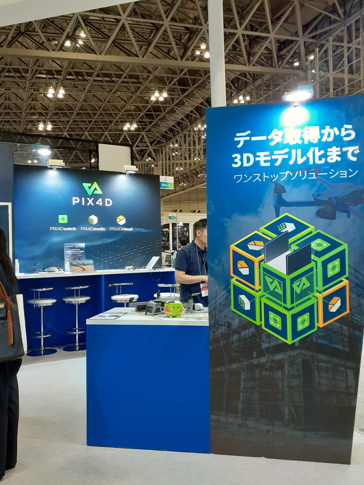
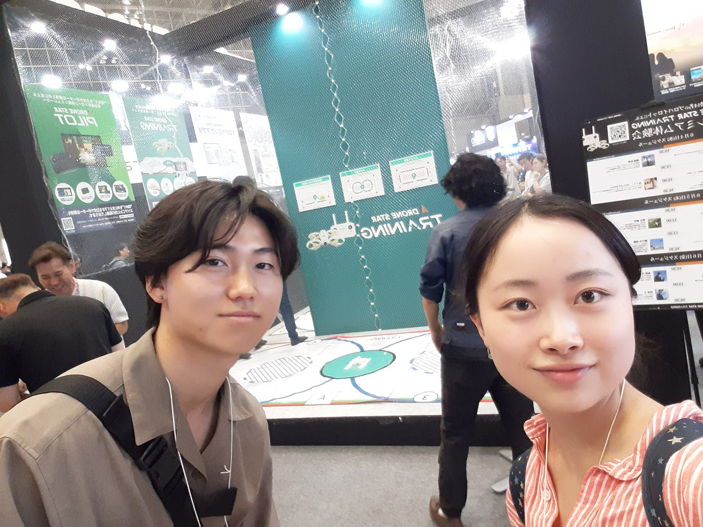
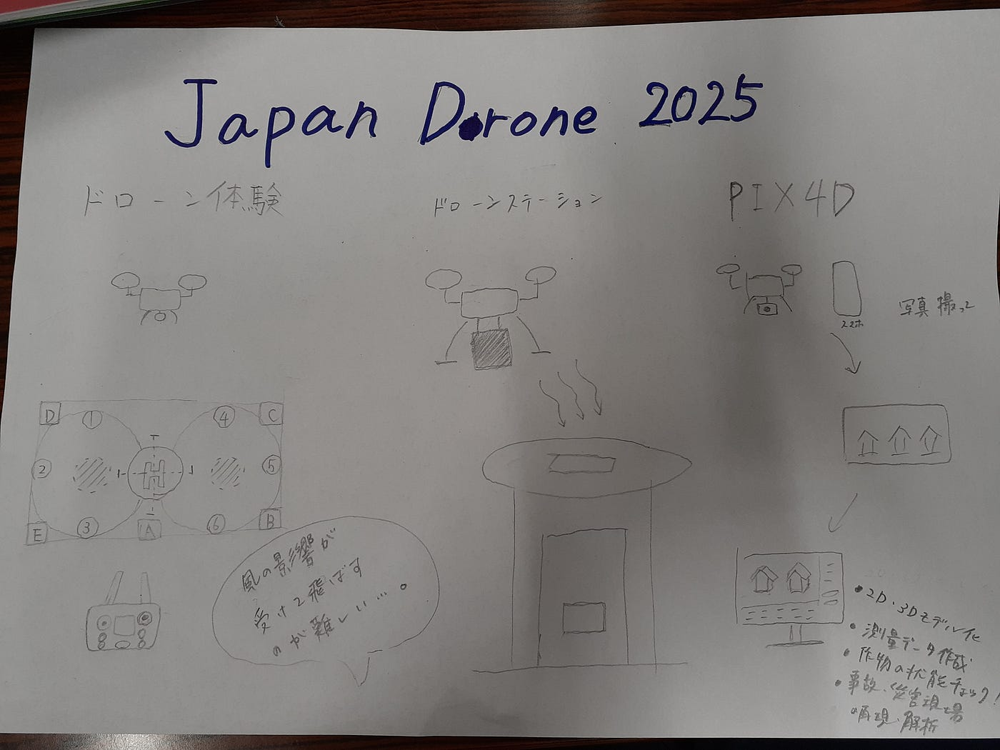

## Japan Drone 2025に行ってきました！

こんにちは。ドローン部2の寺土日南子です。

私は6/4~6/6に幕張メッセで開催されたドローンイベントに行ってきました。

このイベントにはドローン部2のあきさん、ふうか、あきらも参加しており、今回株式会社ORSO DRONE STAR主催のドローン体験をしたふうか、あきら、私の感想とたくさんの企業がドローンを出展していたため、私独自で面白かった企業の取り組みを二つピックアップして紹介する。

> ドローン体験の感想

体験の内容

今回私たちが頂いたトレーニング用のドローンで、コースが描かれたトレーニングマットの上を飛ぶ内容だった。トレーニングマットは実際のドローン国家資格用コースを3分の1のスケールにしたものを使用。

ふうか

ゲームをほとんどやってこなかった私にとって、コントローラー操作が難しかった。また、ドローンの正面に合わせてコントローラーの前後右左が変わるので難しかった。

頂いたドローンで練習して、かっこいい飛行を目指します😎

あきら

最初に四角を描くように飛ばし、その後に丸を練習したのですが丸を書くだけでもとても難しく、講習中に丸を描けるようになるところまでは行くことができませんでした。また、室内の環境であったにも関わらずドローンが安定して飛行しなかったことからトイドローンが風に弱いということを実感できました。

ひなこ

今回私たちが操縦したドローンは練習用で、とても機体自体が軽いらしく風に流されやすかった。場内は微風が吹いている感じで、その影響で一定に留まることが困難でリモコンで微調整をしながら何とか飛ばしていた。ドローンの授業で安藤先生方が使用していたドローンは風にも基本流されることはなかったので、飛ばしやすかった印象を受けた。そのため頂いたドローンは練習用として、微調整の操作や方向感覚を身につけるために良いドローンだと感じたので、室内で練習してみようと思う。

> ブースの感想

Drone Japnan2025には様々なドローンがあり、そこで特に興味深かったドローンの活用方法を二つ取り上げる。

1. イームズロボティクス株式会社：ドローンステーション。

_ドローンステーションは、ドローンで配送した貨物を自動で格納できる機能を有する宅配ボックスのことをいう。ドローンに貨物を自動で切り離す機能を装備して、上部が開閉できる宅配ボックスに着陸させ切り離して格納が完了する。ドローンとドローンステーションを使って、配送困難や買い物難民、孤立集落、災害時対応といった地域課題解決も見据えてこの取り組みを進めている。_

近年人手不足が深刻化しており、宅配業者が減っている状況からドローンの物流サービスは非常に期待されていると思う。そのため、非常に面白い取り組みであり配送サービスの一つの選択肢となることで様々な場面で役立てられると感じた。

2. PIX4D：フォトグラメトリーのソフトウェア会社。

_この会社は、スマホやドローン等を活用して撮影した画像から地理情報を含むマップや2D・3Dモデルを生成するソフトウェアを開発している。高精度の測量データ作成や作物の健康状態を分析し効率的な肥料散布ができる農業用ドローン向けのソフトウェアもある。また事故、災害現場をデジタル上に再現・解析を可能とするものなど、様々な分野で活用されるソフトを開発している。_

様々な企業の出し物を見ながら歩いていた時に、「データ取得から3Dモデル化までワンストップソルーション」というキャッチフレーズに興味を持ってチラシを読んだ。最近はドローンをただ飛ばすだけではなくどのように活用していくかが重要でドローンから取得したデータを簡単にデータ化できるソフトウェアは非常に良いものだと思い私の中でもう一つ注目の取り組みだと感じた。

最後に、今回Drone Japan 2025に参加して本当に大小、用途様々なドローンがこの世に存在していることに驚いた。ソフトバンクやGMOなど私でも聞いたことがある会社もドローン開発に取り組んでいたため、今後さらに注目の分野になるのではないかと感じた。私はまだまだドローンの知識がないためブースの中に入って質問をすることに気が引けてしまい、もっと積極的に企業の方とお話ができるように知識をつけて行けたらよかったと思った。そうすることで更に今どのような課題にドローンを活用しようとしているのかといった様々な面白い話が聞けるため、次に活かしたいと思う。

