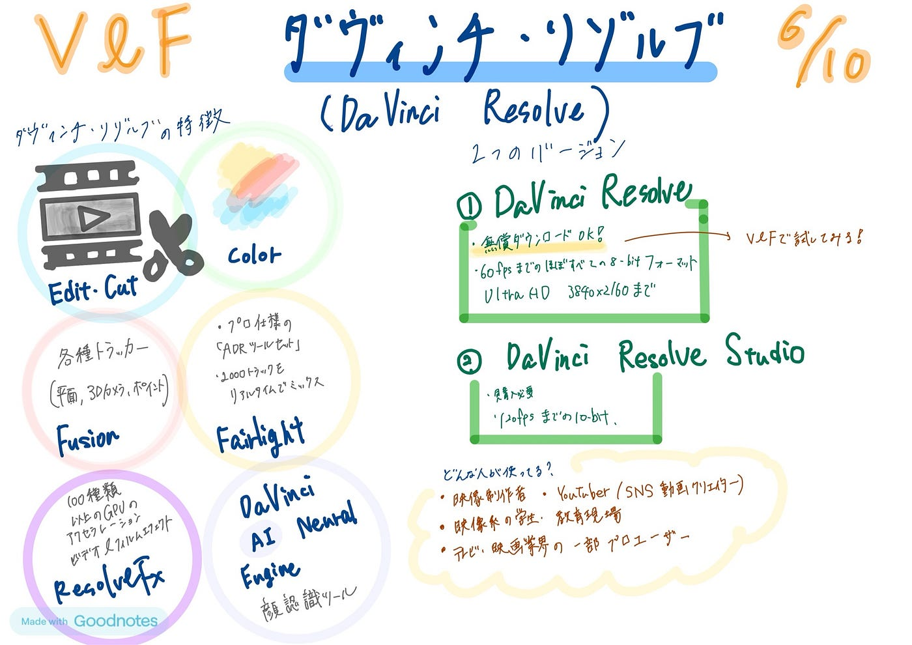

### 【V&F週報】DaVinci Resolveについて調べてみた

### DaVinci Resolveについて調べてみた

こんにちは。4年の古内です。
 今週は、V＆FのTikTok運用やゼミ紹介動画制作に向けた準備として、**無料で使える動画編集ソフト [DaVinci Resolve**](https://www.blackmagicdesign.com/jp/products/davinciresolve/)について調査を行いました。
 使用方法や基本機能、ユーザー層、ビジネスモデルについて簡単にまとめました。

### DaVinci Resolveとは？

DaVinci Resolveは、Blackmagic Design社（オーストラリア）が開発・提供している動画編集・カラーグレーディングソフトです。
 現在は、動画編集・VFX（視覚効果）・音声編集・カラー補正・エクスポート（書き出し）などを**一つのソフト内で完結できる統合型ツール**となっています。

特に**無料で使える範囲が広い**ことが特徴で、プロフェッショナルから学生まで幅広いユーザーに使われています。

### 基本機能（無料版で利用可能なもの）

- **カット編集（Edit／Cutページ）**
 動画クリップの不要部分を削除し、並べ替えや基本的なトランジション追加ができます。

- **テキスト挿入**
 テロップやタイトルを画面上に表示できます。簡単なアニメーション付きテキストも利用可能です。

- **音声調整**
 音量の上げ下げ、フェード、BGM追加などの音声調整が可能です。

- **カラー補正**
 明るさやコントラスト、色味をクリップ単位で細かく調整できます。

- **書き出し（エクスポート）**
 YouTubeや一般的な動画フォーマット向けに簡単に書き出せます。

### 使用方法（基本操作の流れ）

1. **新規プロジェクト作成**
 DaVinci Resolveを起動し、「新規プロジェクト」を作成。

1. **素材読み込み**
 動画ファイルなどを「メディアプール」にドラッグして読み込みます。

1. **編集（CutまたはEditページ）**
 タイムラインに素材を並べてカット編集。簡単なテロップ追加もここで可能。

1. **カラー調整**
 Colorページで映像のトーンを整えます。

1. **書き出し**
 Deliverページでファイル形式や画質を選んでエクスポート。

※使用方法は[Blackmagic Design公式チュートリアル](https://www.blackmagicdesign.com/jp/products/davinciresolve/training)を参考にしました。

### どんな人が使っているの？

DaVinci Resolveは、以下のようなユーザーに利用されています：

- 映像制作者

- YouTuber／SNS動画クリエイター

- 映像系の学生・教育現場

- テレビ・映画業界の一部プロユーザー

### ビジネスモデル

DaVinci Resolveには大きく分けて2つのバージョンがあります。

1つ目は**「DaVinci Resolve（無料版）」**で、動画編集・カラー補正・音声編集などの主要機能がすべて含まれており、個人や教育用途にも十分な機能を備えています。コストをかけずに本格的な映像制作ができる点が魅力です。

2つ目は**「DaVinci Resolve Studio（有料版）」で、**AIによる自動編集補助、ノイズ除去、高度なHDR編集、マルチGPU対応など、プロフェッショナル向けの高度な機能が追加されています。価格は約43,000円の買い切り型（2024年時点の参考価格）で、サブスクリプションではなく一度の購入で永久ライセンスを取得できます。

### まとめ

今回、DaVinci Resolveについて調査してみて、**無料でこれだけ高機能な編集ソフトが使える**のは非常に魅力的だと感じました。
 操作にはやや慣れが必要ですが、公式チュートリアルやYouTube解説が豊富にあり、独学でも十分に使いこなせそうです。

V＆Fで動画制作を進めるうえで、**誰でも無料で使えるツール**として、DaVinci Resolveは非常に有力な選択肢だと改めて感じました。

### グラレコ

