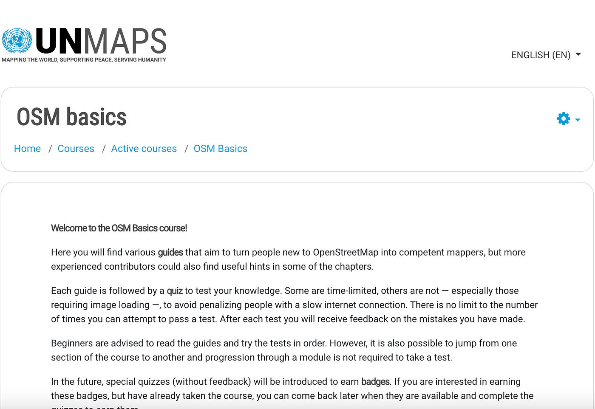
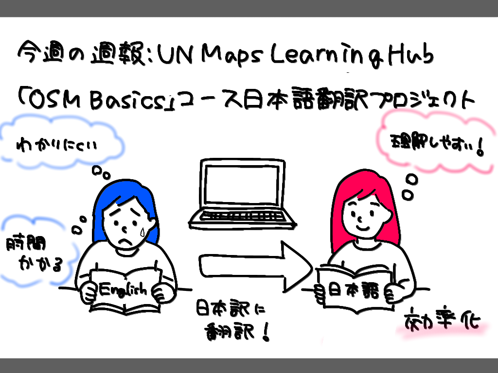

### 【5/10週報youth2】UN Maps Learning Hub「OSM Basics」コース日本語翻訳プロジェクト

こんにちは！3年の小崎です。今週のyouth2では、私たちが以前から取り組みたいと考えていた**[UN Maps Learning Hub**](https://mappers.un.org/learning/)の**[OSM Basics**コース](https://mappers.un.org/learning/course/view.php?id=25)の日本語翻訳プロジェクトについて作戦会議を行い、いよいよ作業を開始することになりました。

#### プロジェクトの意義と効果

- **国際的な需要に対する貢献:** 先日ゆかりさんが参加したUNのMappyHourイベントにおいて、UN Maps Learning Hubが学習リソースとして紹介され、多言語対応への強いニーズがあることを実感したそうです。そのため、日本語版を作成することは、国内の利用者のみならず、国際的なコミュニティにおける理解の促進に貢献できるものだと考えています。

- **学習の効率化:** 昨年先輩方が参加したUN Mappersの活動で英語の教材を利用した際、専門用語や複雑な表現が多くあり作業に時間がかかったそうです。そのため、日本語版を作成することで、言語の壁が取り除かれ、より多くのゼミ生や利用する人がスムーズにOSMの基礎を学ぶことができると考えています。

- また、「OSM Basics」コースは、私たち3年生や今後古橋研究室に新たに加わる学生がUN Mappersチームの活動などのゼミ活動に慣れるために必要な教材だと考えています。そのため、日本語版を作成することで、学習負担を軽減し、より効率的に実践的なスキルを習得できる環境を整えることに繋がります。

#### プロジェクト完了目標と具体的な進め方

まだ翻訳量がどの程度あるか把握しきれていないのですが、**9月のマニラの学会前**を目安に完了させることを目標としています。

**作業フロー:** コース全体をセクションに分割し、ページ単位で割り振りを決める予定です。

**翻訳ルールの統一:** 日本語の表現にばらつきが出ないよう、**統一された翻訳ルール**を作ります。ざっと考えた具体的なルールは以下の通りです。

・文体は「だ・である」調に統一

・「map」は「地図」、「feature」は「地物」など、主要な専門用語については一貫した訳語を使う

これらのルールは、翻訳後の**推敲作業の際の基準**に使う予定です。

来週の週報では、上記を踏まえ、**全体のタスク量（ページ数）を具体的に把握し、各担当者への詳細なページ割り振り**を決定し実作業に取り組む予定です！

以下グラレコです

