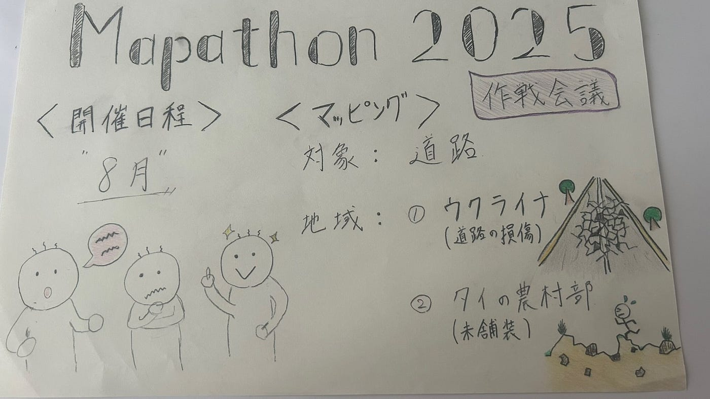

### Youth1 週報 2025/06/10

こんにちは、3年の井上です。

今週のYouthの活動はAGU主催のマッパソンのテーマについて話し合いました。

まだ、不確定な部分が多いですが、マッパソンの大枠が決定したため、報告させていただきます。

> _**開催日程_**

話し合いの結果**"8月"**での開催を予定しています。

8月開催の主な理由としては、①期末テストや期末レポートの日程と被らないようにする、②バタバタする新学期の最初の時期を避けたい、です。

> _**スケジュール_**

マッパソン本番までの仮スケジュールは[こちら](https://docs.google.com/document/d/1QYlU_D7iDJw8cC-dJEpEYktZM4fkBA4VHJnMod0OhXo/edit?tab=t.e0uoxfmpuhvr)になります。

> _**役割分担_**

事前準備段階での役割は[こちら](https://docs.google.com/document/d/1QYlU_D7iDJw8cC-dJEpEYktZM4fkBA4VHJnMod0OhXo/edit?tab=t.e0uoxfmpuhvr)になります。

当日の役割についてはまだ未定となっています。

> _**マッピング_**

今回のマッピング対象は**"道路"**という事で、道路に関するマッピングテーマ案を2つ考えました。

・1つ目「ウクライナ南部の復興支援のための道路整備」

対象地域：ウクライナ南部

背景：特に2023年ごろに戦線が南部に集中していたため、道路や橋の破壊が深刻。

使用ツール：OSM Tasking Manager

・2つ目「未舗装道路のマッピングによるインフラ支援」

対象地域：タイの農村部

背景：バンコクから離れた農村部では未舗装の道路が多くみられたことを実感。医療や物流等のアクセスが不利。

使用ツール：OSM Tasking Manager

これらのアイデアについては、まだまだあいまいな部分が多いので、話し合いを重ねて精査していく必要があります。

> _**まとめ_**

今回の話し合いでは、これから本番までのプロセスをざっくりと決めることができたので良い話し合いができたと考えています。

これから会議を重ねてプロジェクトの詳細を詰めていきたいと思います。

> _**グラレコ_**

最後に今回のグラレコです。

