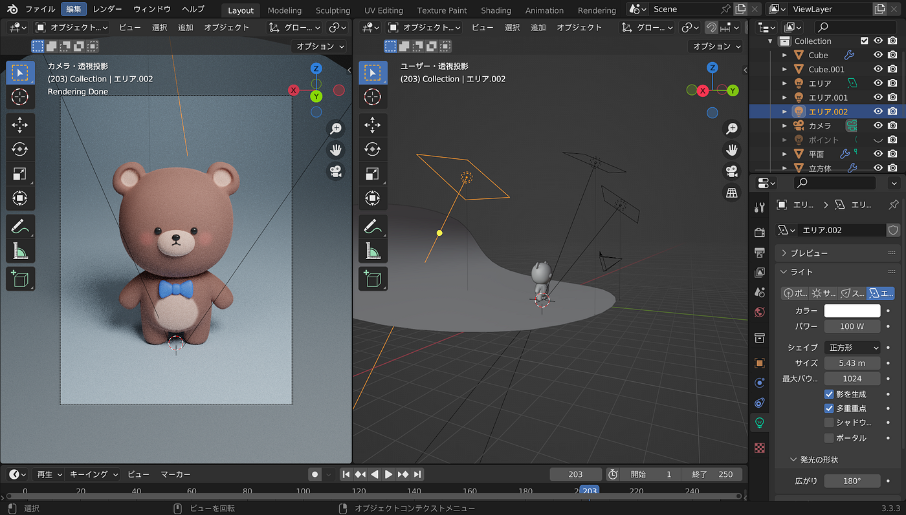
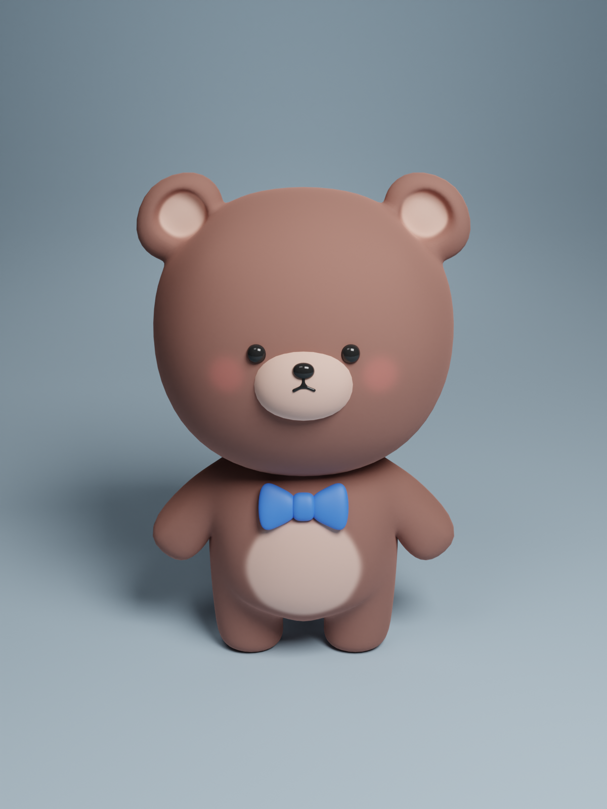
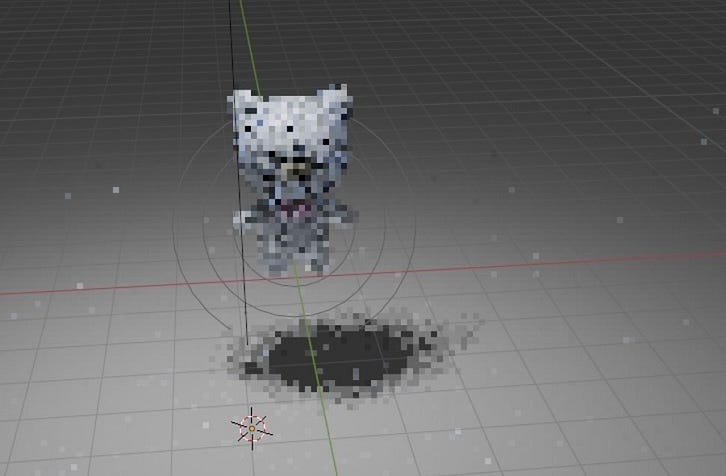
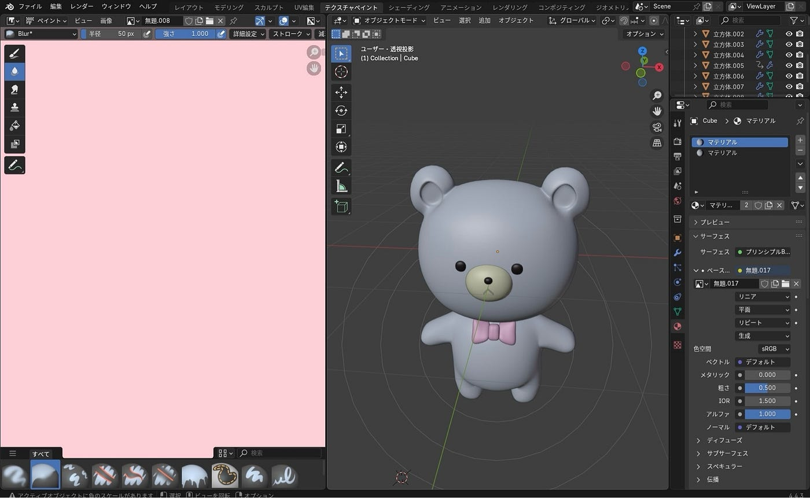
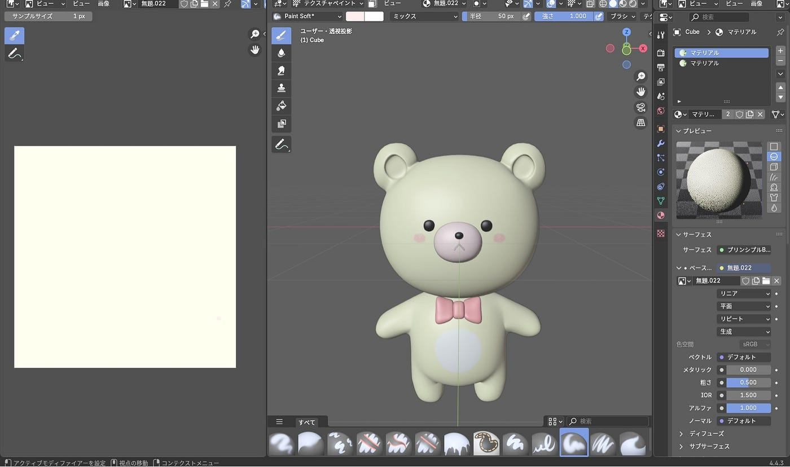
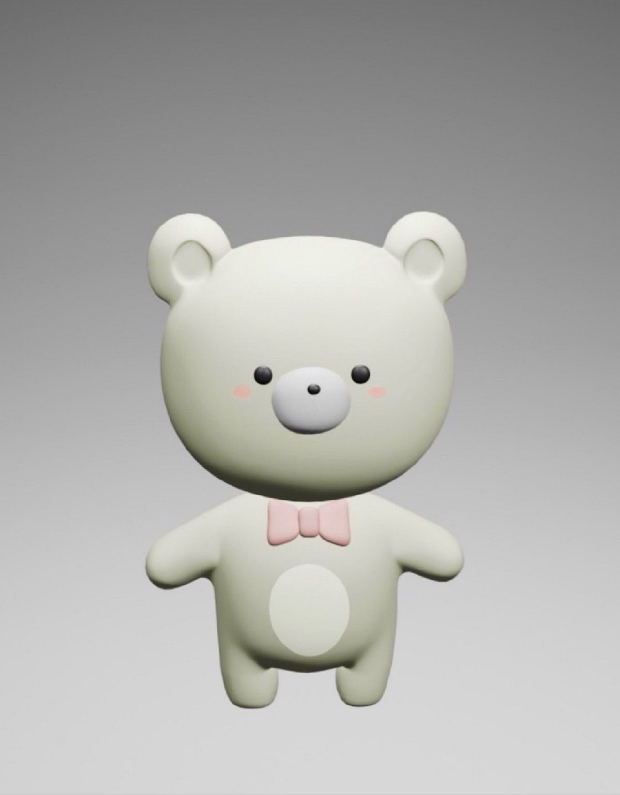
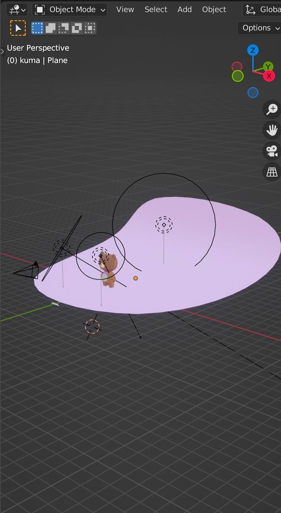
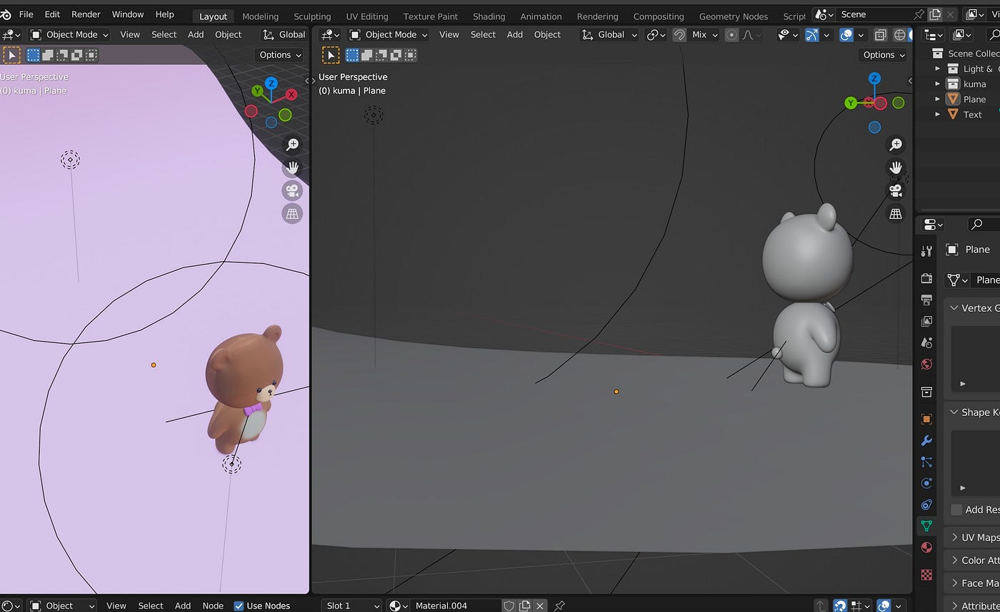
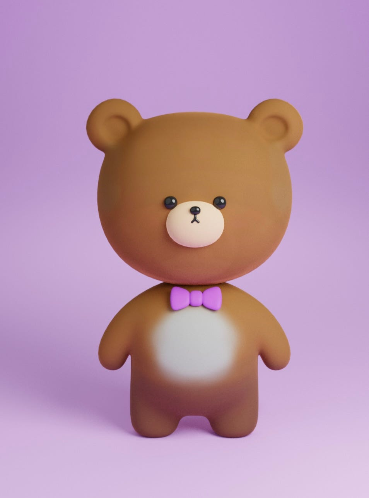
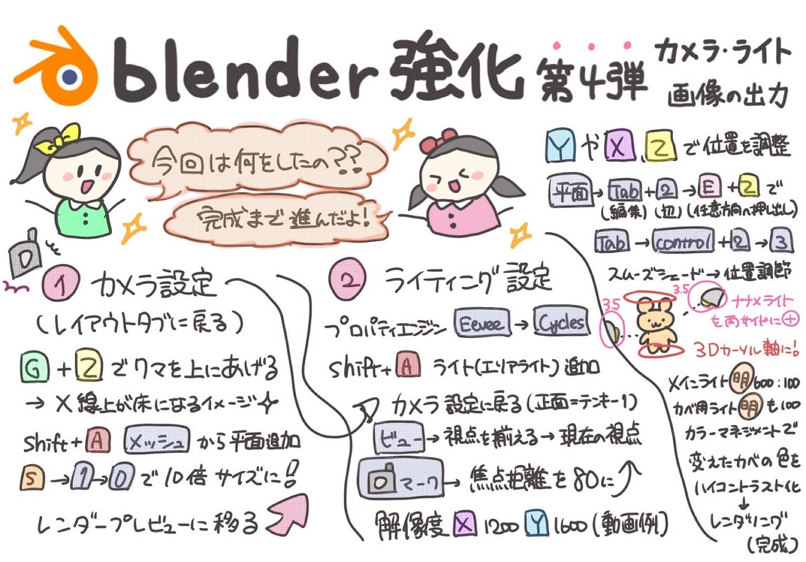

### 【デザイン部6/17週報】クマのキャラクター完成！

こんにちは、3年臼井です。

先週に引き続きBlenderを用いてクマのキャラクター制作の続きを行いました。今回は、クマのキャラクターを画像として出力するためのカメラ、ライト設定を行い、実際に画像を出力しました。

参考にしている動画

今回で動画内で紹介された作業は全て終了しました。次回以降、アニメーション制作を行うかは未定です。

#### 各メンバーの成果報告

ちはな

今回は作業途中でBlenderが落ちてしまうトラブルが何度か起こったので、こまめに保存するようにしました。

ライトの調整が難しく、位置や方向、光の強さを細かく調整して最終的な画像を出力しました。

レンダリング作業は初めてだったので、ここまで時間がかかると知らず驚きました。動画をレンダリングするときは更に時間がかかるようなので、機会があれば覚悟して臨みたいです。

最終的に出力した画像は我ながら上手くできたと思ったので、またBlenderでの制作を行ってみたいと思いました。

ゆうか

何度もデータが飛んでしまい、一からやり直したりもしたのですが、毎回ライトをCyclesに変更したあたりから様子がおかしくなり、 クマがいきなり消えたり画面がキラキラと輝き始めたため1度ギブアップしましたが、最終的には何とか完成まで行きつくことができました。始めから作り直した際には、前回のリベンジとして腕を綺麗に作ることができたのは良かったと思いました。

こうな

この前の作業のどこで間違えたかよくわからなく、クマもあまり納得がいかない感じだったので、もう一度動画を見ながら作り直す作業を行いました。

新しく作ったクマは動画通りに大きさを調整したり、目や鼻の位置を置くようにしました。（あまり工夫しようとすると逆に失敗することに気づきました笑ので慣れないうちはそのまま動画通りに作るようにします）

最後の調整は簡単かと思ったが、ライトの調整からレンダリング作業全部が難しく、細かく調整することが必要でした。

今回かなりblenderの基本作業が覚えてきて、これからも色々なものを作ってみようと思います。

#### グラレコ

