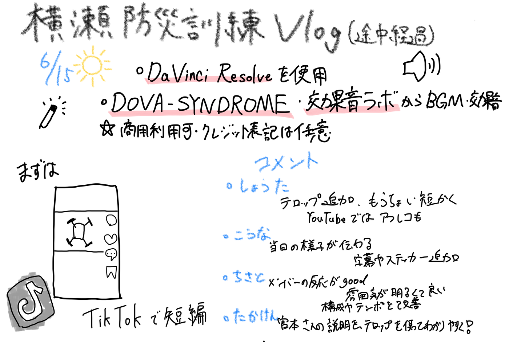

### 【6/17 V&F週報】6/15横瀬町防災訓練の一日を動画にしてみた(途中経過)

こんにちは！V&Fの荒川です。

先日、横瀬で開催された防災訓練に参加しました！その日の様子を動画で撮影し、Vlog風に仕上げようと思っています。今回の週報では、編集の経過や動画の構想について報告します。

ドローンバードの方々及び、動画に映っている地域住民の方々には、研究室の活動として動画をSNS等に掲載する許可をもらっています。

#### 使用するソフトなど

・DaVinci Redolve （編集）

・[DOVA-SYNDROME](https://dova-s.jp/)、[効果音ラボ](https://soundeffect-lab.info/)（BGM・効果音）

上記2つのサイトは商用利用可、クレジット表記は基本的には任意となっています（DOVA-SYNDROMに関しては、音源作成者の希望によってクレジット表記必要の有無が変わる。特に指定がない限り、表記は任意）。

#### 動画（途中経過）

まずは短めの動画でTikTokに投稿しようと考えています。

編集途中ですが、大まかな構成は以下のものになる予定です。

#### V&Fメンバーからのコメント

・しょうた

テロップを追加して当日の様子を説明しようと思っています。また、TikTokへの投稿を考えると、もう少し短く編集しようと思います。YouTube用の長い動画も編集しようと考えているので、そちらでは音声を入れてより詳しい説明を含めようと考えています。

・たかけん

宮本さんの、ドローンに関する話が良い。ゼミ生以外にもわかりやすいようにテロップで解説を入れたい。オープニングの雰囲気が良いなと思った。

・こうな

当日の雰囲気が伝わってきました。また、ドローンを飛ばす際の注意点の説明もあって、実際に操作する様子を見ることも出来ました。短い時間でわかりやすく作られている所に関して私自身も意識していきたいです。字幕やステッカーなどの工夫もあったらもっと楽しみながら見れると思います。

・ちさと

この動画では、イベントに参加したメンバーの反応がうまく取り入れられており、そのおかげで動画全体の雰囲気が明るく、親しみやすいものになっていて良かった。TikTokでの動画投稿は、短い時間で内容を凝縮して伝える必要があり、構成やテンポに工夫のしがいがある。一方、YouTubeは尺が長く取れる分、丁寧な説明や内容の深掘りが求められ、編集には情報整理と構成力が必要となる。媒体ごとの特性を意識した編集を、今後自分も心がけていきたい。

#### ひとりごと

動画編集にハマってしまい、プライベートでも使う用でDJIのosmo pocket3を購入しました。今回は初の撮影だったので試しに4k撮影をしましたが、データの大きさが半端なくてびっくりしています。編集の段階で結局1920×1080に解像度を落としたので、今後は1080pかそれ以下の解像度で撮影しようと思います、、、。

#### グラレコ

