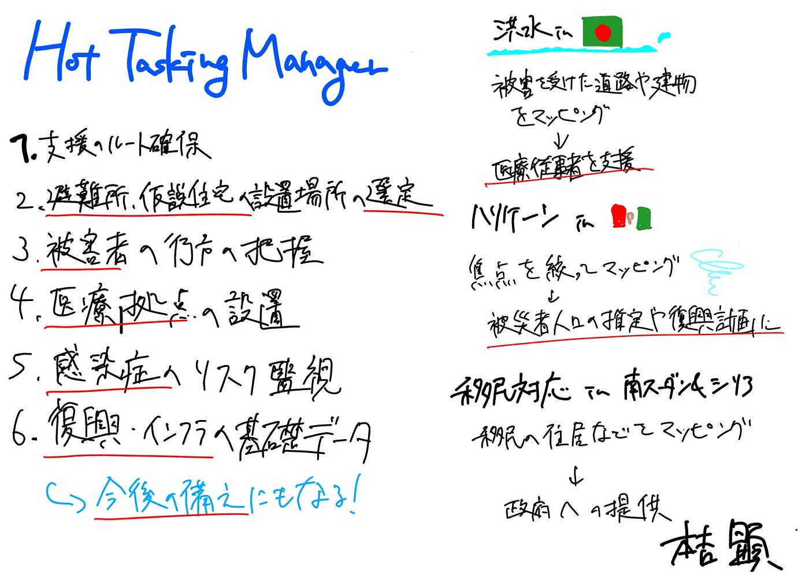

### 【Youth2週報】HOT Tasking Manager はいかにして役立っているのか

こんにちは。三年の本吉顕です。最近では梅雨に入り、季節の変わり目らしい天候になってきましたがいかがお過ごしでしょうか。本当は今回の週報では先週の週報の続きとしてOSM Basicsについて書こうと思ったのですが、Linkedinからログインができず、新しくアカウントを作ってもconfirmationメールが届かなかったため他のことについて書きます。

さて、今週の週報は普段私たちがCrisis Mappingを行っている媒体である [HOT Tasking Manager](https://tasks.hotosm.org/)についてです。古橋研では地球上で大規模な災害などが起こった場合にゼミ生がHOT Taksing Managerを使って被災地をマッピングして被災者に貢献します。しかし、具体的にはどのようなことに貢献しているのでしょうか。今回はHOT Taking Manager上で行われるCrisis Mappingが被災地の人々にどのように役に立っているのか調べてみました。

### **Crisis Mapping が役に立つ主な分野**

**1,緊急支援のルート確保・物資輸送の計画**

被災直後は、道路の寸断や通行不能が多く、物資や救援チームの到達が困難になります。Crisis Mappingによって**使える道路・橋・障害物**などをマッピングすることで、**最短で安全なルート**を支援組織が把握でき、迅速な物資輸送が可能になります。

**2.避難所や仮設住宅の適切な設置場所の特定**

人々が安全に避難できる場所を探すために、被災の程度・人口密度・インフラの有無などを地図上で可視化する必要があります。これにより、**危険地域を避けつつ、人々が集まりやすい避難所の候補地**を選定することができます。

**3. 被災者や行方不明者の分布把握**

災害時にはどこにどれだけの人がいるのか把握するのが困難です。Crisis Mappingにより、**被災地域の人口分布や避難先情報を地図化**し、重点的に支援が必要なエリアを特定できます。捜索・救助や物資配分の効率化にもつながります。

**4.医療・衛生支援の拠点配置**

感染症やケガ人対応のため、**医療施設や衛生拠点の配置**が必要です。事前に医療機関やアクセス道路の情報をマッピングしておくことで、適切な場所への配置とリーチが可能になり、二次被害の防止にもつながります。

**5.感染症の蔓延リスク地域の監視**

エボラやコレラなど感染症が拡大する危険性がある場合、人の移動ルートや人口集中エリアを把握することで、感染拡大を未然に防ぐ対策（検問所設置や隔離計画など）が可能になります。

**6. 復興・インフラ再建の基礎データ整備**

災害後の都市計画や復興には、正確な地理情報が不可欠です。Crisis Mappingは**長期的な再建計画の基盤となる地図データの整備**にも活用され、建物の再配置やインフラ更新の基礎資料になります。

### 具体的な活用例

#### **South Asian floods (2017)**

2017年にバングラデシュで起きた壊滅的な洪水を支援するために、HOTは” South Asian Flood Activation”を立ち上げ、現地の医療従事者を支援しました。洪水の被害を受けた住宅や道のマッピングをとおして、医療従事者が被災者の支援をすることを可能にし、さらに今後の災害に備えたメカニズムを発展させました。

[Disaster Response: South Asian Floods 2017
To support response to the devastating after-effects of the 2017 Bangladesh floods, HOT initiated the "South Asian…www.hotosm.org](https://www.hotosm.org/projects/disaster-response-south-asian-floods-2017)

#### Otis Hurricane(2023)

カテゴリー5のオーティスハリケーンがメキシコのアカプルコを直撃し、破壊的な風と激しい雨をもたらし、建物やインフラの崩壊、人口の移動、死亡者が出るなど大きな被害を出しました。しかし、地方自治体が対応をするにあたって復興計画やデータ管理に不可欠な詳細な地理空間データが不足していました。そこで、HOT とコミュニティ期間が正確なマッピングを行いました。これにより、教育機関、医療施設、公共市場に特に焦点を当てた災害前後の建物を把握することができました。これは被災者の人口の推定や対象を絞った復興計画に寄与しました。

[Hurricane Otis 2023 Response
Versión en Españolwww.hotosm.org](https://www.hotosm.org/projects/hurricane-otis-2023-response/)

### 番外編

Crisis Mapping ではありませんが、他にもHOT Tasking Managerでのマッピングが活躍している事例があるので番外編として紹介します。

#### 南スーダンとシリアでの難民の対応

このプログラムでは、地図にまだ情報がない場所や足りないデータを補うことが目的として難民のコミュニティリーダーを育成し、彼らが住んでいる地域の脆弱性や資源をマッピングしました。これらの地図はOpen Street Mapに公開される他、受け入れ国の政府やPRM(アメリカ合衆国国務省 人口、難民、移住局）,UNHCR（国連難民高等弁務官事務所）,NGOなどの関係機関にも提供されました。

[Refugee response: South Sudan and Syria
The "Crowdsourcing Non-Camp Refugee Data Through OpenStreetMap" project aims to improve program planning and service…www.hotosm.org](https://www.hotosm.org/projects/urban_innovations_crowdsourcing_non-camp_refugee_data)

### まとめ

HOT Tasking Manager によって作られた地図は主に被災者の避難や物資のルート確保に使われるだけではなく、避難所や仮設住宅など拠点の特定や行方不明者の特定、さらには人の移動経路や人口集中エリアから感染症の対策や災害からの復興にも役に立つことがわかった。また、一度マッピングされたエリアは今後の災害が発生した際にも対応できるメカニズムが出来上がっているため、未来への備えになることもわかった。私たちの行っているマッピングが具体的にどのように役に立っているのか実例を知ることができたため、今後は意欲的にマッピングに参加できるようにしていきたい。

### 参考文献

Humanitarian OpenStreetMap Team（発行年不明）『Disaster Response: South Asian Floods 2017』2025年6月22日閲覧，[https://www.hotosm.org/projects/disaster-response-south-asian-floods-2017](https://www.hotosm.org/projects/disaster-response-south-asian-floods-2017)

Humanitarian OpenStreetMap Team（発行年不明）『Hurricane Otis 2023 Response』2025年6月22日閲覧，[https://www.hotosm.org/projects/hurricane-otis-2023-response/](https://www.hotosm.org/projects/hurricane-otis-2023-response/)

Humanitarian OpenStreetMap Team（発行年不明）『Urban Innovations: Crowdsourcing Non-Camp Refugee Data』2025年6月22日閲覧，[https://www.hotosm.org/projects/urban_innovations_crowdsourcing_non-camp_refugee_data](https://www.hotosm.org/projects/urban_innovations_crowdsourcing_non-camp_refugee_data)

Humanitarian OpenStreetMap Team（発行年不明）『Tasking Manager』2025年6月22日閲覧，

[https://www.hotosm.org/tech-suite/tasking-manager/](https://www.hotosm.org/tech-suite/tasking-manager/)

### グラレコ

