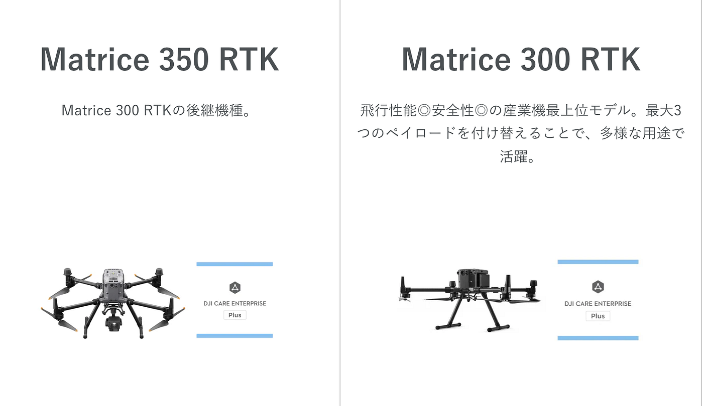
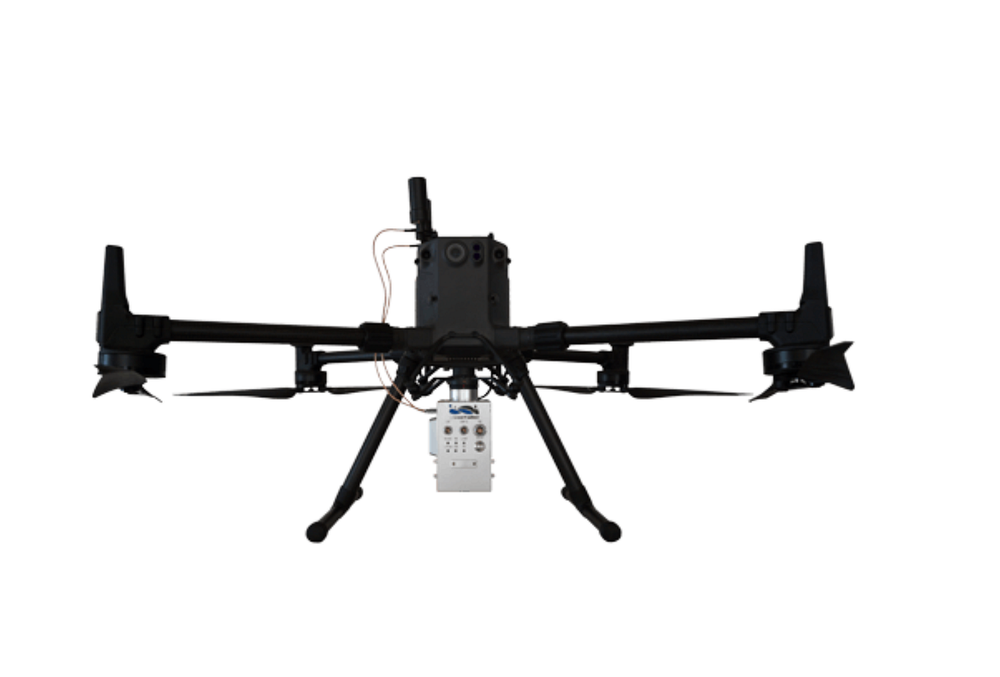
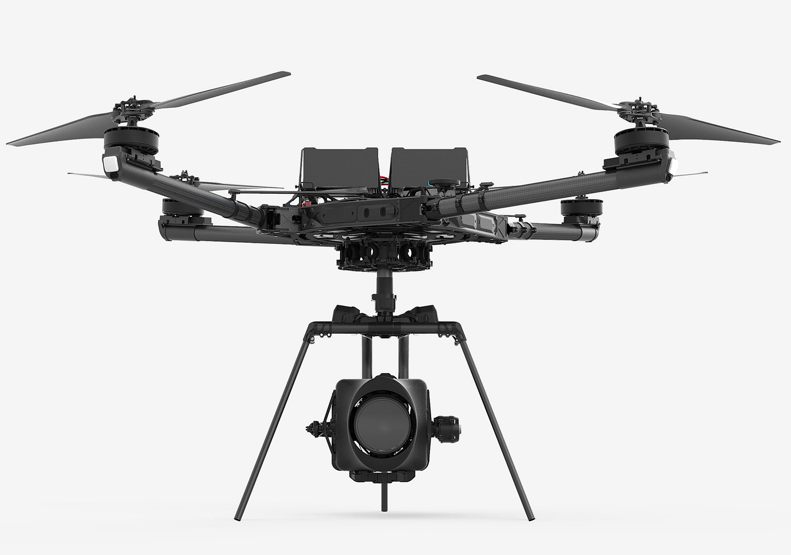
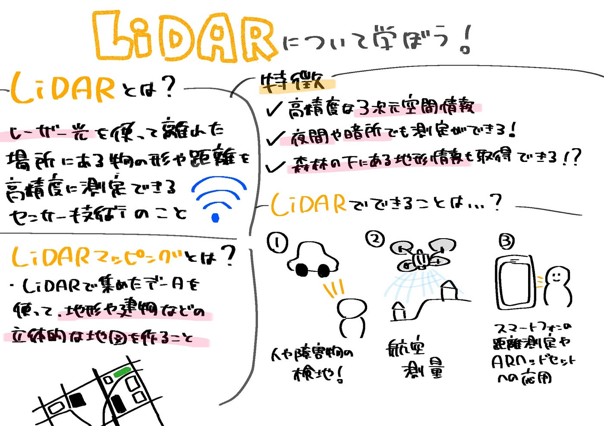

### 【ドローン部２ 5/16週報】LiDARについて学んでみよう

こんにちは！3年の小崎です。今週のドローン部２では、LiDARについて学んでみたのでそれをまとめました。

#### LiDARとは？

> LiDAR（ライダー）とは、離れた場所にある物体の形状や距離をレーザー光を使って測定するセンサー技術のことをいいます。この技術を実現するためのセンサー装置を指す場合もあります。

（空間情報クラブ,“LiDARとは”,https://club.informatix.co.jp/?p=394&amp=1,2025/6/15アクセス）

#### 特徴

- 高精度な3次元空間情報を取得できる

- 光源であるレーザーを利用するため、夜間や暗所でも測定が可能

- 森林や植生の下にある地形情報も、レーザー光が植生を透過することで取得できる場合がある

元々地質、海洋、気象、農林業、宇宙探査などの分野で利用されていましたが、遠距離からでも高精度な測定が可能なことから近年では自動運転分野で利用されるようになりました。

#### LiDARマッピングとは？

LiDARは、その高精度な計測能力を活かして、地形図の作成や航空測量に用いられます。これにより、広範囲の3Dデータを効率的に取得し、詳細な地図やモデルを作成することが可能です。

**例1) LiDARでできること**

- 高精度な人や障害物の検知（自動運転分野）

- 航空測量

- 地形図作成

- 体操競技における演技の難易度計測

- スマートフォンの距離測定やARヘッドセットへの応用

**例2) 考古分野での活用**

レーザー光が森林の植生を透過する特性を利用し、地上からは見えにくい古代の遺跡や地形を「透視」することができるという特徴を活かし、森林の成長過程の観測や、アマゾンの密林に眠る古代都市の計測など、様々な事象の観測や図像化に役立てられてきました。

具体例として、ルーマニアのネアムツ郡の森林深くに埋もれていた5000年前の要塞集落の調査にLiDARが活用され、地上からは発見が困難だった構造物が明らかになりました。

#### LiDARを搭載したドローンの種類

**・DJI Matriceシリーズ（例: Matrice 300 RTK, Matrice 350 RTK）**

: DJI Zenmuse L1やL2といったLiDARペイロードと組み合わせて使用され、高精度な3Dデータ収集が可能

**・GreenValley International LiAirシリーズ**

: ハンドヘルド型、ドローン搭載型など、多様なLiDARシステムを提供しており、様々なLiAirモデルがドローンに搭載されている

**・Freefly Alta X**

: ペイロード容量が大きく、様々なLiDARセンサーの搭載が可能で、頑丈な作りが特徴です。

### どうやって活用されているのか

以前の記事の内容を基に、LiDAR技術に焦点を当てて、その活用方法についてまとめました。

LiDARは私たちが普段使用しているスマートフォンにも搭載されています。スマートフォンに搭載されるLiDAR技術は、レーザー光の反射時間を利用して対象物までの距離を正確に測定し、高精度な3Dスキャンをすることができます。

これにより、iPhoneなどのスマートフォンで拡張現実（AR）アプリケーションが強化され、建設業界などでの3Dスキャン活用が促進されています。

スマートフォンでの3Dスキャンアプリには、LiDAR技術の他に、複数の写真から3Dモデルを作成する「フォトグラメトリ」技術も利用されています。WIDAR、Polycam、3D Scanner App、Scaniverseといったアプリが代表的です。スマートフォンの手軽さや携帯性が利点である一方で、専門的なハンドヘルド3Dスキャナーと比較すると、その精度には差があります。LiDARはミリ波レーダーよりも高精度ですが、悪天候時には性能が低下する可能性もあります。

#### フォトグラメトリとは

- **原理**: 複数の写真から対象物の3D形状や位置を測定する技術

- **方法**: 異なる視点から撮影された写真の重なり合う部分を解析し、点群データやテクスチャ付きの3Dモデルを生成

- **応用**: ドローン測量、文化財の記録、ゲームやVR/ARコンテンツ制作など、多岐にわたる分野で活用

#### 感想

LiDARというシステムを今回初めて知りました。自動運転支援システムや地形図作成といった身近な応用から、考古学における遺跡発見のような意外な分野での活用まで、その汎用性と可能性に驚かされました。

参考文献

- 産業技術総合研究所. (2022年9月28日). _LiDARとは？測量に使われるLiDARのメリット・デメリットや導入事例を解説_. AIST Magazine. [https://www.aist.go.jp/aist_j/magazine/20220928.html](https://www.aist.go.jp/aist_j/magazine/20220928.html) (2025年6月16日アクセス).

- 山本, 晃司. (2024年4月22日). _レーザーで透視した「5000年前の要塞」がルーマニアで発見される_. Esquire Japan. [https://www.esquire.com/jp/news/history-archaeology/a64262844/5000-year-old-fortress-romania/](https://www.esquire.com/jp/news/history-archaeology/a64262844/5000-year-old-fortress-romania/) (2025年6月16日アクセス).

- 光響. (日付なし). _LiDAR ホーム | ハンドヘルド型・ドローン搭載用・超高点群密度・ソリッドステート・1550 nm_. [https://www.symphotony.com/lidar-5/](https://www.symphotony.com/lidar-5/) (2025年6月16日アクセス).

- YellowScan. (日付なし). _LiDARマッピング用DJIドローン：完全ガイド_. [https://www.yellowscan.com/ja/knowledge/dji-drones-for-lidar-mapping/](https://www.yellowscan.com/ja/knowledge/dji-drones-for-lidar-mapping/) (2025年6月16日アクセス).

- 光響. (日付なし). _ドローン搭載用 LiDAR LiAir −ライエアー− ｜ GreenValley International_. [https://www.symphotony.com/lidar/greenvalley/liair/](https://www.symphotony.com/lidar/greenvalley/liair/) (2025年6月16日アクセス).

- Pilot Institute. (日付なし). _LiDAR Drones: The Best Models for Surveying, Mapping, and More_. [https://pilotinstitute.com/lidar-drones/](https://pilotinstitute.com/lidar-drones/) (2025年6月16日アクセス).

- Advexure. (日付なし). _Top 7 LiDAR Sensors for Drones_. [https://advexure.com/blogs/news/top-7-lidar-sensors-for-drones](https://advexure.com/blogs/news/top-7-lidar-sensors-for-drones) (2025年6月16日アクセス).

- UAV Coach. (日付なし). _LiDAR Drones: An In-Depth Guide [New for 2025]_. [https://uavcoach.com/lidar-drones/](https://uavcoach.com/lidar-drones/) (2025年6月16日アクセス).

- IDEOROBO. (日付なし). _Freefly Alta X 製品画像_. [https://www.ideorobo.com/products/altax/](https://www.ideorobo.com/products/altax/) (2025年6月16日アクセス).

- スキャンテック. (日付なし). _スマートフォン用3Dスキャナーアプリでどこまでできる？ハンドヘルド3Dスキャナーと比較検証_. 3D-SCAN TECH. [https://3d-scantech.jp/column/smartphone/](https://3d-scantech.jp/column/smartphone/) (2025年6月17日アクセス).

- 株式会社建設ITワールド. (2024年4月22日). _LiDARとは？レーザーを使った次世代の測量技術｜iPhoneへの搭載で何が変わる？_. Digital Construction. [https://digital-construction.jp/guide/182](https://digital-construction.jp/guide/182) (2025年6月17日アクセス).

以下グラレコです

