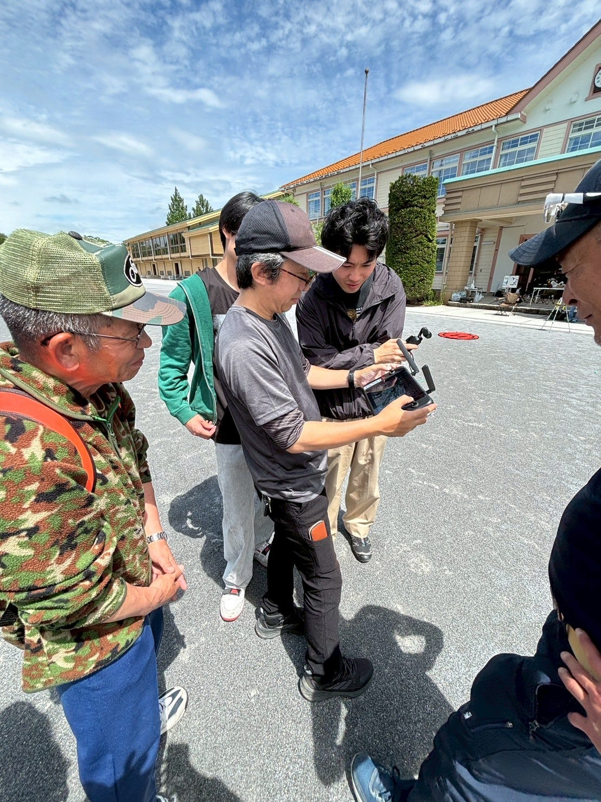
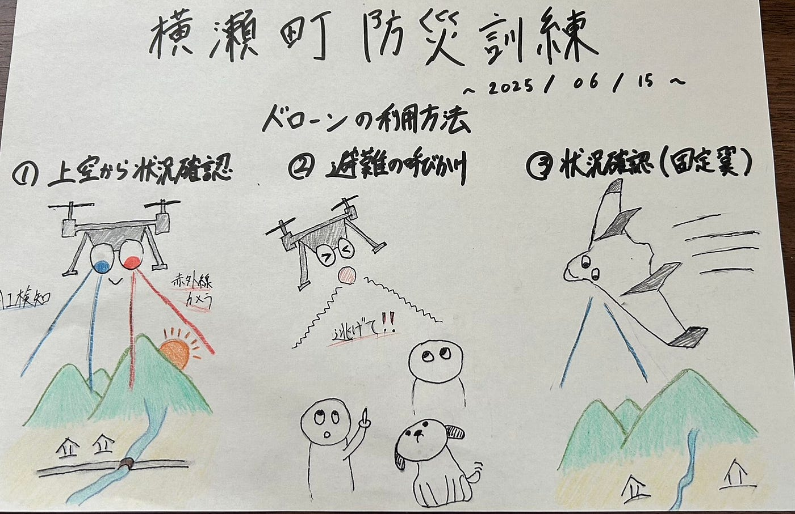

### 【6/17ドローン部１週報】横瀬町防災訓練に参加！

こんにちは、3年の井上です。

今週のドローン部１の週報では、令和7年6月15日に横瀬小学校にて開催された横瀬町防災訓練の様子を紹介します。

今回、ドローン部としてはドローンバードの方々の手伝いをしたり話を聞いたりして、災害時のドローン活用について学んできました。

> _**訓練概要_**

埼玉県横瀬町における台風接近に伴う非難・被災状況確認等の初動訓練で、町全体対象とした大規模な訓練。

実施日はドローンバードが協力参加し、訓練を実施

> _**訓練内容（ドローン）_**

訓練では防災共生無線放送、安心安全メール配信、避難指示発令など様々な内容が行われましたが、今回はドローンに関する訓練内容についてまとめさせていただきます。

_**・ドローンを使っての上空からの被害状況確認訓練_**

ドローンに搭載されたカメラから撮影された映像を基に、広範囲の被害状況確認ができるようになっていました。カメラの機能で特に印象的だったのが、**”赤外線カメラ”**と**”車や人のAI検知”**です。

AI検知では、検知した人や車を分かりやすくマーキングしてくれるため、人が集まっている場所や救助を求めている人の場所などが、映像からすぐにわかるようになっていました。

赤外線カメラでは、建物や木々で隠れて直接確認できない人の場所が分かるため、家屋の中に取り残された人などを見つけ出すことができます。また、夜間でも捜索が可能であるというメリットにも気づくことができました。

これらの機能についてはドローン操縦のスペシャリストである清水さんをはじめとするエキスパートの方々に教えていただきました。ありがとうございます！

_**・ドローンでの避難の呼びかけ_**

ドローンに設置したスピーカーから音を出し、避難を呼びかけるという試みが行われていました。

いろいろなところに呼びかけに行けるというのは画期的で面白い取り組みだと思いましたが、スピーカーはカメラに比べて重いためドローンに乗せるのにはあまり向いていないというデメリットも存在するという事が分かりました。

_**・固定翼ドローンを使った状況確認のためのシステム設定訓練_**

一般的に想像されるプロペラで飛ぶドローンだけでなく、飛行機能ような形の[固定翼ドローン](https://www.nttedt.co.jp/vtol)による被害状況が行われることを知りました。

実際に飛ぶところは見ることはできませんでしたが、固定翼ドローンを飛ばすためのシステム設定を見せていただきました。

> _**感想、振り返り_**

元々雨予報で、ドローンを飛ばせるかわからない状態でしたが当日は奇跡的に晴れて実際に訓練する様子を見れたので良かったです。

今まではドローンについて映像や資料でしか知ることができなかったが、実際に社会で利活用される姿を見て、ドローンに対する理解が深まるとともに、古橋研究室で学べることが社会に多大なる貢献をもたらすという事を改めて実感できました。

今後もイベントや活動に積極的に参加していきたいと思います！

> _**グラレコ_**

今回のグラレコはこちらです。

