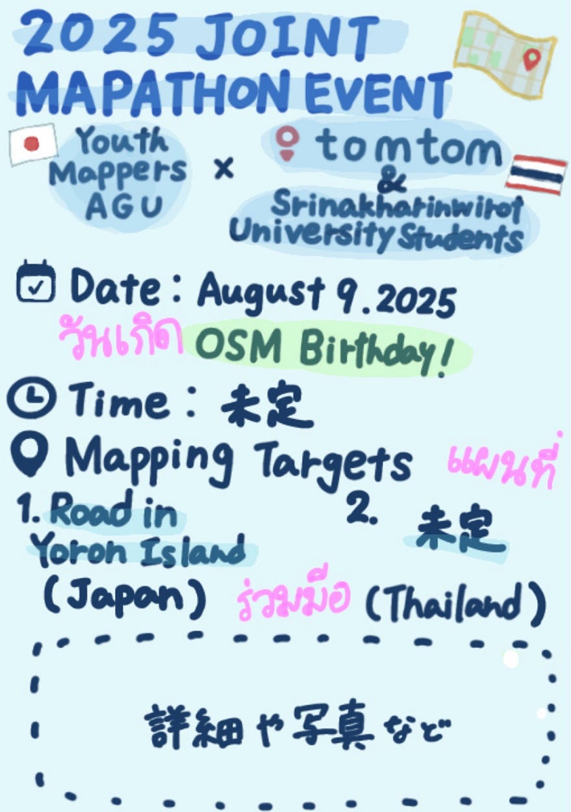

### YouthMappersAGU × SWU w/ TomTom: Joint Mapathon①週報【2025/6/17】

**สวัสดี ค่ะ😊岡**村です。先週の井上に引き続きYouthMappersAGU主催予定のMapathonの進捗報告を簡単にします。

_**今回のマッパソン概要_**
[TomTom](https://www.tomtom.com/)と[シーナカリンウィロート大学](https://swu.ac.th/)の学生と合同で[HoTTaskingManager](https://tasks.hotosm.org/)を行います。

_**目的_**
2024年12月に行われた[FOSS4G Asia](https://www.bing.com/videos/riverview/relatedvideo?q=foss4g%20asia%202024&mid=655C6B151F3BEEC4BD3C655C6B151F3BEEC4BD3C&ajaxhist=0)で知り合った学生と協力し合って
いくことで、ネットワークを築いていくと同時に、今後のYouth Mappers AGU マッパソンのさらなる発展を目指します。

_**今回の進捗
_**☑日程確定

→８/９（土）OSM誕生日

□マッピング対象 
①与論島の道路
2025年2月に現在の4年を中心に行われた、「与論島マッピング」に引き続き、マップされた道路でズレている箇所を直す作業をTomTomに提案。
②タイ
TomTomとタイのどこをマッピングした方がいいか相談。

☑タイのレベル感先生に聞く

⇨初心者と経験者で分かれる

☑シーナの学生呼びかける

☑ポスター大枠確定

☑修正案 ゼミのアーカイブ動画確認

☑ユース２との連携

☑日程アンケート、確定

☑aki シーナの学生に呼びかけ

_**今後の流れ_**
・Googleドキュメントにまとめています。
[20250115_YouthMappers AGU — Google ドキュメント](https://docs.google.com/document/d/1QYlU_D7iDJw8cC-dJEpEYktZM4fkBA4VHJnMod0OhXo/edit?tab=t.e0uoxfmpuhvr#heading=h.86eg8xcp7p0v)

・GitHub
[８月開催マッパソン w/ TomTom and Srinakharinwirot の学生たち · Issue #1 · furuhashilab/2025Mapathon](https://github.com/furuhashilab/2025Mapathon/issues/1)

_**おわりに_**
今回のYouthMappersAGUによるマッパソンは、私を含めた3年生にとって初めて運営に関わるイベントになります。そして、その初めての取り組みがタイの皆さんとの合同イベントであることを、とても嬉しく思っています。先輩方に引っ張ってもらいながら、 私たちYouthMappersAGU一同、このマッパソンが意義のあるものとなるよう当日に向けて準備していきます。そして、今後も学外のさまざまな方々と交流を広げていけるような活動につなげていきたいと考えています。

