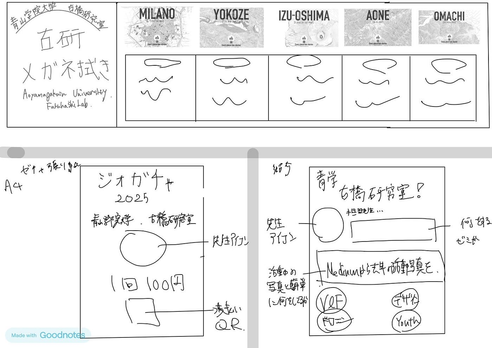
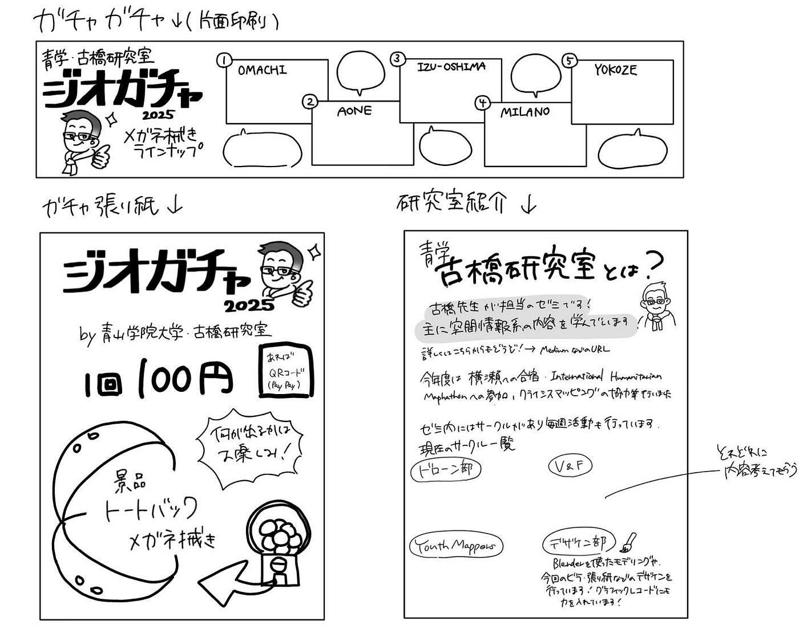
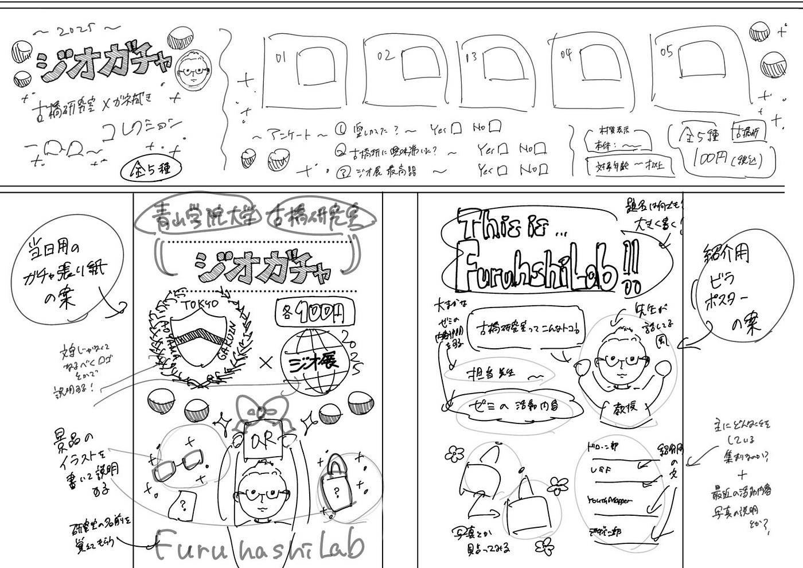
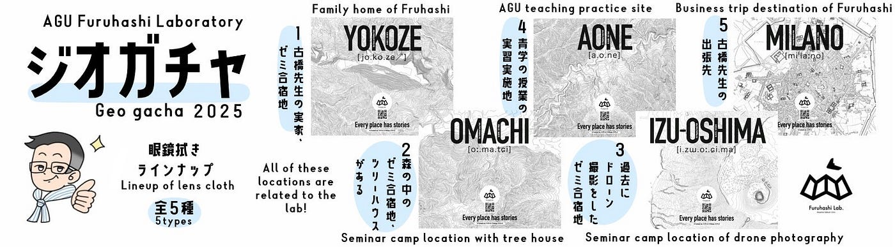
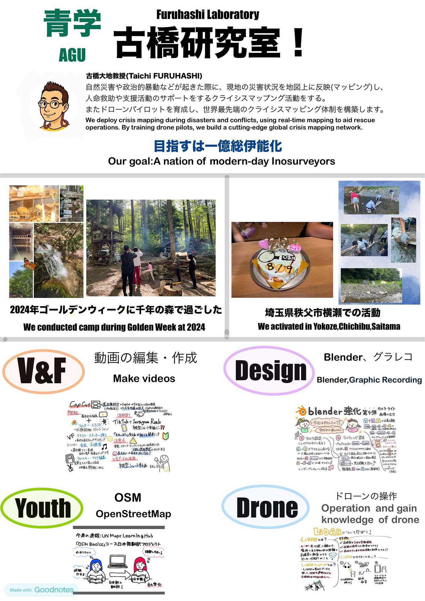
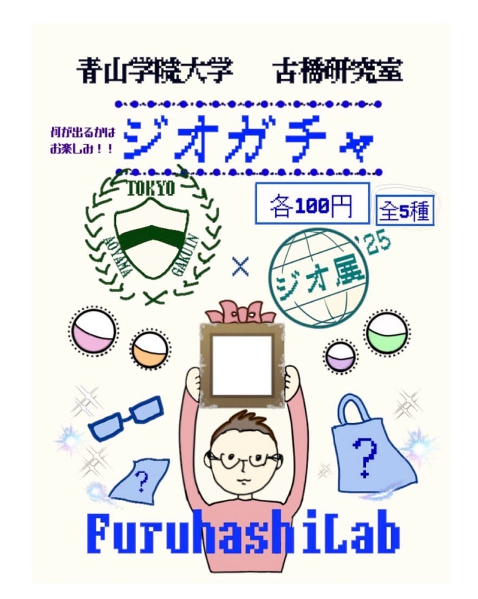
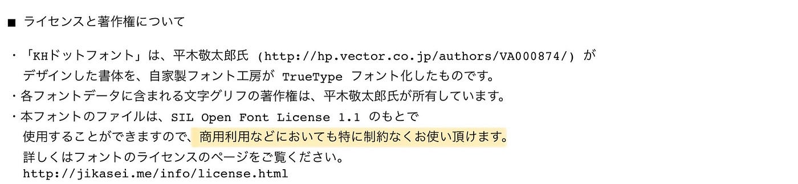
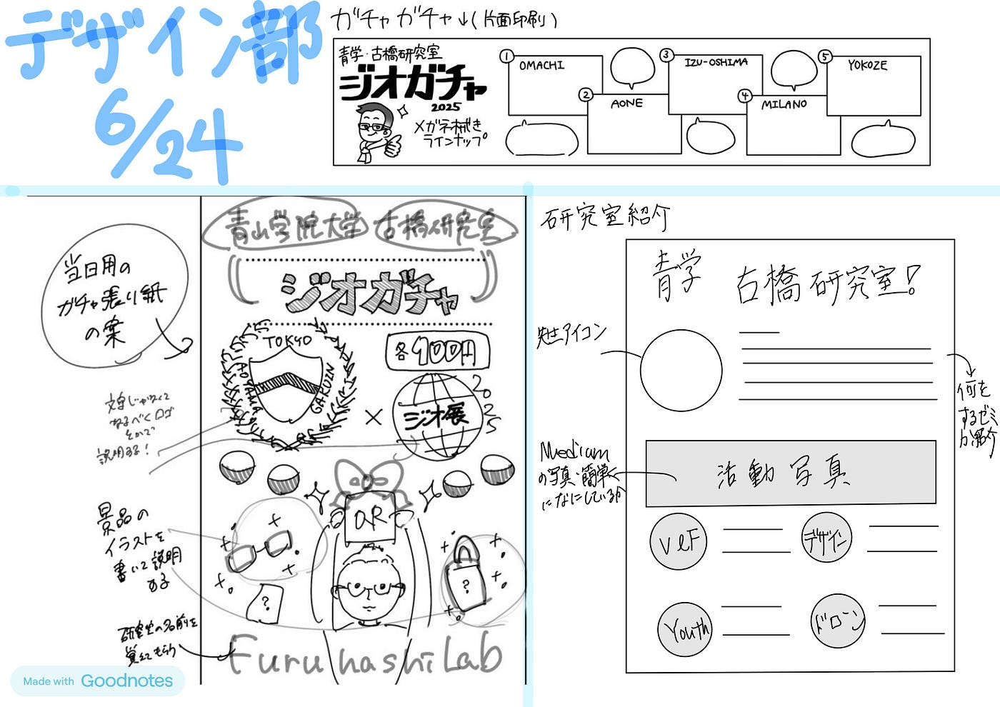

### ジオ展ガチャガチャ類と研究室紹介ポスターデザインを提案します【デザイン6/24】

こんにちは！四年の福田です。

今週はジオ展に向けてガチャガチャの中の紙、ガチャガチャに貼るポスターと研究室を紹介するためのポスターのデザインを考えました。

最初にそれぞれイメージを提案してもらいその中からそれぞれ選んでもらいました。

### 完成形

使用したフォント⤵︎

https://ymnk-design.com/バナナスリップ/

フォントはibis paintの「KHドット」と「チェックポイント」を使用しました。どちらも利用制約は無く、商標利用可能なものでした。

> グラレコ

