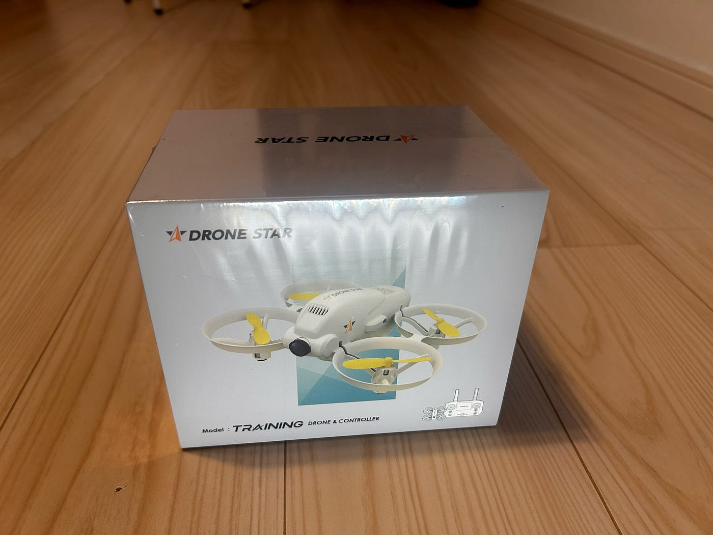
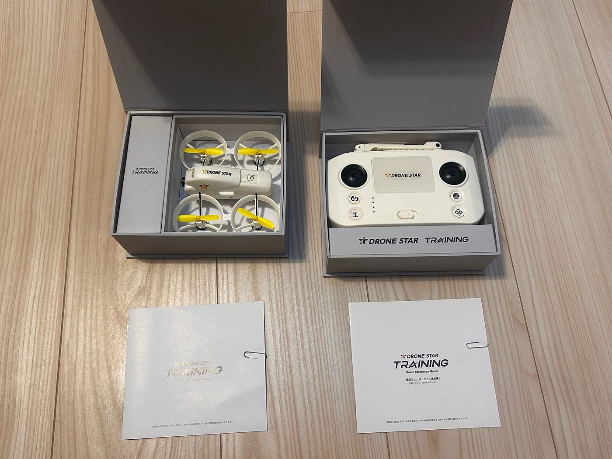
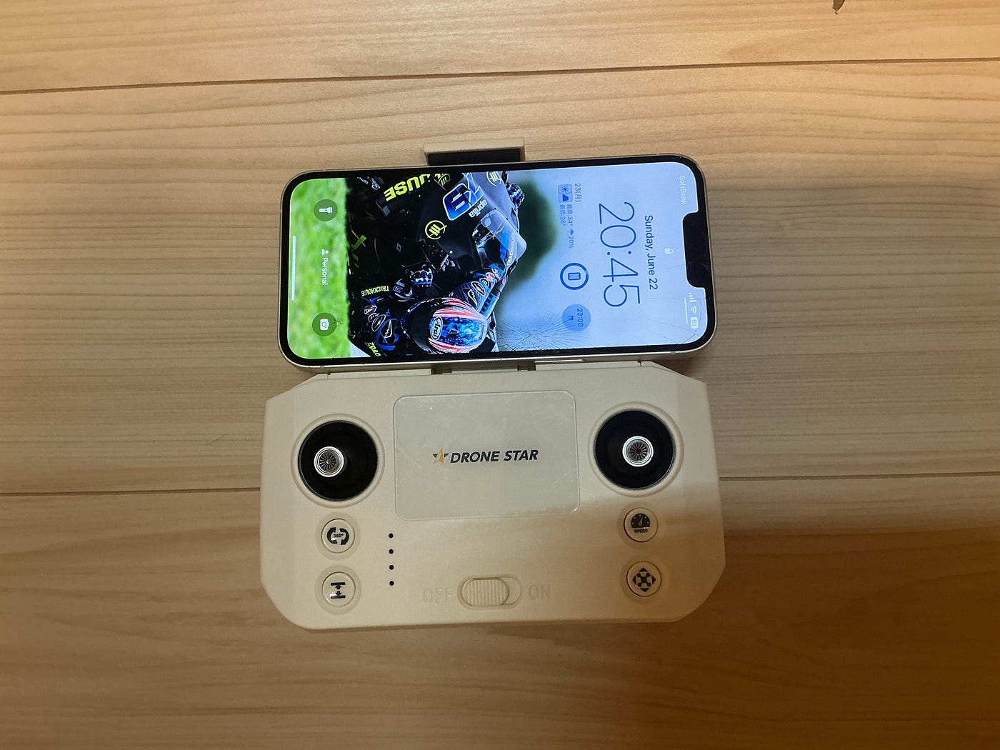
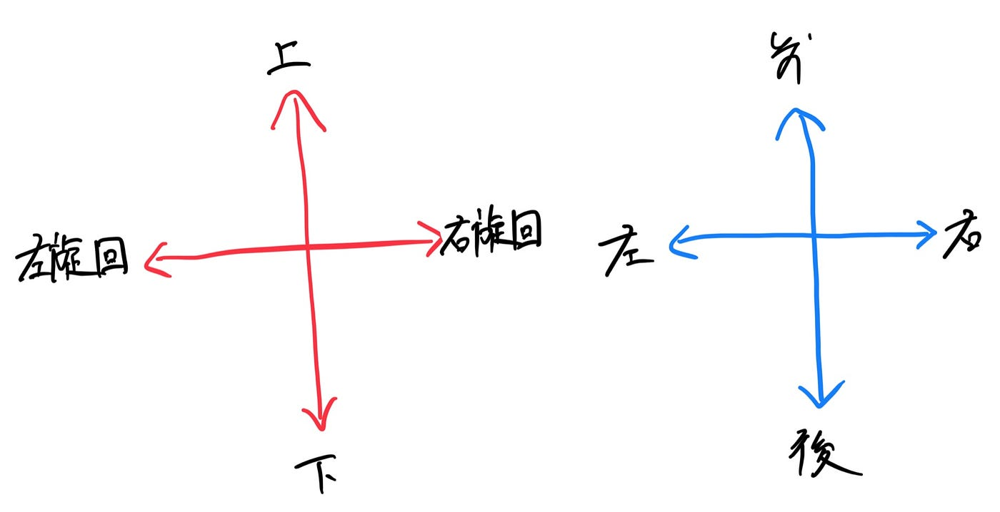
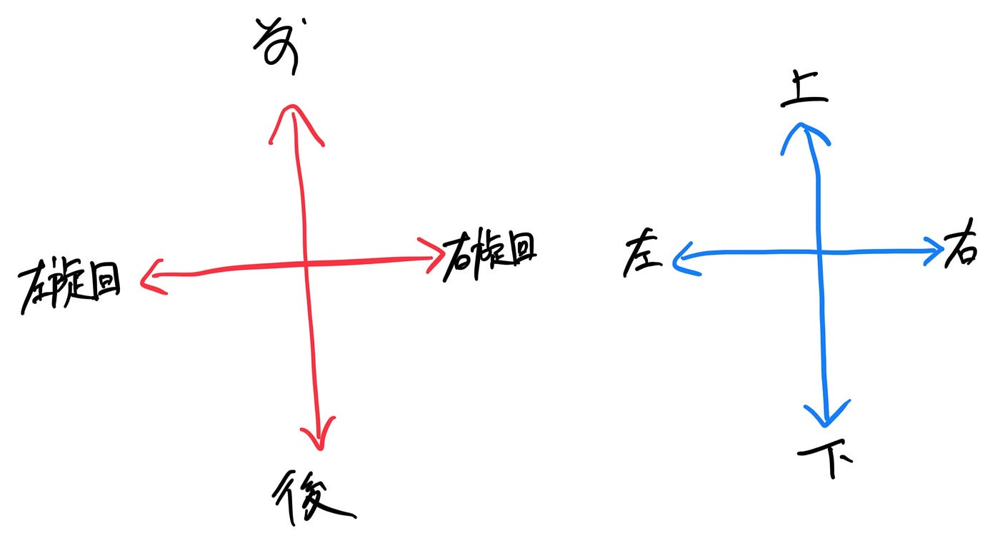
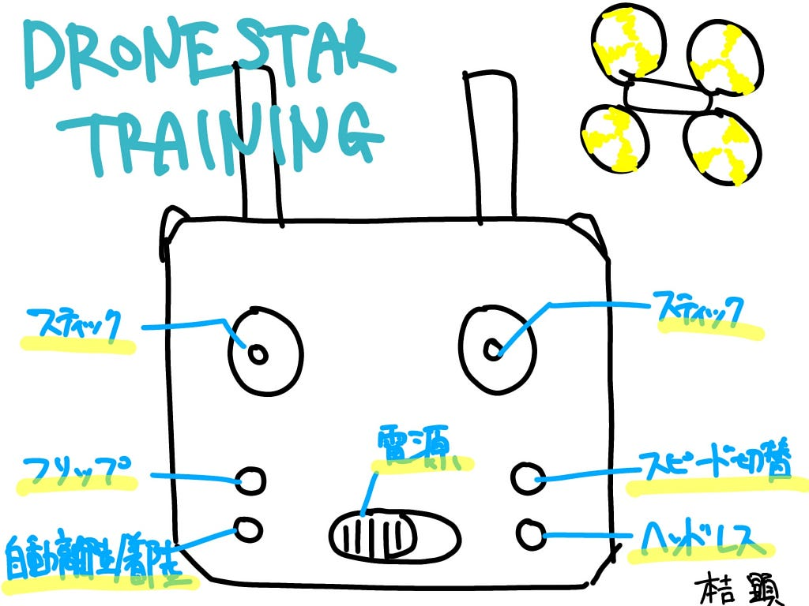

### 【ドローン２週報】ドローンを飛ばすまでに

こんにちは。三回生の本吉顕です。先日、古橋研からは数名がJapan Drone 2025に参加しました。そしてDrone Starのブースで行われているドローンの操作体験会にて訓練用のドローンをいただきました。いざテイクオフ！といきたいところですが、今回は飛ばす前にドローンについてや設定などをまとめます。これがいただいたDRONE STAR Trainingです。

> DRONE STAR TRAININGとは
ビジョンセンサーON/OFF機能搭載
国家資格向け、”お家で練習できる”
新・練習機セットです。

とDrone Starのサイトに書いてありました。

[https://dronestar.official.ec/items/86510539](https://dronestar.official.ec/items/86510539)

飛行時間は約7分、バッテリー一本の充電には60分かかります。たくさん練習するならば予備のバッテリーを買うのが良いでしょう。

### 内容物

DRONE STAR PARTY

バッテリー

充電ケーブル

プロペラA 予備 x2

プロペラB 予備 x2

クッション予備

コントローラー

スティック x2

#### その1.機体を充電する

私のドローンは少し充電がありましたが、長くはもたないのでまず充電しましょう。機体下部のお尻の部分を押すとバッテリーを取り出すことができます。付属のケーブルをバッテリーに刺して充電しましょう。充電中はケーブルが赤く光ります。USBアダプタは5V 1.0~2.0のものを使いましょう。余談ですが、このバッテリーはリサイクル可能であるとの表記が取扱説明書にありました。環境にやさしいんですね！

#### その2. コントローラーに電池を入れる

コントローラーの背面部に電池を入れましょう。単三アルカリ電池を3本です。

#### その3. 操作スティックをコントローラーに取り付ける

開封時は写真のように操作スティックがついていません。コントローラーが入っている方の箱の中の細長い箱を開けると操作スティックが入っています。コントローラーに押し込むようにして取り付けましょう。左右はありません。

写真は開封時の様子。操作スティックはついていません。

#### その4. スマホを取り付ける

機体にカメラが搭載されているため、スマホと連動して飛ばすことが可能です。コントローラーの上部のアンテナを立てましょう。この時、片方が表面、片方が裏面を向くようにすることが大切です。次に、アンテナの間にあるスマホホルダーを限界まで引き出します。かなり硬いので思い切って引っ張りましょう。そして、スマホを横からスライドするようにして取り付けます。私はiphone 14を使用しているのですが、ケースをつけている状態ではスマホホルダーに収まりませんでした。iphoneのproシリーズや、ワイドめのスマホを使っている人は要注意です。

#### その5. ペアリング

いよいよペアリングです。コントローラーの電源を入れ、機体の電源を入れます。このときに機体を平坦なところに置くようにしてください。電源が入るとコントローラーはピ！という音と共に緑色に光り、機体は白色のLEDが点滅します。そして次のステップによってモード選択ができます。

モード1: コントローラーの右のスティックを音がするまで上下に倒し込みます。

モード2: コントローラーの左のスティックを音がするまで上下に倒し込みます。

機体とコントローラーが接続されると機体のLEDが点滅から点灯に変わります。これを持ってペアリング完了とします。

### 操作方法の違い

先ほどモード1とモード2があると言いましたが、その違いは以下の通りです。

モード1

モード2

モード1は日本で主に使われる操作方法です。一方、モード2は海外のドローンに多いとされています。海外のドローンには操作方法としてモード1が選択肢にない場合があるので、両方慣れておくと問題ないでしょう。

### その他機能

#### 自動離陸/着陸

コントローラーの下部にあるボタンを押すと自動で離陸と着陸をしてくれます。離陸の場合、自動的に地上から70cmの高さまで浮かび上がり、ホバリングします。

#### スピード切り替え

コントローラー下部の右にあるボタンを押すとスピードを切り替えることができます。低速、中速、高速の三種類があり、ボタンを押すごとに順番にモードが変わります。

#### ビジョンセンサーON/OFF

安定したホバリングを行うためのビジョンセンサーが搭載されていますが、本機種は国家資格のための練習用ドローンであるため、機能をオフにすることもできます。コントローラー上部の右のボタンで切り替えることができます。

#### ヘッドレス機能

機体が飛行中にコントローラー下部の右にあるこのボタンを押すと、ドローンの向きに関係なく、操縦者から見た感覚で操作できるようになります。ボタンを再度押すと機能はオフになります。

#### フリップ機能

機体飛行中にフリップボタンを押すと機体からピーピーピーと音が鳴ります。そして、スティックで機体を前後左右に動かすと、機体が宙返りをします。ボタンを再度押すことで機能はオフになります。機体が少し上昇してから宙返りするため、周囲に余裕があることを確認してください。

#### スマホ接続

アプリを使って飛行するドローンと接続することでFPVで飛ばすことができます。機体の電源を入れ、スマホをドローンのWi-Fiに接続します。アプリを開き、機体を選択することでつながります。

アプリはこちら→[https://www.dronestar.jp/product/party](https://www.dronestar.jp/product/party)

### 参考文献

DRONE STAR（発行年不明）『DRONE STAR TRAINING｜ドローン国家資格向け“基礎操縦力を鍛える”練習セット』2025年6月23日閲覧，[https://www.dronestar.jp/product/training](https://www.dronestar.jp/product/training)

TEAD株式会社（2020年5月11日）『ドローンの基本操作モード1とモード2の違いって？ 基本動作の用語を覚える』2025年6月23日閲覧，[https://www.tead.co.jp/blog/%E3%83%89%E3%83%AD%E3%83%BC%E3%83%B3%E3%81%AE%E5%9F%BA%E6%9C%AC%E6%93%8D%E4%BD%9C%E3%83%A2%E3%83%BC%E3%83%89%EF%BC%91%E3%81%A8%E3%83%A2%E3%83%BC](https://www.tead.co.jp/blog/%E3%83%89%E3%83%AD%E3%83%BC%E3%83%B3%E3%81%AE%E5%9F%BA%E6%9C%AC%E6%93%8D%E4%BD%9C%E3%83%A2%E3%83%BC%E3%83%89%EF%BC%91%E3%81%A8%E3%83%A2%E3%83%BC%E3%83%892%E3%81%AE%E9%81%95%E3%81%84%E3%81%A3%E3%81%A6/)

### グラレコ

