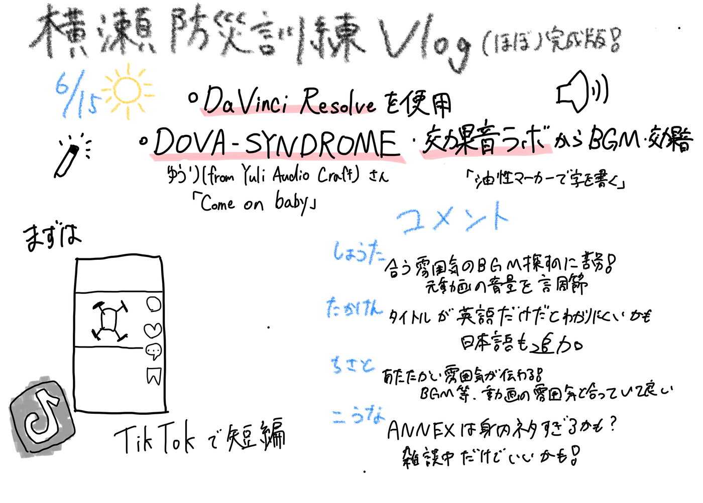

### 【6/24 V&F週報】6/15横瀬町防災訓練の一日を動画にしてみた

こんにちは！V&Fの荒川です。

日本はハチャメチャに暑い日が続き、熱中症ギリギリで日々生活しています。

今週の週報では、先週に引き続き横瀬町防災訓練のvlog動画を編集し、ひとまず完成したので報告します。

フィードバックを踏まえて修正した後、TikTokに投稿します。

#### 使用したBGM・効果音

**BGM**

作曲者：ゆうり(from Yuli Audio Craft), (DOVA-SYNDROME)

曲名：「[Come on baby](https://dova-s.jp/bgm/play22033.html)」

**効果音**

効果音：効果音ラボ「[油性マーカーで字を書く](https://soundeffect-lab.info/sound/search.php?s=%E6%B2%B9%E6%80%A7%E3%83%9E%E3%83%BC%E3%82%AB%E3%83%BC%E3%81%A7%E5%AD%97%E3%82%92%E6%9B%B8%E3%81%8F)」

動画の説明欄等にクレジットを表記する予定です。

#### 工夫した点

先週の発表の際に、「楽しそう」「明るい雰囲気」といった声をいただいたので、BGMやテロップのフォント・言葉遣いなどで明るい雰囲気を強調できるように工夫しました。

TikTokのターゲット(1,2年生など。古橋研の雰囲気や活動のアピール目的）や動画の長さを考えて、簡潔にわかりやすいテロップを意識しました。

長期的にTikTokを運営していくことを考えて、メンバーの名前も入れてみました。

#### V&Fメンバーから

**しょうた**

丁度良い雰囲気のBGMを探すことに苦労しました。クリップによっては声が小さくて聞こえにくいものがあったので、編集の際に音量を調節しました。

**たかけん**

テンポが良いと思います。タイトルが英語だけだと少しハテナが残るので、日本語でも付け足そうと思います。

**こうな**

明るい雰囲気が伝わってきました！何をしているか字幕があることですごく分かりやすかったです。

古橋研究室ANNEXは身内ネタすぎるので、雑談中！だけのテロップでいいのではないかと思いました。

**ちさと**

ドローン部のあたたかい雰囲気がよく伝わってくる、とても素敵な動画だと思いました。テロップのタイミングやフォント、BGMの選び方にも工夫が感じられて、動画全体の雰囲気としっかりマッチしている点も良いと感じました！

#### グラレコ

