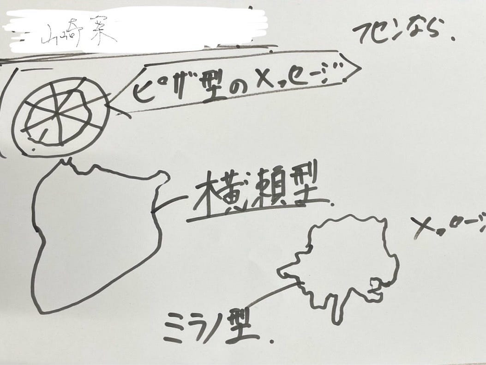
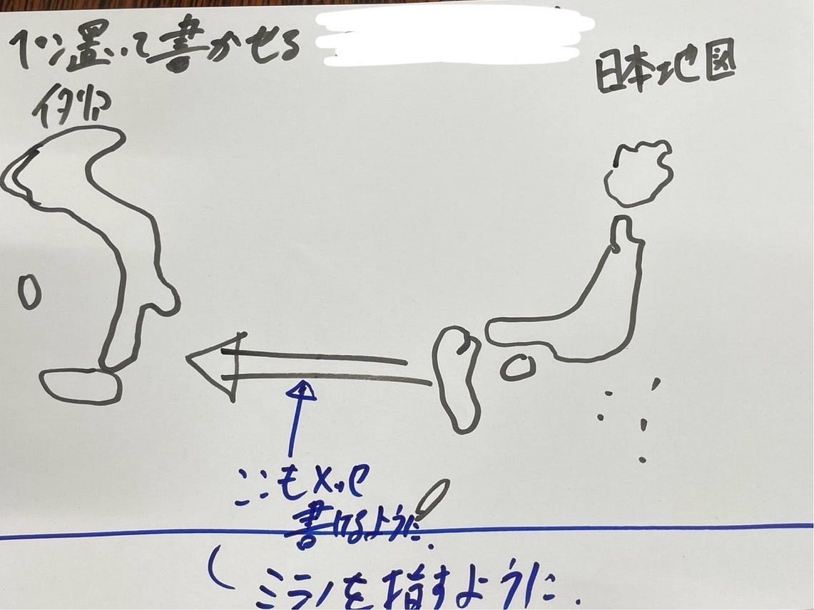
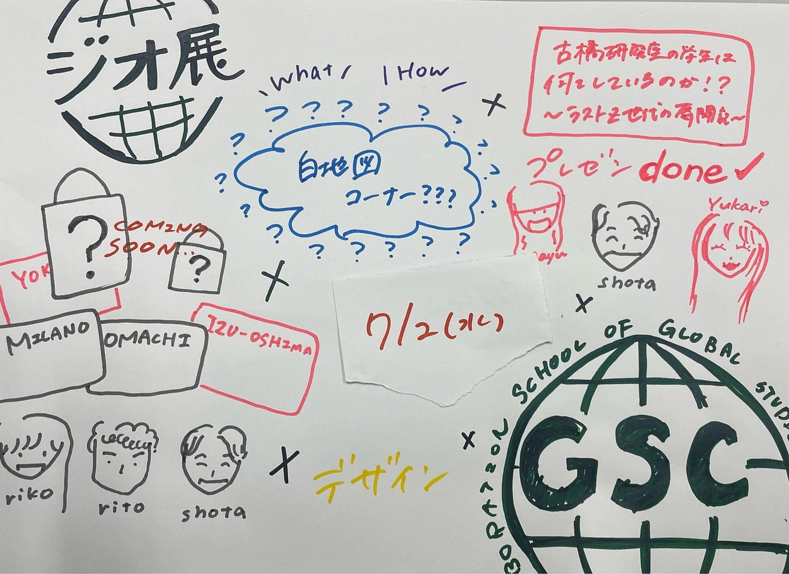

## 6/24 週報 ジオ展準備

こんにちは。若干体調を崩しているユース①4年の金澤です。(ジオ展までになんとか治します。)

今週は7/2(水)開催のジオ展2025の進捗状況について週報をまとめました。

### 1 役割分担

まず、今回の役割分担を先週のゼミ終了後に行いました。三年生が積極的にガーメントプリンターの使用に携われることや、日頃のデザインの成果を発揮できるような役割分担を意識しました。

以下のリンクに役割分担を載せてあります。

また、当日の展示物についても細かく記載されております。

### 2 各班の進捗状況(当日除く)

**①プレゼン**　まゆ、ゆかり、しょうた

古橋研究室についてのプレゼン資料をまとめている最中です。企業の人が何を求めているのかを考えながら作っています。

🌟先生に1分の紹介動画依頼

**②展示物作成**　りこ、しょうた、ゆうだい

•メガネクリーナー白とピンク　80枚済

•トートバッグ　進行中

**③白地図メッセージコーナー**　りと、けんたろう、みく、ちさと

🌟青学ブースのサイズ感確認

•グループ作成も返信なし

•山﨑の手書き案で終了

**④ポスター作成**

デザイン部週報にて

【ジオ展に関してのgithubリンク】

[furuhashilab/GeoExhibition2025
Contribute to furuhashilab/GeoExhibition2025 development by creating an account on GitHub.github.com](https://github.com/furuhashilab/GeoExhibition2025)

今年のジオ展も成功するように最大限に準備を頑張りたいと思います！

人数が多い分、工夫できたら良いです。
