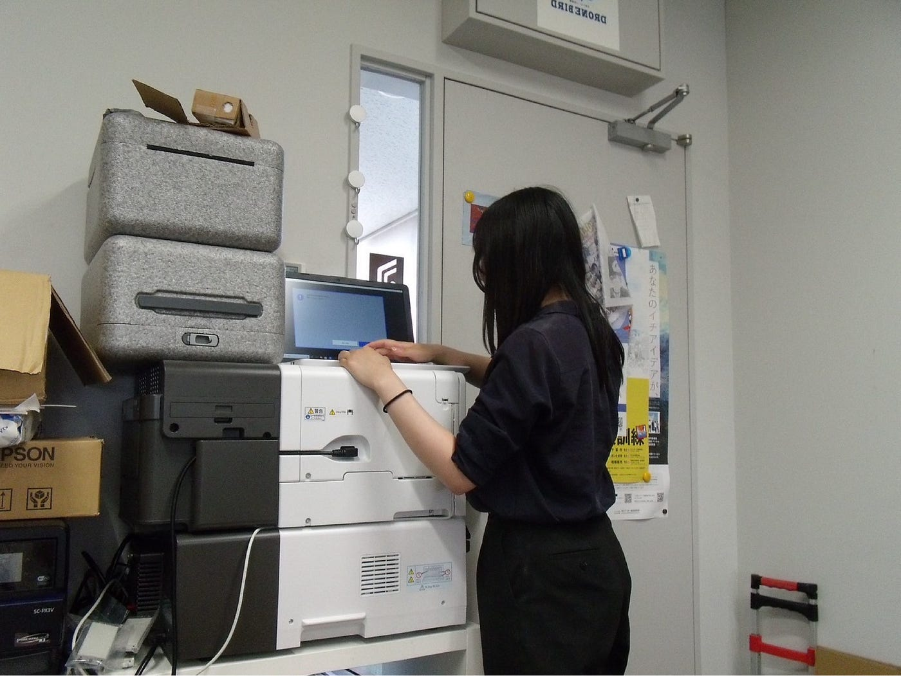
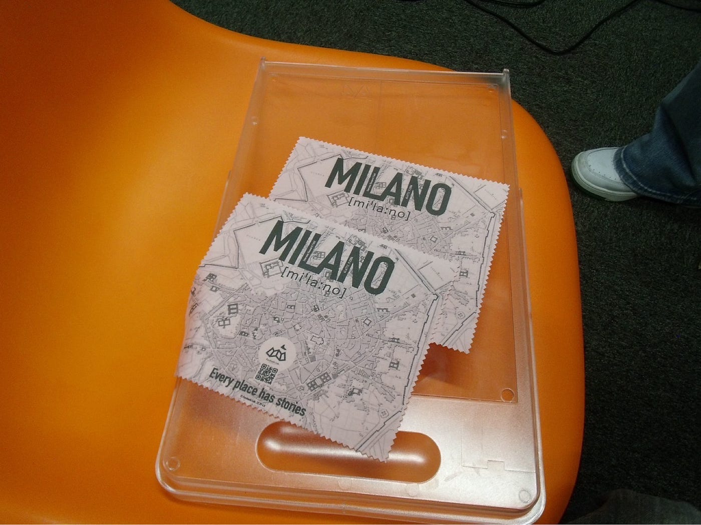
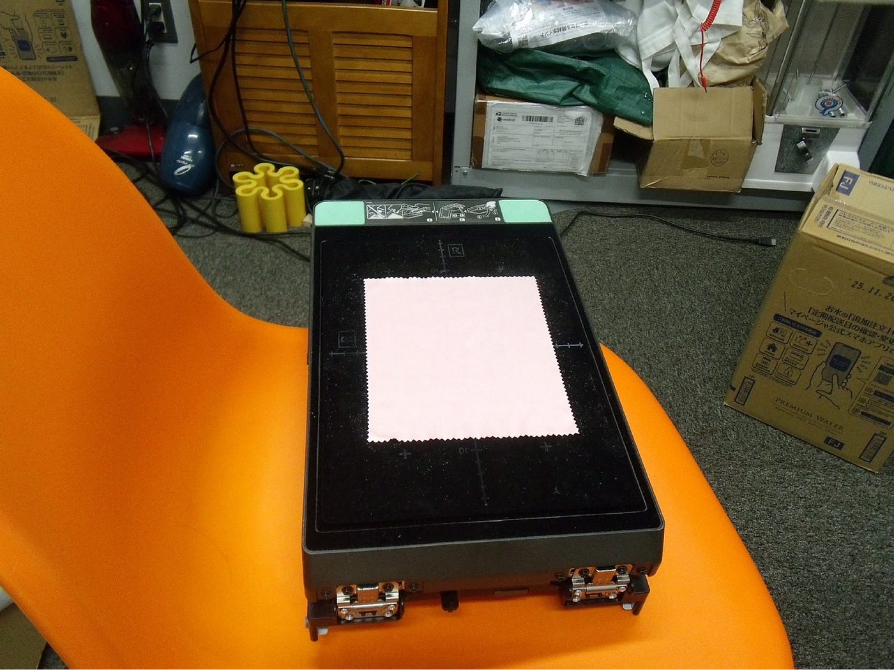
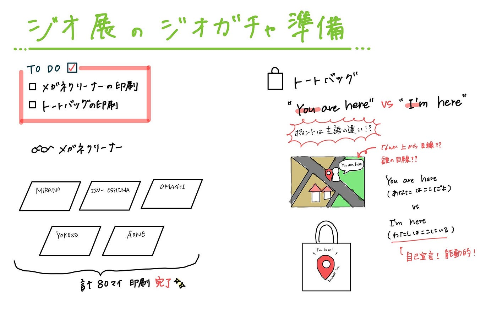

## 【Youth②】今年もやってきたジオガチャ準備！

こんにちは。4年の末木です！

今週のYouth②の週報はジオ展の準備についてです！

私たちは今7/2に控えたジオ展に向けて、5月のハッカソンに始まり、残り1週間ピッチをあげてジオガチャ作成やプレゼン準備を頑張っている最中です…

それぞれに担当分けされていますが、今回は私の担当であるジオガチャの準備について紹介させていただきます！

### 具体的な役割

- トートバッグの印刷

- メガネクリーナーの印刷

この2点が私の役割でした。

昨年もガーメントプリンターで作成したので、どのようにすれば効率が良いかわかっていたので、効率を意識しながら進めました。

作業風景はこんな感じです。

ガーメントプリンターを使う機会は卒業したら来る気がしないので大変ではありますが、貴重な機会だと思って楽しんで行いました！

### You are here 🆚 I’m here

実際にトートバッグのデザインを進める中で、「地図上での現在地の表現」としてどの英語表現がふさわしいか、研究室内で白熱した議論が交わされました。

もともとは “You are here” が定番として提案されていましたが、

- 「なんだか上から目線っぽい」

- 「自分が自分の意思でここに来たというメッセージがほしい」

という意見がでてきました。

その中で対抗案として挙がったのが ‘I’m here’や‘I’m　at+場所名’でした。

**📍 そもそも “here” とは？**

[Cambridge Dictionary](https://dictionary.cambridge.org/ja/dictionary/english/here) によると、“here” は：

> in, at, or to this place（ここに／で／へ）

つまり、「here」は“場所”そのものというより、話し手のいる場所／指し示す場所を示す指標的な言葉なんです。それだけに、誰がその「here」を発しているのか＝主語の違いが重要になります。

**🔁 主語の違いが意味を変える**

•	You are here

→「誰か（案内者）」が「あなたはここだよ」と指し示す言い方

→ 地図などでよく見る表現

•	I’m here

→「自分自身がここにいる」と宣言する能動的な言い方

→ より主体的・経験的なニュアンス

**🌍 英語の言語感覚からの考察**

英語では “You” が中立的で広く使える人称であり、案内や注意喚起にもよく使われます。

しかし日本語では「あなた」という言葉が時に距離感や上から目線と捉えられることもあります。

そのため、「You are here」という表現に対しても、

•	「誰かに位置づけられている感じがする」

•	「自分でここに来た感がない」

といった違和感が生まれる場合があるのだと考察しました。

**🗺 地図的文脈からの視点**

“ You are here” は、もともと地図の上で現在地を示すラベルとして定番ですが、それは地図を作った誰かが見る人を配置するという構図になっています。

一方、“I’m here” は、地図を見る側＝自分が「ここに来た」と表現する形です。

この違いには、空間をどう捉えるかという価値観の違いが表れているとも言えます。たとえば、Specht and Feigenbaum（2018）は、地図作成の視線＝cartographic gaze に対して批判的に言及し、次のように述べています：

> “The cartographic gaze objectifies the Other and robs one of freedom as a subject…”（地図作成の視点は他者を客体化し、主体としての自由を奪う）

[Specht, D., & Feigenbaum, A. (2018). From the cartographic gaze to contestatory cartographies. In Mapping and politics in the digital age (pp. 39 – 55). Routledge.](https://scholar.google.com/scholar?hl=ja&as_sdt=0%2C5&q=From+Cartographic+Gaze+to+Contestatory+Cartographies&btnG=#d=gs_qabs&t=1750733146531&u=%23p%3DniAHm2Q5x6AJ)

これは、地図の中で人々を「見る側」によって固定し、動かせない存在として表現してしまう支配的な構図であることを示しています。つまり、場所を示す言葉には、それを誰の視点で語るのかという重要な問いが隠されているのです。だからこそ、「I’m here」という表現をトートバッグのような個人的なアイテムに使うことで、「自分がここに来た」「この場所にいるのは私だ」という主体的な意味を込めることができ、その人の体験や選択がにじみ出るようなメッセージになるのではないかと考えました。

このような背景を経て、最終的に「I’m here」を私も便乗して推したいなと思います…！今回の議論を通して言葉の選び方ひとつで、表現の奥行きや伝わるメッセージの質が大きく変わるのだと実感しました。ジオ展まで残りわずかですが、こうした背景を意識しながら、トートバッグ作成に取り組んでいきたいと思います！

