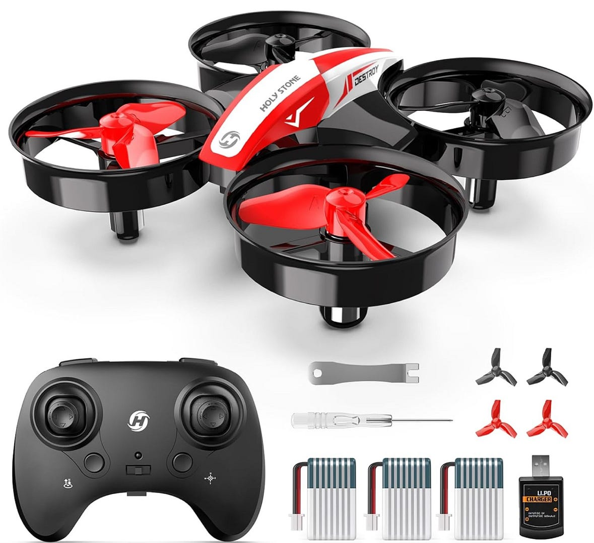
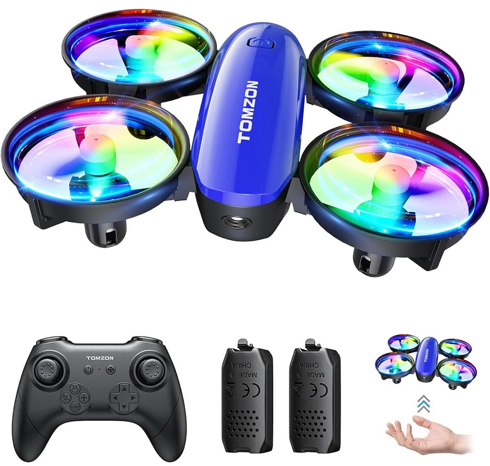
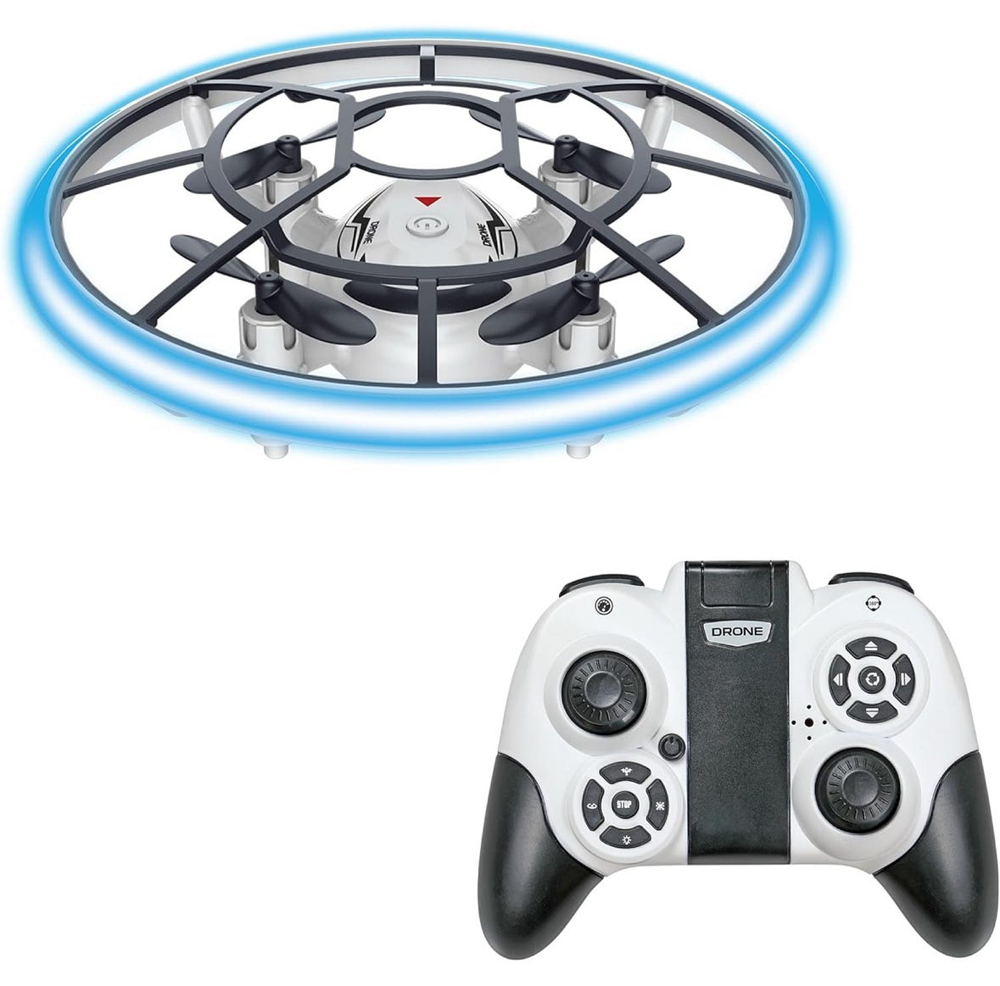
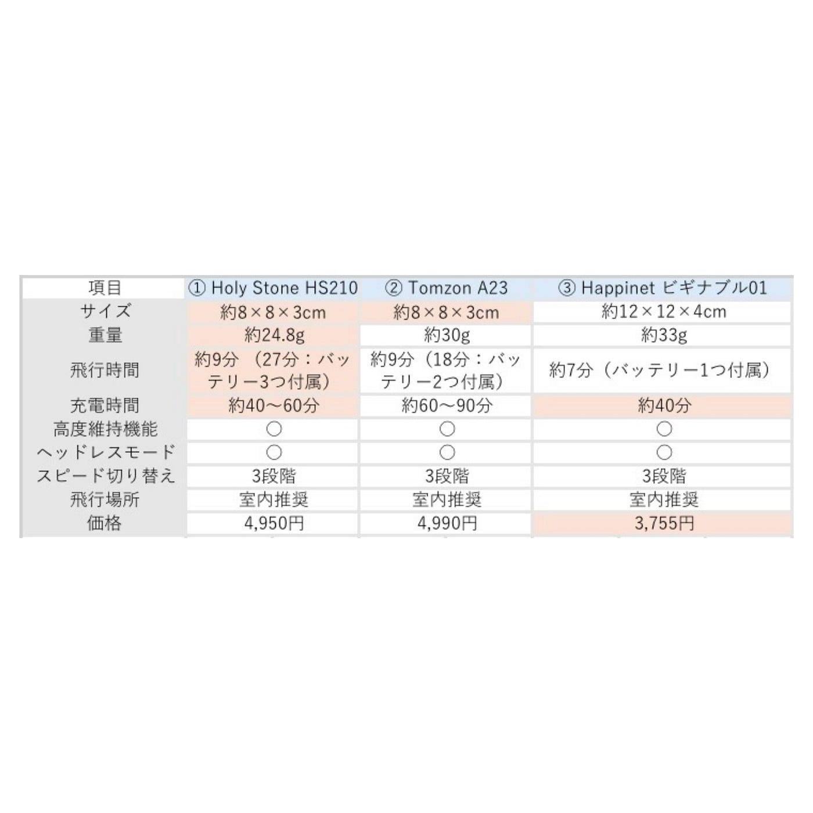
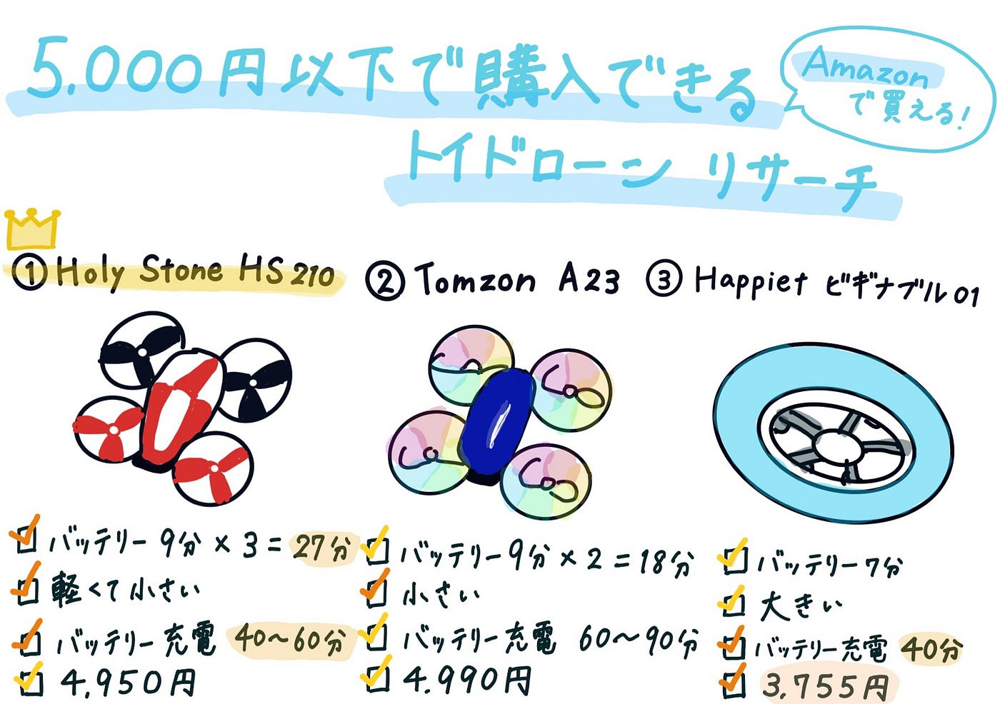

## 操作練習に最適！5,000円以下のトイドローン比較レポート【6/24ドローン1週報】

こんにちは！3年の安生です。

今週は、[Amazon](https://www.amazon.co.jp/)で販売されている5,000円以下のトイドローンについてリサーチした結果を報告します。

**目的：**ドローンの操作に慣れるために、低価格で購入できるトイドローンを比較し、おすすめの1台を選定すること

レビューの内容やスペックなどをもとに、以下の3つをピックアップしました。

**[① Holy Stone HS210**](https://amzn.asia/d/7pOgAR6)

**[② Tomzon A23**](https://amzn.asia/d/cmKrfJT)

**[③ Happinet ビギナブル01**](https://amzn.asia/d/9sySEkG)

それぞれの詳細を以下の表で比較しました。

⚠️実際はバッテリーが弱くなってくるため、記載の半分程度の時間しか飛ばないと考えていた方がよいです。

次に、それぞれのメリット·デメリットをまとめました。

**[① Holy Stone HS210**](https://amzn.asia/d/5yI9SrA)

⭕️メリット

- **バッテリーが3つ付属**しており、最長で**約27分間**の練習が可能

- 軽量でコンパクトなため、狭い室内でも操作しやすい

- バッテリーの充電時間が**約40〜60分**と比較的短い

⚠️デメリット

- 長時間の飛行にはバッテリー交換の手間がある

**[② Tomzon A23**](https://amzn.asia/d/69g7X2y)

⭕️メリット

- コンパクトなため、狭い室内でも操作しやすい

⚠️デメリット

- バッテリーの充電時間が**約60〜90分**とやや長い

- 長時間の飛行にはバッテリー交換の手間がある

**[③ Happinet ビギナブル01**](https://amzn.asia/d/9sySEkG)

⭕️メリット

- 価格が最も安く、気軽に始めやすい

- バッテリーの充電時間が**約40分**と比較的短い

⚠️デメリット

- 飛行時間が**約7分**と短め（**バッテリー1つのみ付属**）

- 他の2つと比べてサイズがやや大きめで、狭い室内では不向きな場合も

**【まとめ】**

3つのトイドローンを比較した結果、私は **[① Holy Stone HS210**](https://amzn.asia/d/a3fKPtT) を購入したいと考えました。

理由は、操作に慣れるために十分な飛行時間が確保できることと、初心者向けの機能が充実していることです。特に、バッテリーが3つ付属しており、こまめに充電を待たずに練習できる点は大きな魅力でした。また、軽量かつコンパクトなため室内でも扱いやすく、初めての練習に適していると感じました。

一方で、カメラは非搭載であり、映像確認などの練習はできないというデメリットもありますが、今回は「操作に慣れること」が主な目的であるため、その点は大きな問題にはならないと判断しました。

以上の理由から、操作練習に最も適しているのは[① Holy Stone HS210](https://amzn.asia/d/9KEXpld)です。

（参考サイト）

① Holy Stone HS210

[Holy Stone ドローン 100g未満 ミニドローン こども向け 室内向け バッテリー3個付き 飛行時間27分 安定 頑丈 高度維持 ヘッドレスモード フリップモード搭載 モード1/2転換可…
Holy Stone ドローン 100g未満 ミニドローン こども向け 室内向け バッテリー3個付き 飛行時間27分 安定 頑丈 高度維持 ヘッドレスモード フリップモード搭載 モード1/2転換可 国内認証済み 誕生日ギフト…amzn.asia](https://amzn.asia/d/5yI9SrA)

[HS210 Mini Drone
Mini Drone RC Helicopter Plane with One Key Start/Land, Auto Hovering, 3D Flip, Headless Mode, Can be Gifts for Boys and…www.holystone.com](https://www.holystone.com/en/Drones/Mini/HS210.html?srsltid=AfmBOoqqb3h63wkAIa7GsDzizc5kJ7FAsGtEl979QhJjizAqNv3TTxXC&utm_source=chatgpt.com)

② Tomzon A23

[ドローン 子供向け LEDライト付き Tomzon 100g未満 トイドローン 手投げ離陸 宙返り 360°回転 サークル飛行 ワンキー離陸 ヘッドレスモード スピード3段階 モード1/2切替可能…
ドローン 子供向け LEDライト付き Tomzon 100g未満 トイドローン 手投げ離陸 宙返り 360°回転 サークル飛行 ワンキー離陸 ヘッドレスモード スピード3段階 モード1/2切替可能 360°保護カバー 室内向け 小型…www.amazon.co.jp](https://www.amazon.co.jp/LED%E3%83%A9%E3%82%A4%E3%83%88%E4%BB%98%E3%81%8D-Tomzon-%E3%83%98%E3%83%83%E3%83%89%E3%83%AC%E3%82%B9%E3%83%A2%E3%83%BC%E3%83%89-%E3%82%B9%E3%83%94%E3%83%BC%E3%83%893%E6%AE%B5%E9%9A%8E-360%C2%B0%E4%BF%9D%E8%AD%B7%E3%82%AB%E3%83%90%E3%83%BC/dp/B0DCZ2SP4Z)

[TOMZON A23 Mini Drone…
www.rc-airstage.com](https://www.rc-airstage.com/product_info.php/products_id/21593?utm_source=chatgpt.com)

③ Happinet ビギナブル01

[ハピネット(Happinet) ビギナーズ トイ ドローン ビギナブル01(ゼロワン)(対象年齢8歳~)
初めてのドローン決定版！…amzn.asia](https://amzn.asia/d/32LW8Aa)

[ドローン初心者でも簡単に飛ばせる！楽しめる！「ビギナーズ トイ ドローン　"ビギナブル"」2023年10月28日（土）発売（税込6,028円）
株式会社ハピネットのプレスリリース（2023年9月1日 17時02分）ドローン初心者でも簡単に飛ばせる！楽しめる！「ビギナーズ トイ ドローン　"ビギナブル"」2023年10月28日（土）発売（税込6,028円）prtimes.jp](https://prtimes.jp/main/html/rd/p/000001391.000031422.html)

以下グラレコです。

