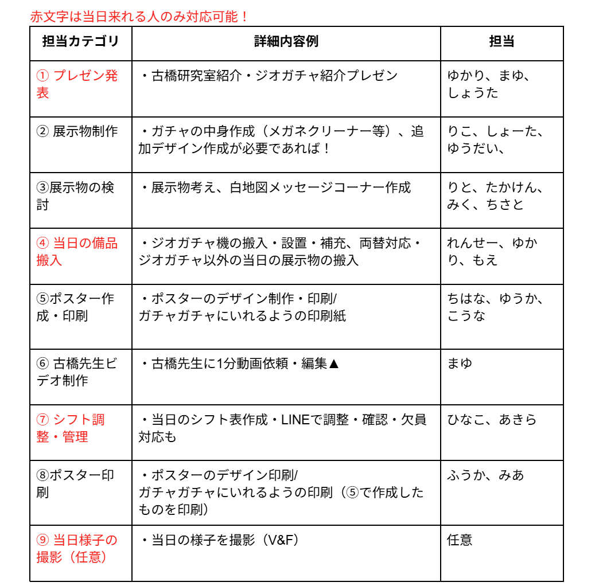
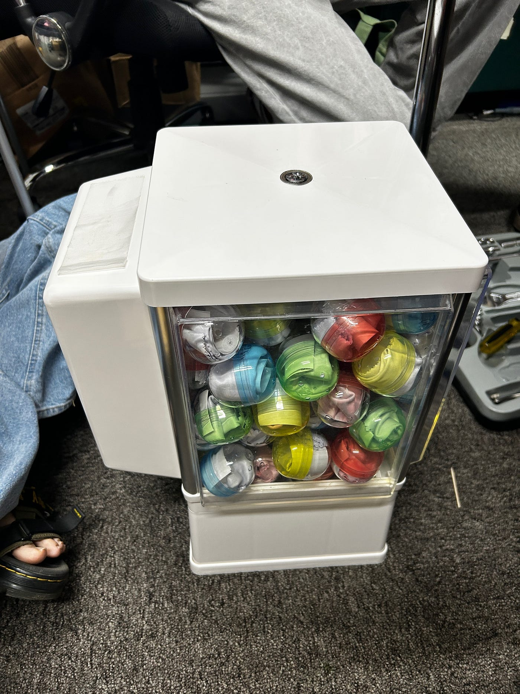
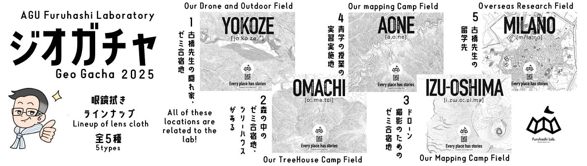
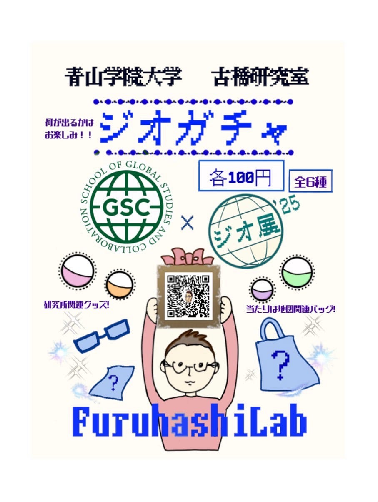
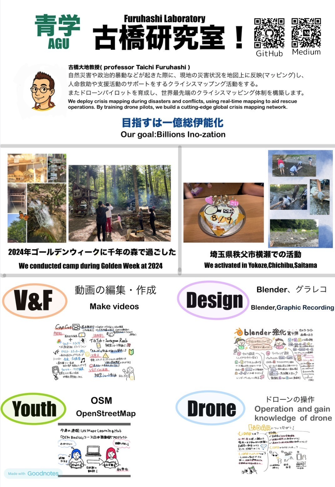
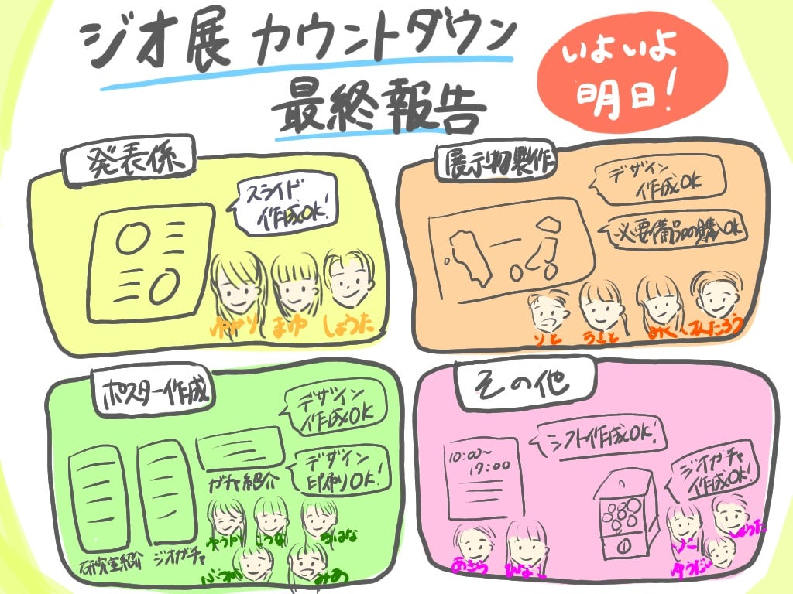

### いよいよ明日！ジオ展カウントダウン最終報告！【2025/7/1 ドローン1 週報】

こんにちは！ドローン1部4年の林（優）です。

いよいよ明日は「[ジオ展2025](https://www.geoten.org/)」本番ですね！林は初めての参加ということもあり、わくわくした気持ちとどきどきした感情が入り混じっています。

さて、先週はユース1部が進捗を発表してくれましたが、今週の進捗報告はドローン1部が代表してお伝えいたします。

先週の進捗報告は、[こちら](http://6/24 週報 ジオ展準備 - Furuhashi(mapconcierge)Lab. - Medium)からご覧いただけますので、ぜひチェックしてみてください。

### 担当の振り返り

以下がジオ展の担当分けになっています。

### 各班の進捗状況

#### GitHub

各担当の進捗状況はGitHub上でも管理しています。

→[View 2 · @YukariHayashi’s untitled project](https://github.com/orgs/furuhashilab/projects/73/views/2)

#### ①発表

担当：ゆかり、まゆ、しょうた

＜発表スライド＞

- 今日のゼミ終了後に一度先生と一緒にリハが行えればと思います。よろしくお願いいたします。

#### ②展示物制作

担当：りこ、ゆうだい、しょうた

- 眼鏡クリーナー：100枚作成

- バッグ：13枚作成

→ガチャカプセルに入れ、準備完了。

＜完成系＞

#### ③白地図メッセージコーナー

担当：りと、けんたろう、みく、ちさと

<タスク>

1.古橋先生へのメッセージを貼る地図の印刷

2.地図用紙の具体的なデザイン案

3.メッセージを書く付箋の案

<進捗状況>

1→インクがないため、まだ未実施

2→現在みくが考案中。

3→購入済

#### ④ポスター作製・印刷

担当（デザイン検討）：こうな、ちはな、ゆうか

＜完成デザイン＞

担当（印刷）：みあ、ふうか

- 全て印刷完了

#### ⑤シフト表の作成

担当：あきら、ひなこ

- 作成済み

→当日参加予定のメンバーに報告済み。

### 感想

- ジオ展のアイデアソンが開催されたのはずいぶん前のことのように感じられ、今となっては懐かしいです。（笑）そしてついに、いよいよ明日が本番です！残っている準備作業を最後までしっかり終わらせて、万全の状態で本番に臨みたいと思います。

- 今年は当日、約10名のメンバーが現地に参加できる予定で、とても心強く感じています。また、他の団体や企業の展示を見たり、直接お話しできたりするのも、今からとても楽しみです！

### グラレコ

