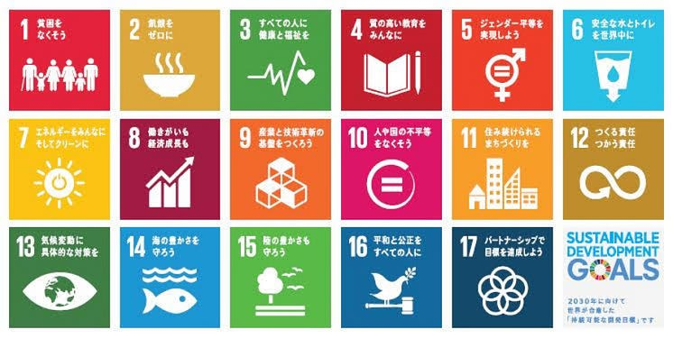
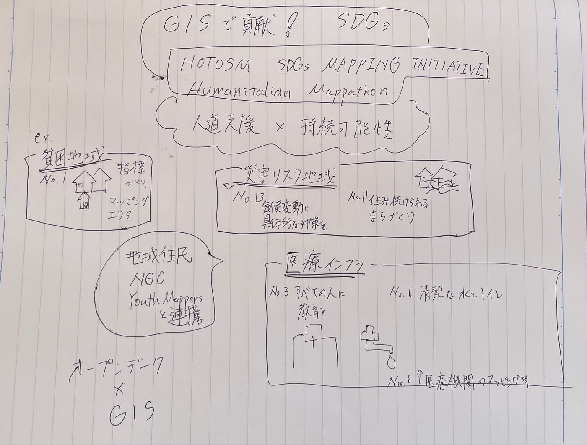

## SDGsおさらい〜9月の翻訳完成に向けて簡単な復習〜

こんにちは、Youth2所属の佐藤愛妃です。今回は、SDGsへの理解を深めるための簡単な説明とクイズを記事にしました。

出典: https://www.env.go.jp/earth/sdgs/index.html

### はじめに – SDGsと地図の関わり

「SDGs（持続可能な開発目標）」は、2030年までに達成を目指す17の国際目標です。世界の課題を解決するための共通言語とも言えるこの目標は、貧困や教育、ジェンダー平等、気候変動など多岐にわたります。

そして、このSDGsの達成を支えるツールのひとつが地理空間情報（GIS）です。位置情報を活用することで、世界中の課題を「地図に見える化」し、より正確で迅速な支援や政策立案が可能になります。

#### 🌏 HOTOSM SDGs Mapping Initiative の紹介

「HOTOSM SDGs Mapping Initiative」は、人道支援とSDGs達成を地図づくりで後押しする国際的なプロジェクトです。オープンストリートマップを使って、貧困地域や災害リスク地域、医療・水インフラの位置情報を可視化。地域住民やNGOと連携し、「誰一人取り残さない」世界を目指して、持続可能な社会の基盤づくりを支えています。

[Open Mapping for SDGs
Crowdsourced geospatial data, particularly in OpenStreetMap, is helping fill data gaps at the micro level as well as…sdgs.hotosm.org](https://sdgs.hotosm.org/)

また、そのような地図の力を有効に活用しているのが、学生主体の国際ネットワーク YouthMappers です。YouthMappersは「We don’t just build maps. We build mappers.（私たちは地図だけでなく、地図をつくる人を育てる）」を合言葉に、地図づくりを通じて世界の課題解決に取り組んでいます。

[Our Story | YouthMappers
OUR STORY ​ ​ Who We Are We are a global community of students, researchers, educators, and scholars that use public…www.youthmappers.org](https://www.youthmappers.org/our-story)

[HOT Tasking Manager
Tasking Manager is a the tool for coordination of volunteers and organization of groups to map on OpenStreetMap.tasks.hotosm.org](https://tasks.hotosm.org/)

今回は、YouthMappersと特に関連が強いSDGsの目標を中心に、章ごとに楽しく学んでいきましょう！

貧困をなくそう

（目標1）と地図目標1は「貧困をなくそう」です。世界には1日1.9ドル未満で生活する「極度の貧困状態」にある人が約7億人います。ここで地図が役立つのが、貧困地域の特定です。YouthMappersの学生たちは、地域ごとの所得データや衛星画像をもとに、生活環境をマッピングしています。これにより、どの地域に支援が必要かが一目でわかり、効果的な支援が可能になります。

[Poverty Mapping with an OpenStreetMap Base in Sumbawa
During HOT's time working in Indonesia we've met with many different groups doing different types of mapping. One of the…hotosm-staging-new.fly.dev](https://hotosm-staging-new.fly.dev/en/news/poverty-mapping-with-an-openstreetmap-base-in-sumbawa/)

飢餓をゼロに

（目標2）と農地マッピング目標2「飢餓をゼロに」は、食料安全保障と持続可能な農業の推進を掲げています。YouthMappersでは、農作物の分布や農村部の灌漑状況をマッピングし、収穫量予測や食料不足地域の特定に貢献しています。例えばアフリカの農村地帯では、衛星画像から作物の成長状況を分析し、早期に食料危機を察知する取り組みが進められています。

[Open Mapping for SDGs
"Our soils, freshwater, oceans, forests and biodiversity are being rapidly degraded. Climate change is putting even more…sdgs.hotosm.org](https://sdgs.hotosm.org/pages/part-iv-using-open-data-and-maps-to-meet-and-monitor-sdgs/sdg-goal-02/)

[Poverty Mapping in Developing Countries using High Resolution Satellite Imagery, OpenStreetMap and…
For efficient targeting of policies, poverty maps should be made available at the finest administrative unit of planning…ui.adsabs.harvard.edu](https://ui.adsabs.harvard.edu/abs/2020AGUFMIN007..12C/abstract)

住み続けられるまちづくりを

（目標11）目標11は「住み続けられるまちづくりを」。都市化が進む中、災害に強く、誰もが安全に暮らせる街づくりが重要です。YouthMappersでは、防災マップや都市インフラの地図づくりに協力しています。地震や洪水の被害を最小化するために、建物や道路の位置情報を正確に記録するプロジェクト。

[Sustainable Cities & Communities
Datasets for Sustainable Cities & Communities Core Datasets in OSM Related OSM Datasets Related External Spatial…www.hotosm.org](https://www.hotosm.org/impact-areas/sustainable-cities/)

気候変動に具体的な対策を（目標13）

目標13「気候変動に具体的な対策を」は、近年特に注目されています。気温上昇、海面上昇、異常気象など、気候変動の影響は地理情報で分析・可視化できます。YouthMappersでは、洪水リスクマップの作成や植生分布の変化解析を行い、地域の防災計画や気候適応戦略に活用しています。

平和と公正をすべての人に

（目標16）目標16は「平和と公正をすべての人に」。紛争地域や難民キャンプのマッピングもYouthMappersが関わる重要な活動です。現地のインフラ状況や避難ルートを正確に把握することで、人道支援の効果が大幅に向上します。

[Open Mapping for SDGs
"The threats of international homicide, violence against children, human trafficking and sexual violence are important…sdgs.hotosm.org](https://sdgs.hotosm.org/pages/part-iv-using-open-data-and-maps-to-meet-and-monitor-sdgs/sdg-goal-16/)

パートナーシップで目標を達成しよう（目標17）

最後に、目標17「パートナーシップで目標を達成しよう」。YouthMappersは世界中の大学、NGO、国際機関と協力し、共同でマッピングプロジェクトを進めています。国境を越えて知識や技術を共有し、世界中の学生たちが一緒に学び、貢献し合う姿はこの目標の体現になっていると思います。

[Open Mapping for SDGs
"A successful sustainable development agenda requires partnerships between governments, the private sector and civil…sdgs.hotosm.org](https://sdgs.hotosm.org/pages/part-iv-using-open-data-and-maps-to-meet-and-monitor-sdgs/sdg-goal-17/)

まとめ

クイズでSDGsを楽しく覚えよう！ここまでYouthMappersと関連が深いSDGs目標を紹介してきましたが、他の目標も含めて全17目標を覚えておくとより理解が深まると思い一覧を載せました↓

1.	貧困をなくそう

2.	飢餓をゼロに

3.	すべての人に健康と福祉を

4.	質の高い教育をみんなに

5.	ジェンダー平等を実現しよう

6.	安全な水とトイレを世界中に

7.	エネルギーをみんなに そしてクリーンに

8.	働きがいも経済成長も

9.	産業と技術革新の基盤をつくろう

10.	人や国の不平等をなくそう

11.	住み続けられるまちづくりを

12.	つくる責任 つかう責任

13.	気候変動に具体的な対策を

14.	海の豊かさを守ろう

15.	陸の豊かさも守ろう

16.	平和と公正をすべての人に

17.	パートナーシップで目標を達成しよう

#### グラレコ

