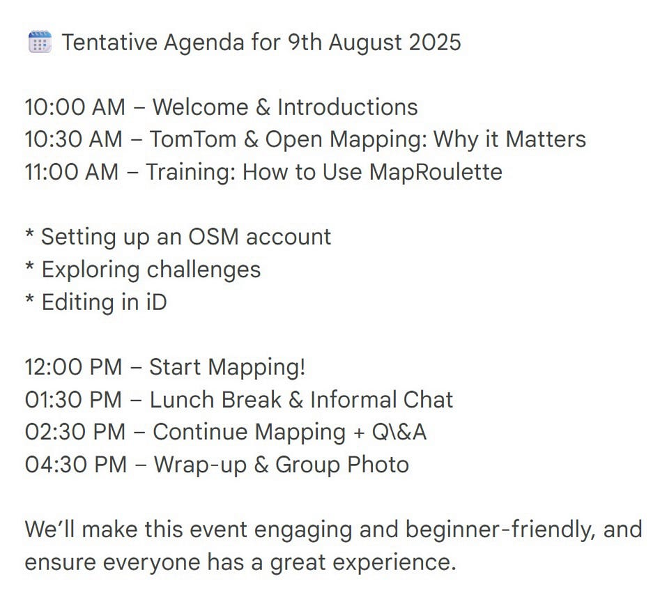
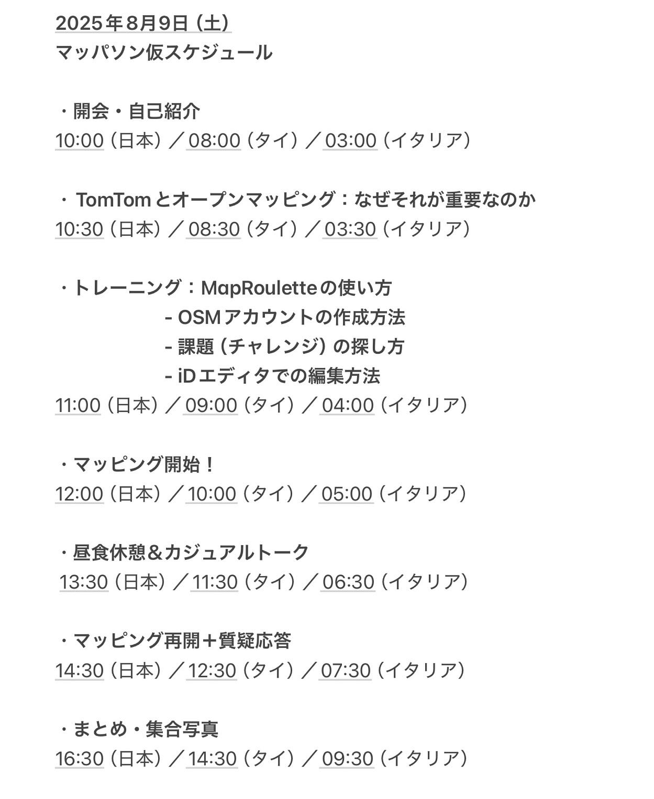
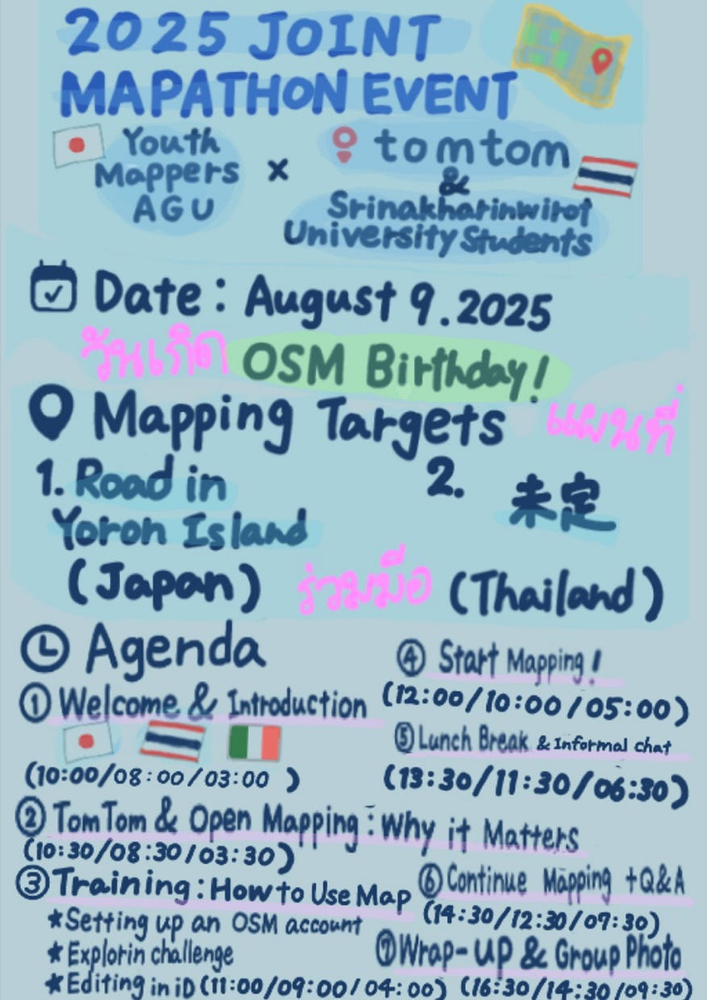

## TomTomってどんな会社？／マッパソンの当日スケジュール共有【7/1 Youth1週報】

こんにちは！3年の安生です。

今週も引き続き、[YouthMappersAGU](https://furuhashilab.github.io/youthmappers4agu/)主催のマッパソンの進捗状況を報告します。

### **１．TomTomについて**

まず、今回マッパソンに協力してくださる[TomTom](https://www.tomtom.com/)について紹介します。

TomTomは、地図や交通情報を専門とするオランダ発のテクノロジー企業で、世界中で位置情報サービスを提供しています。

#### （１）会社概要

TomTomは、オランダのアムステルダムに本社を置く地理空間技術企業で、1991年に設立されました。当初は携帯型カーナビで知られていましたが、現在は高精度な地図データ、リアルタイム交通情報、自動運転支援用のHDマップ、位置情報APIなどを提供する企業へと進化しています。

#### （２）主な事業内容

- 地図とナビゲーション：カーナビ、スマートフォン、企業向けに地図・ルート案内を提供

- 交通情報（TomTom Traffic）：リアルタイム渋滞情報を世界中で配信

- 自動運転支援：センチメートル単位の高精度HDマップで自動運転技術を支援

- APIサービス：開発者や企業が地図や位置情報を利用できるプラットフォームを展開

#### （３）グローバルな拠点展開

アムステルダム（オランダ本社）、日本、バンコクの他にも世界30か国以上に拠点を展開しています。

#### **（４）特徴と最近の動き**

- AIや自動運転分野へ対応を強化

- OpenStreetMapなどオープンマッピング活動との連携も活発

### ２．マッパソン開催場所

次に、マッパソンを開催する場所についてです。

#### **（１）キランさんが当日日本に来てくださる場合**

→TomTom日本オフィスで開催（キランさんとYouthMappersAGUメンバー）、[シーナカリンウィロート](https://swu.ac.th/)大学の学生とはzoomでつなぐハイブリッド形式

**【TomTom日本オフィス】**

**〒140‑0001 東京都品川区北品川4‑7‑35 御殿山トラストタワー 16F**

#### **（２）キランさんが当日日本に来られなかった場合**

→zoomでオンライン開催（YouthMappersAGUメンバーは相模原キャンパスに集まるかどうか検討中）

キランさんからの返信は今週中に来る予定です。

### ３．マッパソンスケジュール

最後に、当日のスケジュールについてです。

キランさんが提案してくださった当日のスケジュールを共有します。

以下に日本、タイ、イタリアの3カ国それぞれの時刻をまとめました。

【参考文献】

1. TomTom Official Website – Company Overview（https://www.tomtom.com/company/）

1. TomTom Careers – Offices（https://www.tomtom.com/careers/offices/）

1. TomTom Newsroom – Life at TomTom（https://www.tomtom.com/newsroom/）

1. Daijob.com「TomTom Japan」企業情報ページ（https://www.daijob.com/en/jobs/company/6671）

最後に、パンフレットのラフ案修正版を共有します。

