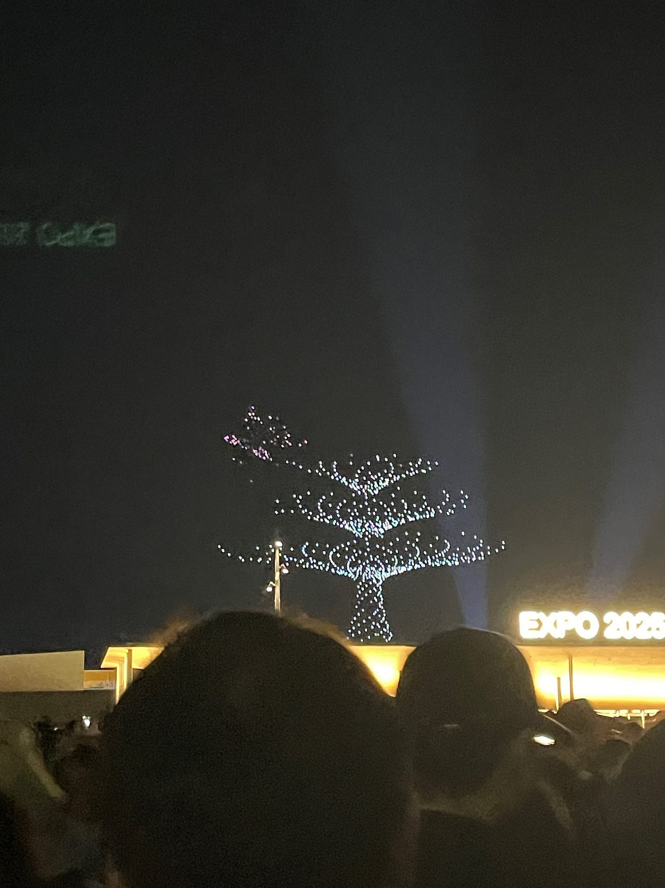
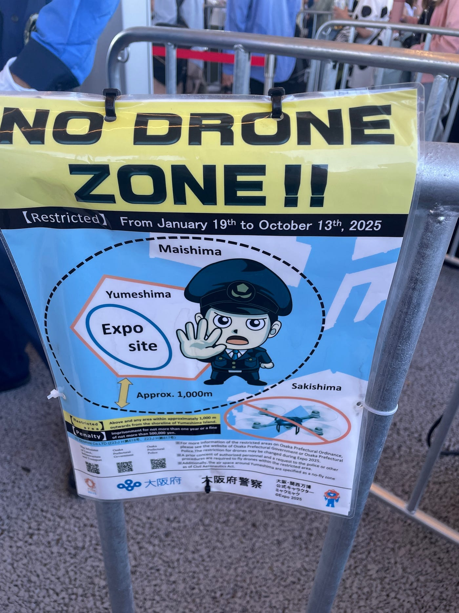
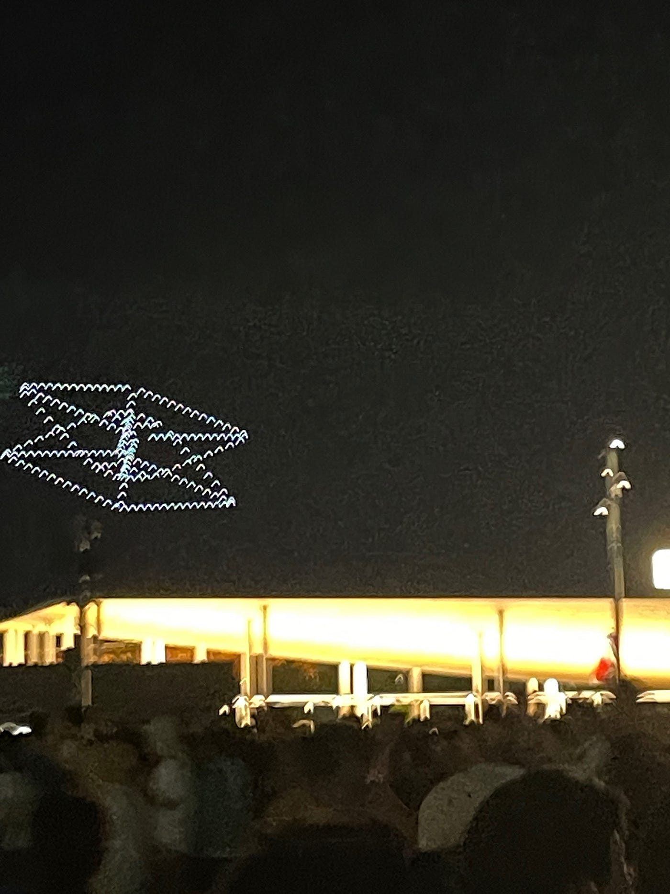
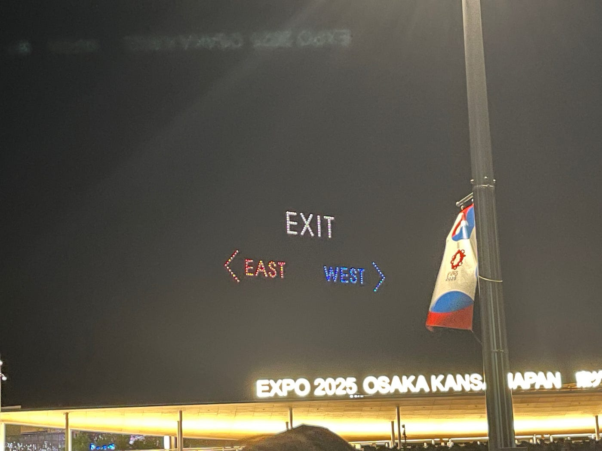
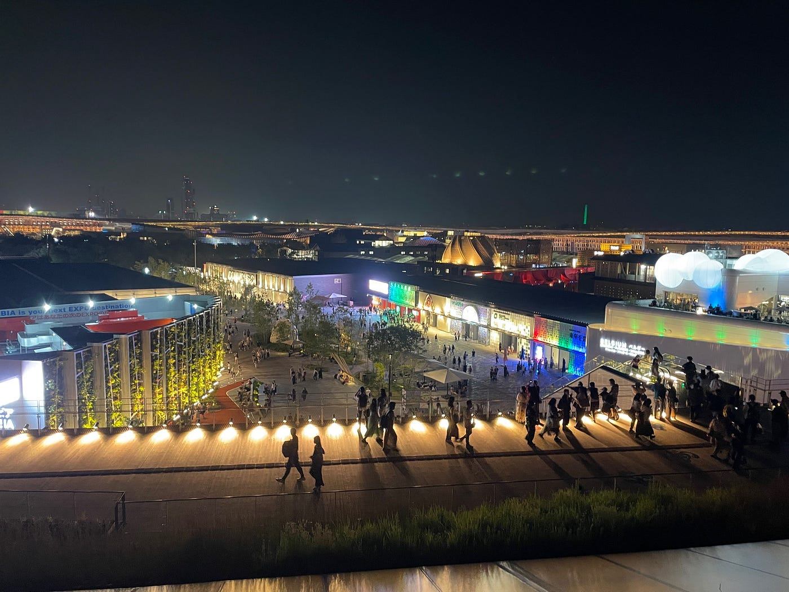
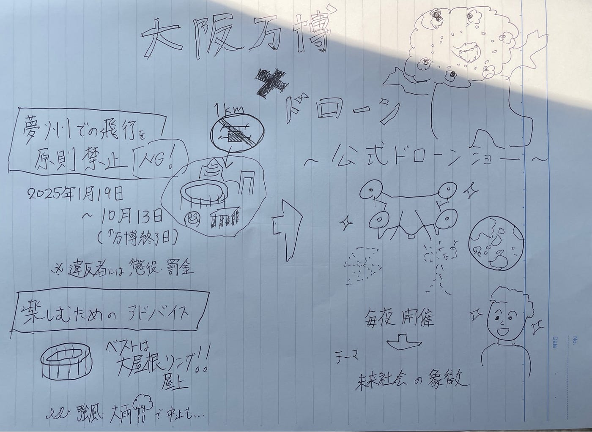

## 🌏 大阪万博×ドローン

こんにちは、ドローン2の佐藤愛妃です！先週、大阪万博に行ってきたので、そこで見たドローンショーと万博ドローン情報をまとめました！

1. 万博開催地・夢洲に及ぶ厳格なドローン規制

大阪府は万博会場である夢洲島およびその半径1kmにわたり、ドローンを原則禁止とする条例を、2025年1月19日から10月13日まで施行しています（条例施行日は令和6年11月13日） 。期間中はホテル周辺など一部地域も規制対象で、違反者には最長1年の懲役または50万円以下の罰金が科されるリスクもあります。

[万博会場でドローン飛ばした疑い　中国館関係者の男を書類送検　飛行原則禁止の条例「知らなかった」（読売テレビ） - Yahoo!ニュース
大阪・関西万博の開幕2日前に、会場内でドローンを飛ばしたとして、中国パビリオン関係者の中国籍の男が書類送検されたことが分かりました。　捜査関係者によりますと、書類送検されたのは、中国パビリオンnews.yahoo.co.jp](https://news.yahoo.co.jp/articles/a022aa96f7559c0b4d7bbae786f3e0c919606200)

ただし、万博協会や施設管理者による正式な申請・公安委員会への届出、航空局への許可取得を経た“公認飛行”については例外的に許可可能です 。これは同時に、会場で演出されるドローンショーの陰には、複雑な手続きと調整があることを示唆しています。

会場ゲート近くの看板

[ドローン規制についてのお知らせ|大阪府警本部
「大阪府2025年日本国際博覧会の準備及び開催時における小型無人機等の飛行の禁止に関する条例」の規定に基づき、夢洲及びその周囲1,000メートルの上空における小型無人機等の飛行は原則禁止されています。www.police.pref.osaka.lg.jp](https://www.police.pref.osaka.lg.jp/sogo/EXPO2025/drone/19356.html)

出典:大阪府条例によるドローン規制について:2025/7/1閲覧

2. “禁止”の先にある壮観：ドローンショーの舞台裏

一方、万博では毎晩21時から、公式ショー「One World, One Planet」の一環として1,000機規模のドローンショーが開催されています。4月13日のオープニングでは2,500機が参加し、ギネス世界記録を更新 。

[万博でギネス認定続々８件...ドローンアートや大人数なわとび、技術に「お墨付き」でＰＲ狙う
【読売新聞】　開幕から２か月が過ぎた大阪・関西万博で、ギネス世界記録が次々と生まれている。これまでに、ドローンによるアートや大人数で跳ぶなわとびなど８件が認定された。展示物に「世界一」のお墨付きを得てＰＲする狙いがあり、注目が集まるwww.yomiuri.co.jp](https://www.yomiuri.co.jp/expo2025/20250619-OYT1T50046/)

エリア内の“空の舞台”で、来場者は自由に立ち寄ってその光景を楽しむことができます 。予約不要で、10分程度の幻想的な光と音の演出が楽しめます！

↓参考までにLink掲載

[Redirect Notice
www.google.com](https://www.google.com/amp/s/www.walkerplus.com/article/1233901/amp/)

3. 楽しむための実践アドバイス

•	ベスト観覧スポット：「大屋根リング」上段の通路（高さ約20 m）やウォータープラザ前が好位置。21時スタートに向けて20:45までに到着が推奨されます 。

•	天候による中止条件：強風（10 m/s以上）、雷、大雨、濃霧などでは中止の可能性が高いと予告されています 。

•	安全対策：虫対策や足元に注意。夜間の暗がりを移動する際、懐中電灯や虫除けグッズの携帯もお忘れなく 。

4. ドローン規制とショー演出の狭間にある調和

万博会場周辺では厳格なドローン飛行禁止措置がとられている一方、「公式ドローンショー」は万博協会の許可と公安委員会・航空局の承認を経ており、規制とイベント演出の二重構造で成り立っています。

これはまさに、先端技術と公共の安全を両立させる取り組みの象徴とも言えるでしょう。ショーの迫力と美しさは、表向きの“光景”だけでなく、裏側の“制度”や“調整”があってこそ成立しています。

5. 未来社会の“生きた実験場”としての万博

万博のテーマは「Designing Future Society for Our Lives」。ドローンショーは、単なるエンターテインメントにとどまらず、「空間の秩序を保ちながら、人々に驚きと感動を届ける」仕組みの先端事例ともいえます。

会場はまた、eVTOL（空飛ぶタクシー）向けの「OSAKAKO Vertiport」体験など、新たな空モビリティの実験の舞台にもなっており、そこでもドローン技術や規制運用の知見が生かされています ！

万博に行く時はぜひドローンショーも見てください！

グラレコ

