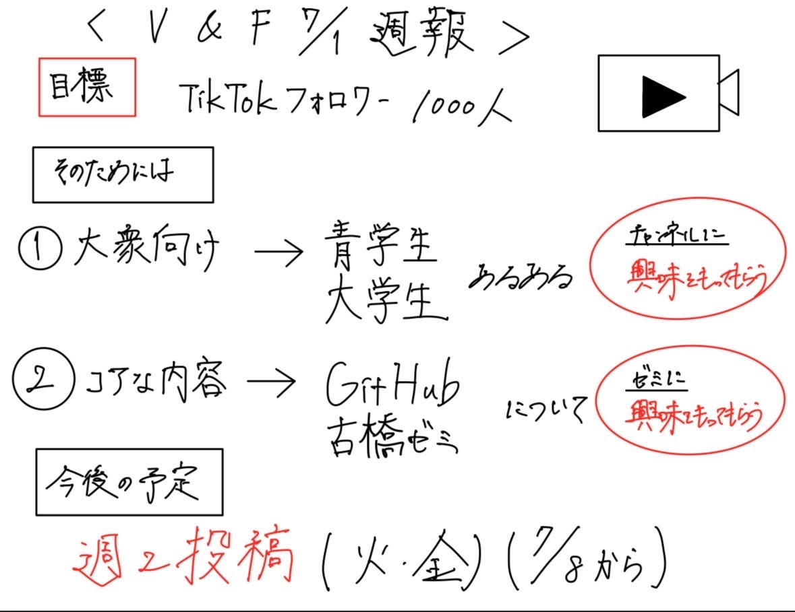

### フォロワー1000人に向けた第一歩 【7/1 V&F】

こんにちは。4年の高井健太郎です。今週は、7月から本格的に開始するTikTok運用に向けて、投稿方針や目標、運用スケジュールについて話し合いを行いました。これまでのV&Fの動画制作とは異なり、今年度はより継続的かつ戦略的にSNS発信に取り組んでいく方針です。

> **TikTok運用の基本方針**

#### 目標

**[TikTokフォロワー1,000人の達成**](https://medium.com/furuhashilab/今年は-攻め-のv-f-v-f週報-4-15-da28aceac07c)をまずの目標に設定しています。

そのために、視聴者との接点を増やし、ゼミの世界観へと自然に引き込めるような、**2種類の投稿スタイルを使い分ける方針**で進めていきます。

> **投稿スタイル（2軸）**

① **大衆向け動画（入口）**

ゼミを知らない人でもすっと見られるような、「共感・笑い・ワクワク重視」の動画。

- 例：大学あるある／青学生あるある／音源ネタ／食レポ系／キャラ紹介／Vlog など

- 目的：TikTok上で“とりあえず見てもらう”接点を増やし、アカウント自体に興味を持ってもらう

② **古橋ゼミコア動画（深掘り）**

ゼミの中身や個性・学びを伝える動画。ゼミに興味がある人、入ゼミを検討している人にも届く内容。

- 例：フィールドワーク紹介／GitHubあるある／古橋先生紹介／研究内容／ツール紹介／合宿Vlog など

- 目的：ゼミへの理解と関心を深め、“世界観”や“らしさ”に共感してもらう

> **投稿スケジュール（暫定）**

- **投稿開始日**：2024年7月9日（火）

- **投稿頻度**：週2回（火曜・金曜）
 ※今後の反応やスケジュールに応じて柔軟に変更の可能性あり

- 投稿内容の方向性：
 — 火曜：**コア動画（深掘り系）**
 — 金曜：**大衆向け動画（拡散狙い）**

7月9日は、ジオ展についての動画投稿する予定です。

> **投稿予定の動画企画案**

#### ① 大衆向け動画（入口）

ゼミ外の人にも刺さる“TikTok映え”重視のネタ

- 【けんたろう案】古橋ゼミって、ぶっちゃけ何してるん？

- 【けんたろう案】MBTI診断、ゼミでやってみた結果www

- 【けんたろう案】ゼミのZoomあるある4選

- 【けんたろう案】これが…青学⁉︎ 青山とは真逆な“青学相模原キャンパス”の日常

- 【けんたろう案】“青学行ってるよ”って言うと、“表参道？”って聞かれる問題

- 【けんたろう案】都会に憧れる青学生の1日【in淵野辺】

- 【けんたろう案】一般vs推薦、どっちが偉いの？

- 【けんたろう案】指定校で青学きたけど何か？

- 【けんたろう案】指定校で入った青学生、一般組に言われがちなセリフ4選

- 【けんたろう案】大学1年の4月、“指定校”のやつと“一般”のやつでギスギスしてる説

- 【けんたろう案】青学生に聞いた！“人生で一番後悔してること”

- 【けんたろう案】“人生で一番恥ずかしかった瞬間”聞いてみた

- 【けんたろう案】推しの1曲、教えてください

- 【ちさと案】ドローンで見る世界（ドローン部から映像を提供）

- 【しょうた案】ラストZ世代大学生の1日vlog（ゼミの日）

- 【しょうた案】普通に流行りの音源

- 【しょうた案】ゼミ室掃除タイムラプス

- 【しょうた案】実写版Ingress

- 【しょうた案】れんせいの美味いチキン南蛮の作り方講座

- 【こうな案】ポケモンgoしながら校内散策

- 【こうな案】Ingressの楽しみ方

#### ② 古橋ゼミコア動画（深掘り）

ゼミの中身や個性、文化が伝わる“濃いめ”のコンテンツ

- 【ちさと案】古橋先生ってどんな人？

- 【ちさと案】ゼミ内サークル紹介

- 【ちさと案】ゼミ内サークルに密着

- 【ちさと案】古橋ゼミメンバーの、ゼミ活動を頑張る一日

- 【ちさと案】フィールドワークの心得

- 【ちさと案】古橋先生の冒険エピソード

- 【ちさと案】フィールドワークのハイライト動画（次回合宿ver）

- 【ちさと案】古橋ゼミ必須ツール紹介（GitHubなど）

- 【ちさと案】ゼミツール初心者あるある

- 【しょうた案】メンバー紹介（チームごと）

- 【しょうた案】MBTIコンサル（たかけん）

- 【しょうた案】ゼミ室までの行き方

- 【しょうた案】リト&アキラの筋トレ講座

- 【しょうた案】上手いグラレコの書き方（ユウカ）

- 【こうな案】合宿の様子（これからもしあったら）

- 【こうな案】普段のゼミの様子（研究室メイン）

- 【こうな案】ジオ展とガチャガチャの紹介

- 【こうな案】サークル紹介を共同作成する

- 【こうな案】これまでの合宿の紹介

- 【こうな案】対話形式で古橋研究室の特徴紹介（ツッコミあり）

- 【こうな案】ゼミでこれまで楽しかったこと紹介

- 【こうな案】研究室にあるもの紹介

投稿動画制作の管理は、去年のNotionハッカソンで作成した[ツール](https://www.notion.so/V-F-1823791036c680c2a9c2e39ab1ad5ac7?pvs=11)を利用したいと思います。

> **今後に向けて**

- 動画案の選定と優先順位づけ

- 投稿用素材の撮影・編集体制の整備

- タイトル・サムネなど、投稿フォーマットの共通化

- 投稿後の分析（再生数・保存数・フォロー数）も記録予定

> **グラレコ**

