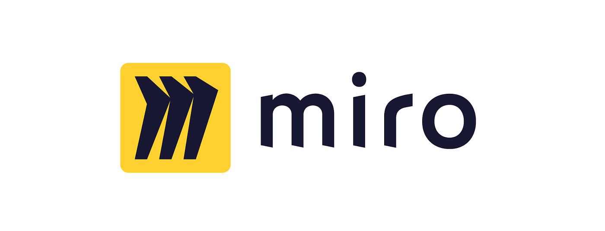
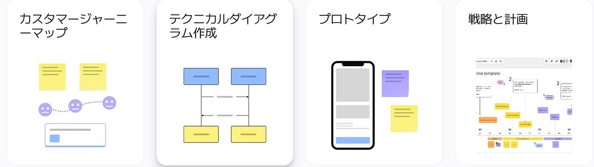
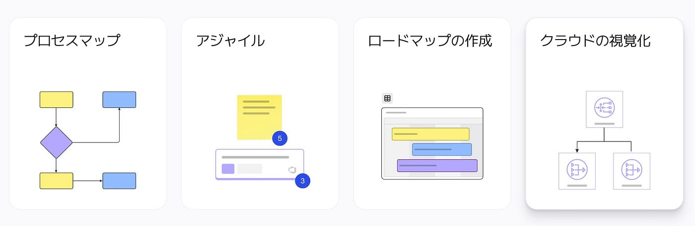
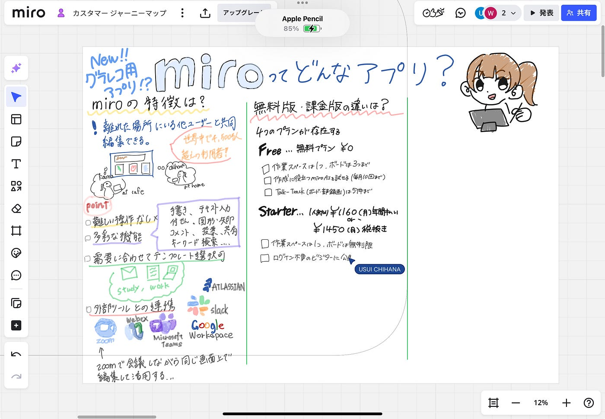
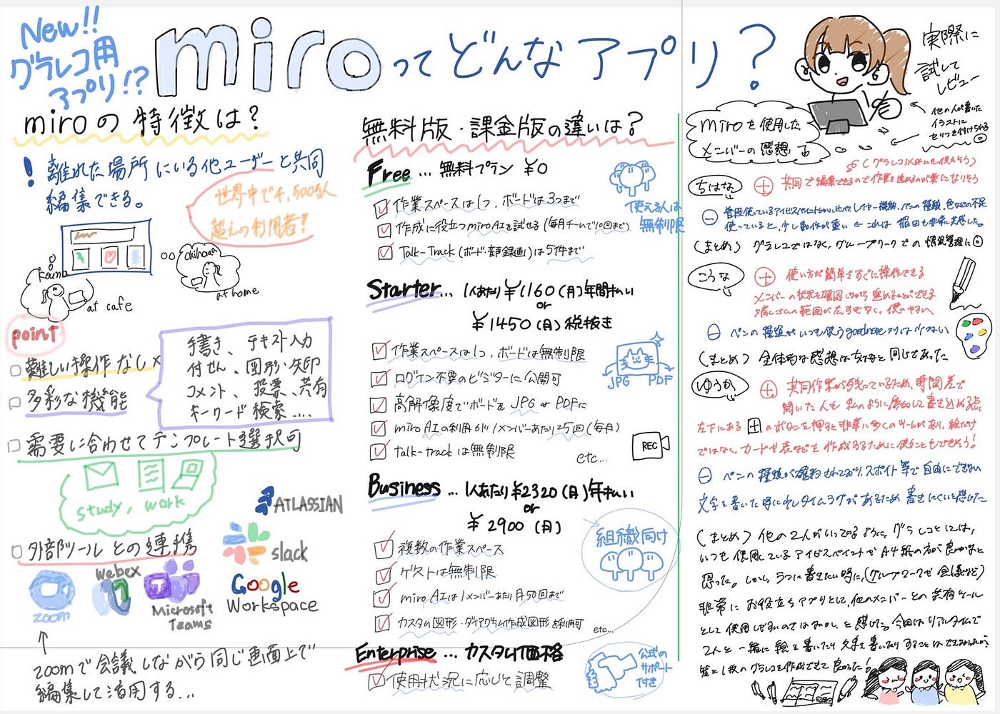

### 共有して描けるグラレコアプリmiro！【7/1デザイン部週報】

こんにちは！四年の福田です。

デザイン部はグラレコを描くアプリでいつもと違って協力して描けるアプリを見つけ、それについて調べました。

### **miroとは？**

まず初めにこのアプリについて簡単に紹介します。

[miro](https://miro.com/ja/)は、Miro .comが開発した仮想ホワイトボードです。離れた場所にいる他ユーザーと共同編集が可能なオンラインホワイトボードツールであり、直感的なUIや豊富なテンプレートが使えることから人気が高く、世界中で4,500万人を超えるユーザーが利用しています。テキスト入力・画像や動画の挿入・付箋・チャットなどさまざまな付加機能の利用が可能です。

2022年6月13日には日本語版の提供が開始され、日本のユーザーにとってはさらに使いやすくなりました。Miroは無料プランの他、編集できるボード数などに違いがある3つの有料プランが用意されています。

### miroの特徴！

#### 1.直感的でわかりやすいUI

ITリテラシーに不安があるユーザーでも、迷わずに操作することが可能です。日常的に使う多くの機能は、簡単なマウス操作やドラッグ＆ドロップで使いこなせます。チームでの共同編集において、複雑で手間のかかる操作が求められることはありません。

#### 2.多彩な機能を搭載

Miroはオンラインホワイトボードを使う際に便利な、以下にあげる多彩な機能を搭載しています。

- **手書き機能**

- **テキスト入力機能**

- **付箋機能**

- **図形・矢印機能**

- **ファイルのアップロード**

- **コメント機能**

**・テキストチャット・ビデオチャット機能**

- **投票機能**

- **画面共有機能**

- **キーワード検索機能**

使ってみてこんな機能があるんだと感じることがありました。

#### 3.テンプレートが豊富で様々なニーズに対応

300種類を超える豊富なテンプレートが用意されています。

今回の作業では使うことができなかったが、情報の管理やスケジュールを立てる際に使いやすそうなテンプレートはたくさんありました。

#### 4.外部ツールとの連携

Miroは単体で使うだけでなく、100を超える種類の外部ツールと連携させることができます。以下、Miroとの連携が可能な代表的なツールの例です。

- **Microsoft Teams**

- **Google Workspace**

- **Webex**

- **Zoom**

- **Atlassian**

- **Slack**

例えば、zoomで会議をしている際に共有しながら、話の内容をまとめるなどして、参加者の全員が話の内容を文面で確認できるようになる。

zoomとmiroを連携することで画面を切り替えずに編集ができるようになる！

### 無料版と有料版の違い！

miroには4つのバージョンがある

Free（無料プラン）
・ワークスペースは１つ、編集できるボードは3枚まで
・編集人数は無制限、チームに入ったらどのボードも編集できる
・miroAI（作成サポート）を毎月チームあたり10回まで利用可能
・talktrack（画面録画機能）を5件まで利用可能

sterter（1メンバーあたり年間13920円or月1450円）
Freeで使える機能＋
・ボードが無制限
・高解像度でボードをPDFやJPGで保存できる
・カスタムテンプレートを作成可能
・miroAIを毎月メンバーあたり25回まで利用可能
・タイマー、投票、ビデオ通話、非公開モードを利用して会議を開催できる
・ボートのアクセス制限を設定可能
・talktrackが無制限

Business（1メンバーあたり年間27840円or月2900円）
sterterで使える機能＋
・非公開のワークスペースが利用可能
・ゲスト（ログインしない、閲覧のみのユーザー）を無制限に利用可能
・miroAIを毎月メンバーあたり50回まで利用可能
・3600件以上のダイアグラム作成図形とアイコン、カスタム図形を作成し利用可能
・チーム間のタスクの関係性や優先順位をボード上に可視化可能、Jira・Azureと相互連携可能
・企業アカウント管理ツールと連携可能
・連動コピーを使用して複数のボードで情報を共有可能

Enterprise（カスタム価格）
Business で使える機能＋
・使っている人数に応じて自動でライセンス数を調整
・企業管理がもっとシンプルに
・利用状況を把握可能
・セキュリティ機能を更に強化
・データを置く国を選択可能
・miroが提供する24時間365日サポート
・miroAIを毎月メンバーあたり100回まで利用可能

ちはなと同じタイミングで作業してみました。お互いの内容を確認しながら、全体で見て統一感ができるように意識しながらグラレコを描くことができました。

### 感想

ちはな

いい点
・共同で編集できるので作業を進めるのが楽になりそう（グラレコ以外でも）

よくない点
・普段使っているアイビスペイントとかに比べてレイヤー機能、ペンの種類、色などの機能が不足
・使っていると少し動作が重い

まとめ
グラレコではなくグループワークでの情報管理に使うのが便利そう

こうな

いい所
使い方が簡単ですぐに操作出来る
メンバーの状況を確認しながら進められる
消しゴムの範囲が広すぎなく使いやすい

良くないところ
ペンの種類がいつも使うgoodnoteよりは少ない

使ってみての感想はちはなと同じ

ゆうか

いい所

共同作業の内容が残っているので、時間差があっても作業ができる

ツールが多く、カードや表など様々

良くない所

ペンの種類が確約されていて、スポイトを自由に調整できない

文字が書きにくい

まとめ

グラレコを描く時にはアイビスペイントやGoodnoteが使いやすいが、ラフに情報を共有したい時には使いやすい

### グラレコ

今回は3人で共有してグラレコを作成しました。

左からこうな、ちはな、ゆうか

