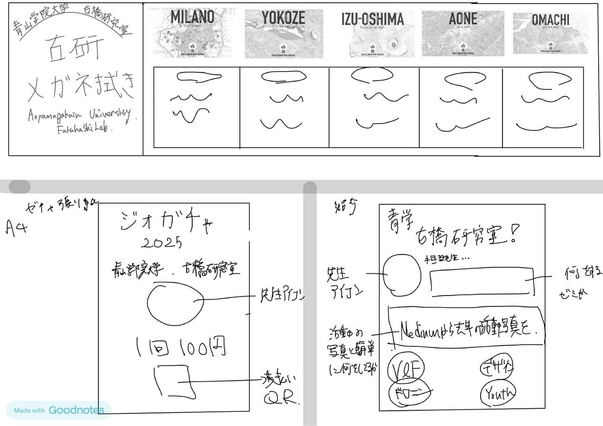
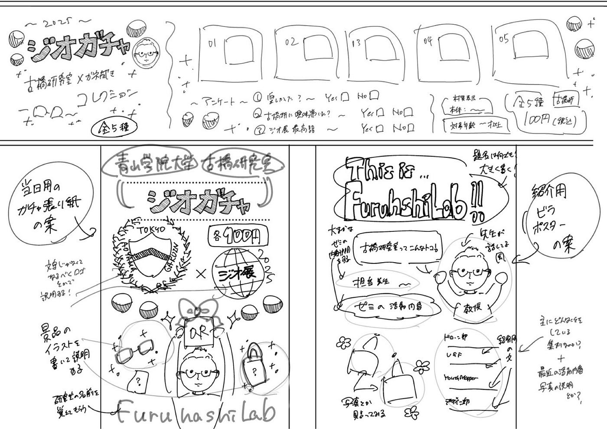
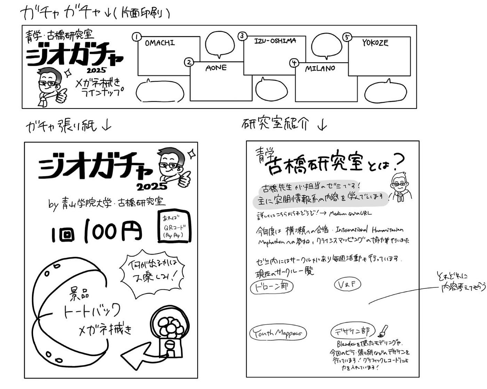
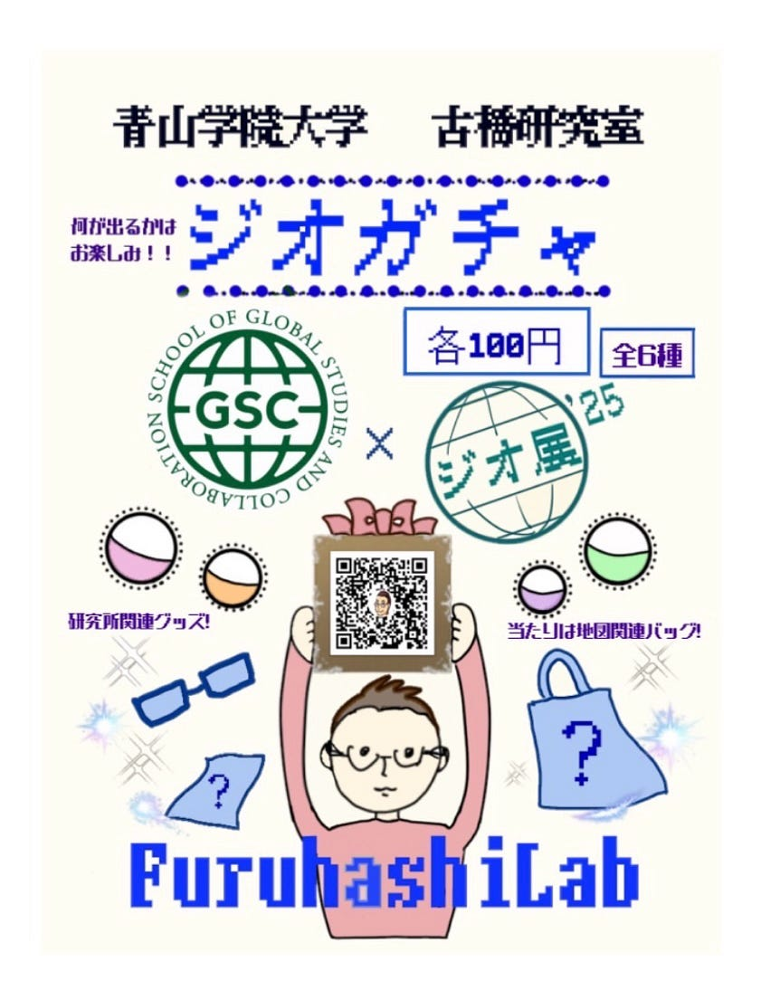
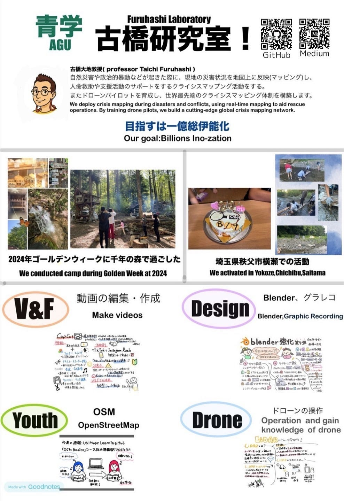
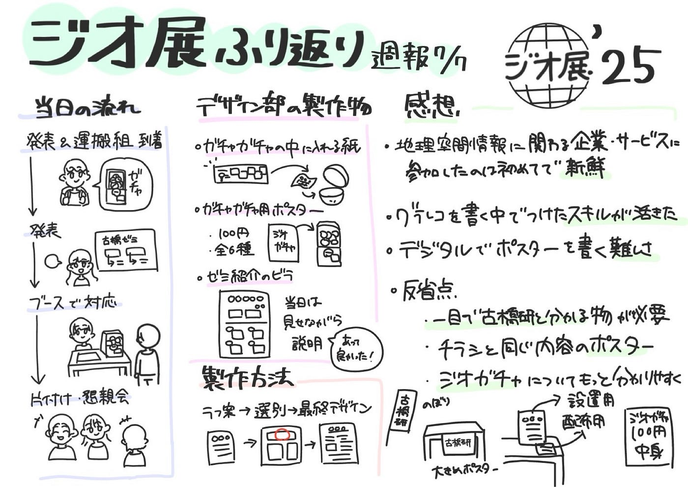
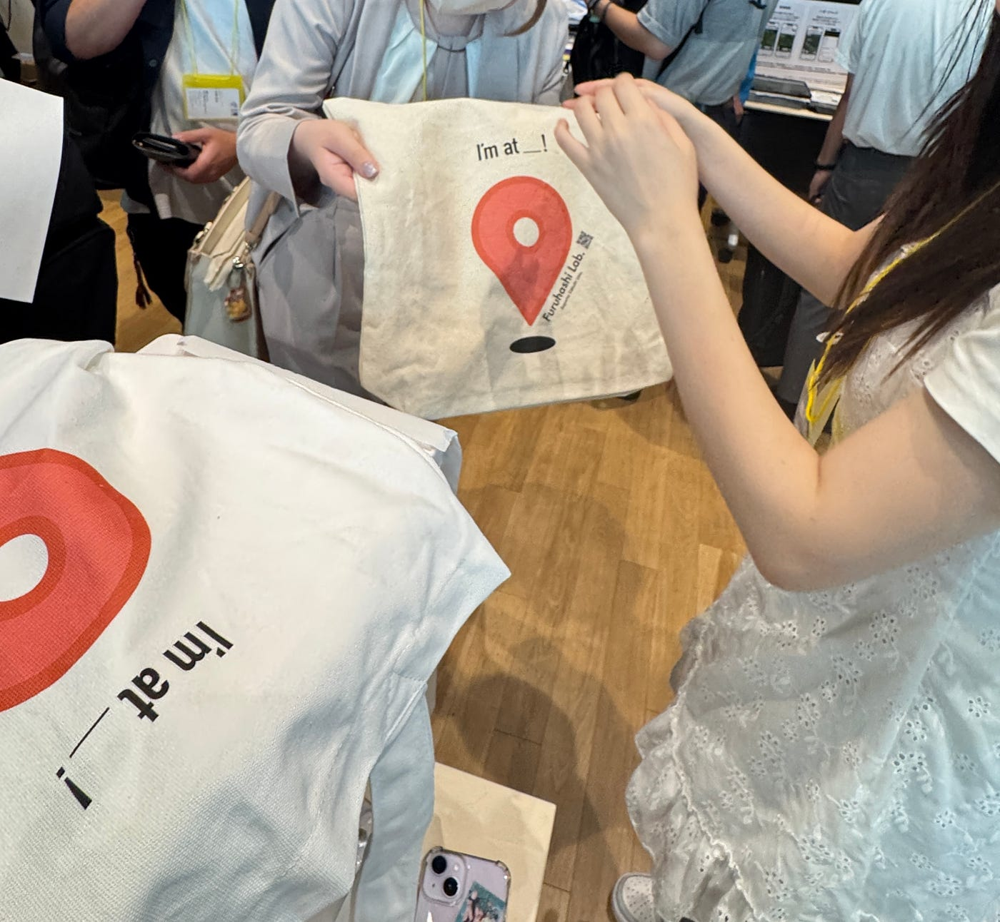
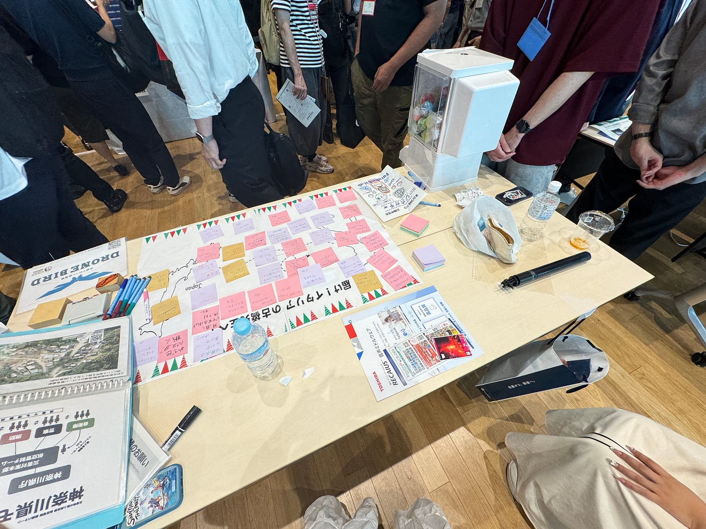

## ジオ展に携わった感想と準備の振り返り【7/7デザイン部週報】

こんにちは！七夕の週報投稿失礼いたします。三年の稲田です。

今週のデザイン部は、ジオ展に当日参加した際に考えたことや、ガチャガチャの中に貼る用の紙・ガチャガチャ用ポスター・ゼミ紹介ポスターを提案した感想など、展示に向けて携わっていた期間　全体を通しての振り返りを行いました。

#### **1. 当日の流れについて**

まず、ジオ展における研究室メンバーの行動軌跡はどのように流れていったのかについて振り返り、記載しようと思います。

1. 発表組とガチャガチャを運ぶ組が到着、発表

1. 自分たちのブロックにおいて、通る人に声をかけてゼミの紹介とガチャガチャの担当を行った。

1. _~お昼休憩でシフト交代~_

1. 17時まで⑵を他メンバーが担当した。

1. ジオ展終了後、片付け・懇親会

当日の印象としては、声をかけて興味を持ってくれた人にゼミのこと紹介した際、ガチャガチャのメイン景品はメガネ拭きではあったものの、ケータイなどの端末も拭くことができるなどを話したところ、購入率が上がったという。(こうな)

#### 2. デザイン部の製作物について

今回のジオ展においてデザイン部は、参加に向けたポスターなどの製作物準備の段階で最も活躍できたのではないかと考えております。

今回、3人は

- ガチャガチャの中に貼る用の紙

- ガチャガチャ用ポスター

- ゼミ紹介ポスター

の企画と完成図の提案、火曜のゼミで伺った改善点を踏まえての修正後の完成までを行いました。

デザイン班全員で工夫した点としては、より良い案を作るため、初めから担当を分けるのではなく、最初に3人とも全ての提案図をラフに書いてグループ内で共有したことが挙げられます。仮提案をV&Fや4年生の方々に見ていただき、そこで選ばれた案を元に、分担して教授に見ていただくための最終用デザインを完成させました。

次に、メンバー一人一人が工夫した点や、ゼミでの指摘を踏まえた改善をどのように行ったかなど、全体的な感想を記載していこうと思います。

- ガチャガチャの中に入れる用の紙

日本語表記だけでなく英語表記を入れる事で英語話者にも内容が分かるようにしました。

なぜその地域が選ばれたか分からないと購入者に疑問を持たせてしまうので、端的な言葉でそれぞれの説明を入れました。

(ちはな)

- ガチャガチャ用ポスター

フォントは遊び心のあるドットにして、古橋先生がQRコードを持っているような絵にしました。

青山学院大からGSCにイラストを修正し、地球社会共生学部であることを示しました。また、メガネ拭き5種類+トートバッグの計6種類として記載し直し、ラフ時にはなかったイラストの上の説明書きを加え、地図に関連したグッズであることなどをやんわり提示するようにしました。(ゆうか)

- ゼミ紹介ポスター

初めに私たちの研究室でどのようなことをしているか簡単に紹介するようにしました。

そして今まで行ったメインのアウトドア活動の様子がわかる写真で他のゼミと異なる所を面白いと思われるようにと工夫しました。

実際当日にチラシを見ながら紹介する際に、“こんなことをするゼミあるんだ！”や“こんなこともできるんだ！”と驚く方もいました。

ゼミの中では四つのサークルに分かれていることも紹介して、そのついでにメディウムで各サークルの活動を確認できることもお話しすることができました。

(こうな)

#### 3. ジオ展を振り返って

ジオ展のような地図関連の企業やサービスの集まる共同展示会に参加したり、作成に携わったりということは今まで一度も経験してこなかったため、新鮮な気持ちで準備することができました。

また、普段から毎週書いていたグラフィックレコーディングにおける文字の大きさや内容を工夫してイラストなどとともに記載するスキルを活かすことができて良かったです。

文化祭や体育祭のポスターを手書きで描いたことはあっても、今回のガチャガチャ用の紙やポスターのように、文字のフォントを選んだり、iPad内の定規を用いて線を引いたりして作ったことはなかったため、カクカクした文字を絵と違和感のないように入れ込むことの難しさなどもありながら、完成させることができて良かったです。

デザイン部としてはいくつか反省点がありました。どの団体として出展しているのか分かりづらかったので、事前に机の前に「青山学院大学・古橋研究室」のように貼れる紙をデザインした方が良い、配るチラシが無くなった時用に同じ内容のポスターが貼ってあった方が良い、ジオガチャが有料である事、中身がゼミに関わるデザインのメガネ拭きである事が一目で分かるようにデザインした方が良いなどの意見が出ました。

4年生は今年で古橋研究室としてジオ展に参加する事はありませんが、3年生は来年度も以上の反省点を生かして頑張りたいです！

